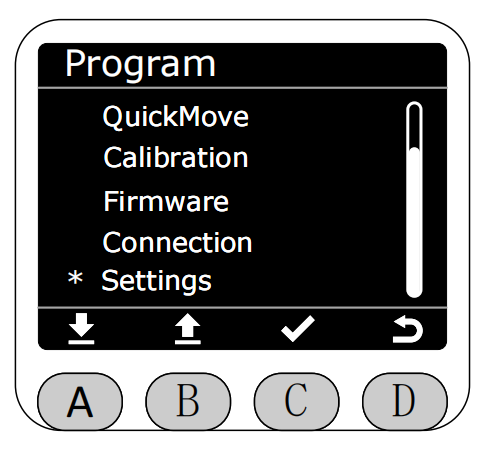
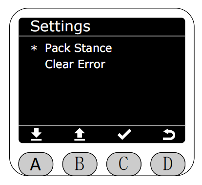
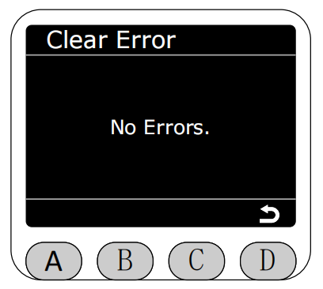
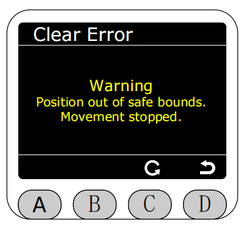
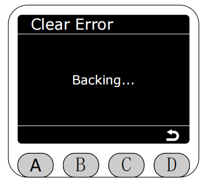
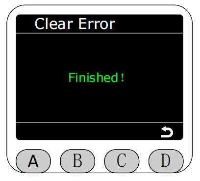
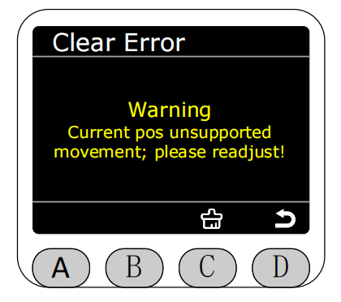
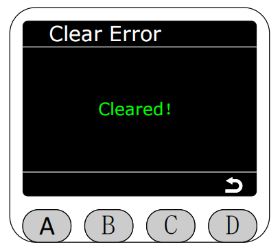

# 设置(Settings)

在Program界面将星号选择为Settings功能，按下C键进入Settings功能。

进入Settings功能后，可选择打包姿态或清除错误。

打包姿态(Pack Stance)模式下,实时显示机械臂的角度数据,长按C键开始打包（此时会先执行回零再执行打包角度）,**此时会机械臂运作,请注意安全**

长按C键之后屏幕下方的黄色文本变为“Packing...”，表示正在打包，即可松开按键。

打包完成会显示绿色文本提示“Finished！”，三秒自动返回settings页面。

打包失败会显示红色文本提示“Failed！”，三秒自动返回settings页面。

进入清除错误(Clear Error)页面,如果机械臂没有处于关节限位或者奇异点限位会提示“No Errors.”

如果有关节处于限位之外就会提示处于限位中，可按下C键回零即可清除限位报错。

回零过程中白色文本提示“Backing...”

回零完成绿色文本提示“Finished！”，三秒自动返回settings页面。

如果机器处于奇异点就会提示处于奇异中，可按下C键即可清除奇异报错。

清除奇异点完成绿色文本提示“Finished！”，三秒自动返回settings页面。

清除奇异点失败红色文本提示“failed！”，三秒自动返回settings页面。

[← 上一页](./5.2.7-connection.md) |[下一页 →](./5.2.9-Q&A.md)