# First Use

MiniRobot is an interactive module consisting of a TFT screen and buttons. The buttons on the bottom, from left to right, are A, B, C, and D. These buttons allow you to switch between displaying different robotic arm information and control the robotic arm's status.

Before starting MiniRobot, the robotic arm must be powered on and the emergency stop button must be connected. After the robotic arm is powered on, if the backend is not started, MiniRobot will default to displaying all current data as 0, including angle, coordinates, and IP. MiniRobot will automatically update the current data approximately 10 seconds after the robotic arm is powered on.

After the robotic arm is powered on, MiniRobot will first display its logo.

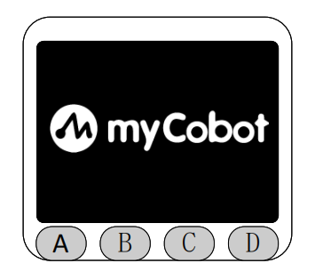

Then it will enter the main interface, which by default displays the joint information and static IP information of the current robotic arm.

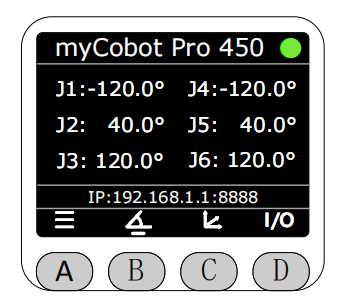

Pressing the A button will enter the menu interface. Use the icons at the bottom of the screen to select specific functions. **Note that if there is no operation on this interface for 30 seconds, it will automatically redirect back to the main interface.**

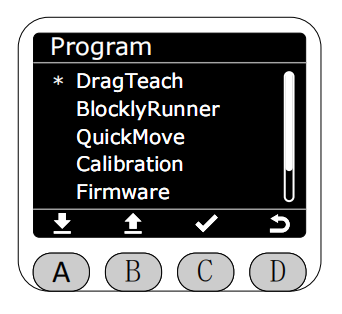

You can switch between displaying different robotic arm information using the buttons at the bottom of the screen. Pressing the C button displays the robotic arm's current coordinates and static IP information.

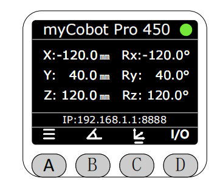

Pressing the D button displays the current input/output status of the M8 interface at the end. No small dot indicates a low level, and a white dot indicates a high level.

**Note that MiniRobot, myStudio Pro, and the Python interface have mutually exclusive control over the robotic arm's motion. Only one interface can control the robotic arm at a time. If MiniRobot enters the control interface, myStudio Pro or the Python interface will not be able to control the robotic arm, and vice versa.**

Entering the control interface is indicated by the following:

1. Dragging the teaching interface and its subpages.

2. The BlocklyRunner interface and its subpages.

3. Quick Movement Interface and its sub-interfaces.

4. Zero-position Calibration Interface and its sub-interfaces.

5. Settings interface and its sub-interfaces.

When another interface is controlling the robotic arm, a pop-up will appear on the screen with the message "Other ports are under control...", which will automatically close after three seconds.

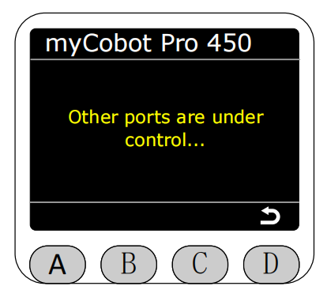

At this point, when entering the menu page, only "Firmware" and "Connection" can be accessed, while other options are grayed out and unavailable.

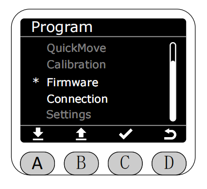

**When the emergency stop button is pressed, a pop-up will appear asking if power needs to be reapplied. Note: You need to release the emergency stop before selecting power-on, otherwise power-on will fail.**

Emergency stop pressed pop-up prompt, press the C key to perform power-on operation.

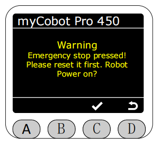

Power-on process pop-up prompt.

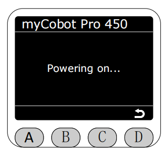

Power-on completion pop-up prompt.

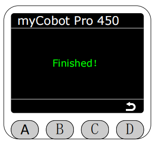

Power-on failure pop-up prompt.

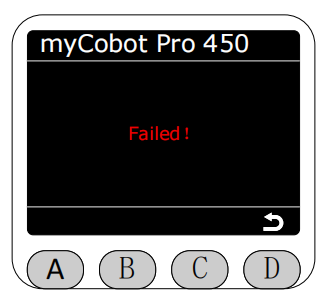

Power-on timeout with no response prompts error code "4-01-0".

**In the robotic arm power-off state, any button operation will prompt to power on first before operating the robotic arm. Note: You need to release the emergency stop before selecting power-on, otherwise power-on will fail.**

Power-off state, press any button to prompt a pop-up, press the C key to perform power-on operation (power-on process prompts are the same as above).

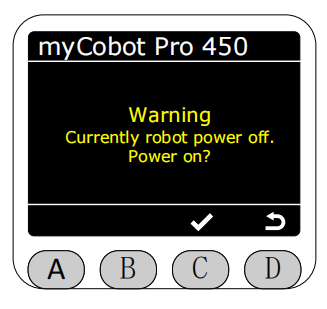

[← Previous Chapter](../5.1-SystemInstructions.md) | [Next Page →](./5.2.2-dragteach.md)