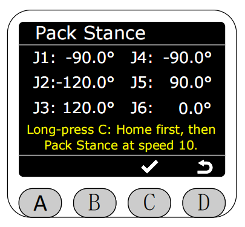
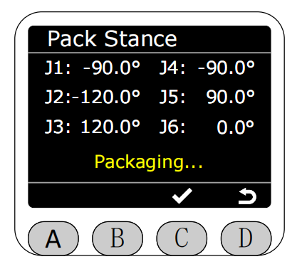
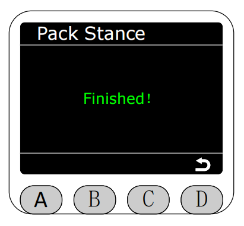
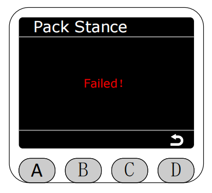
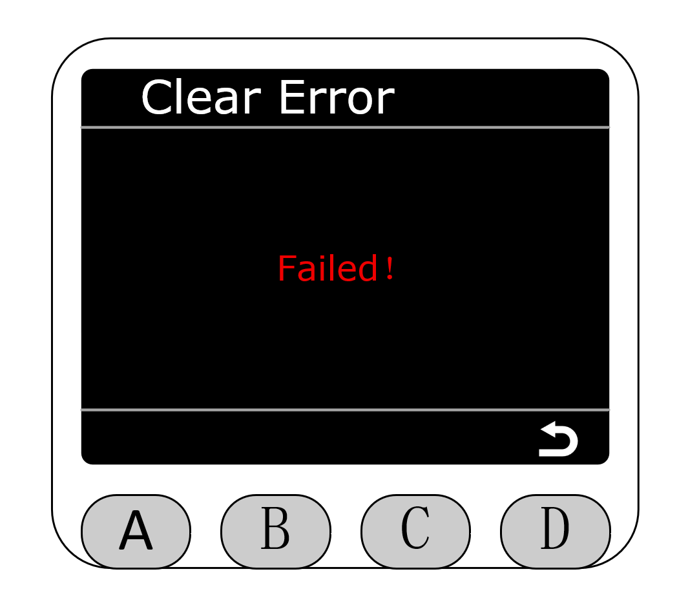

# Settings

Select the Settings function with the asterisk on the Program interface and press the C key to enter the Settings function.

After entering the Settings function, you can select Pack Stance or Clear Error.

In Pack Stance mode, the angle data of the robotic arm is displayed in real-time. Press and hold the C key to start packing (it will first return to zero and then execute the packing angle). **The robotic arm will move at this time, please be careful!**

After pressing and holding the C key, the yellow text at the bottom of the screen changes to "Packing...", indicating that it is packing, and you can release the key.

Packing completion will display green text prompt "Finished!", and return to the settings page automatically after three seconds.

Packing failure will display red text prompt "Failed!", and return to the settings page automatically after three seconds.

Enter the Clear Error page. If the robotic arm is not in joint limit or singularity limit, it will prompt "No Errors."

If any joint is outside the limit, it will prompt that it is in limit, and you can press the C key to return to zero to clear the limit error.

The white text prompts "Backing..." during the return to zero process.

Return to zero completion green text prompts "Finished!", and return to the settings page automatically after three seconds.

If the machine is in a singular point, it will prompt that it is in singularity, and you can press the C key to clear the singularity error.

Clear singularity completion green text prompts "Finished!", and return to the settings page automatically after three seconds.

Clear singularity failure will display red text prompt "Failed!", and return to the settings page automatically after three seconds.

[← Previous Page](./5.2.7-connection.md) |[Next Page →](./5.2.9-Q&A.md)