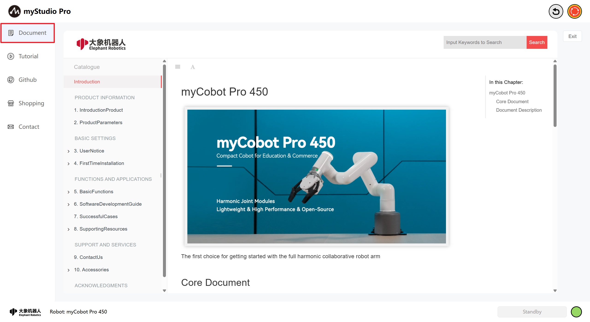
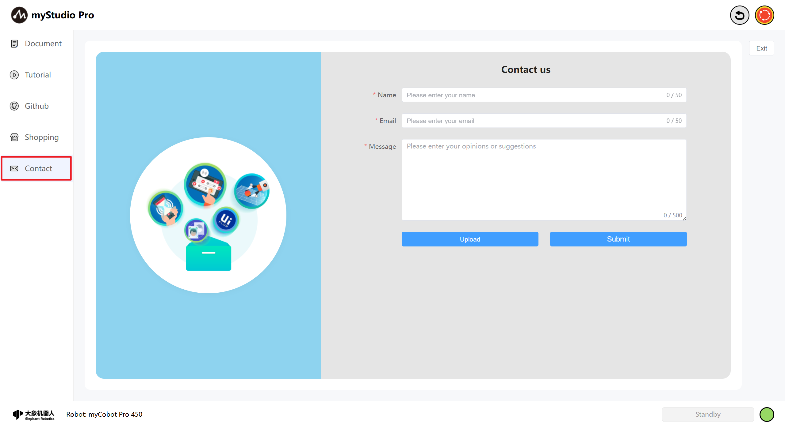
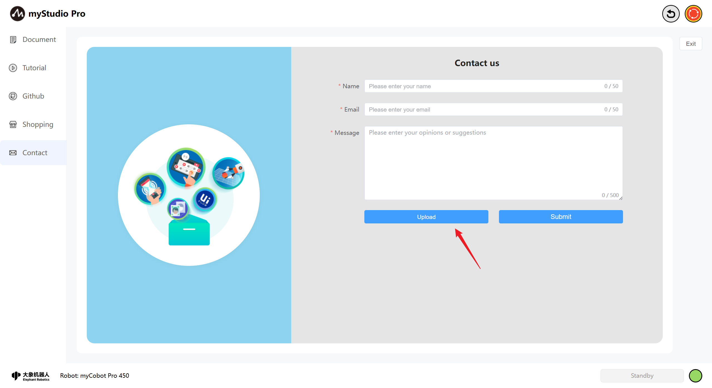
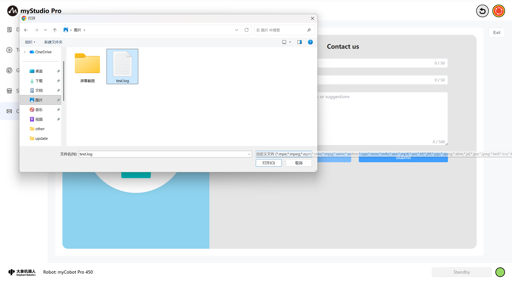
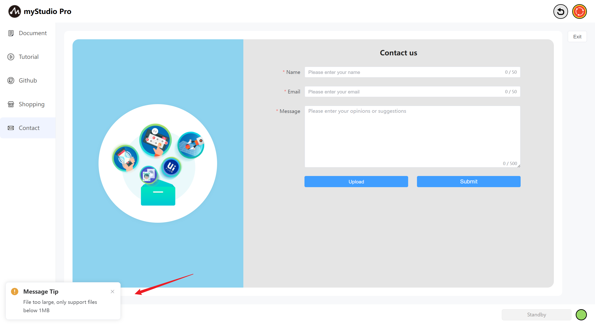
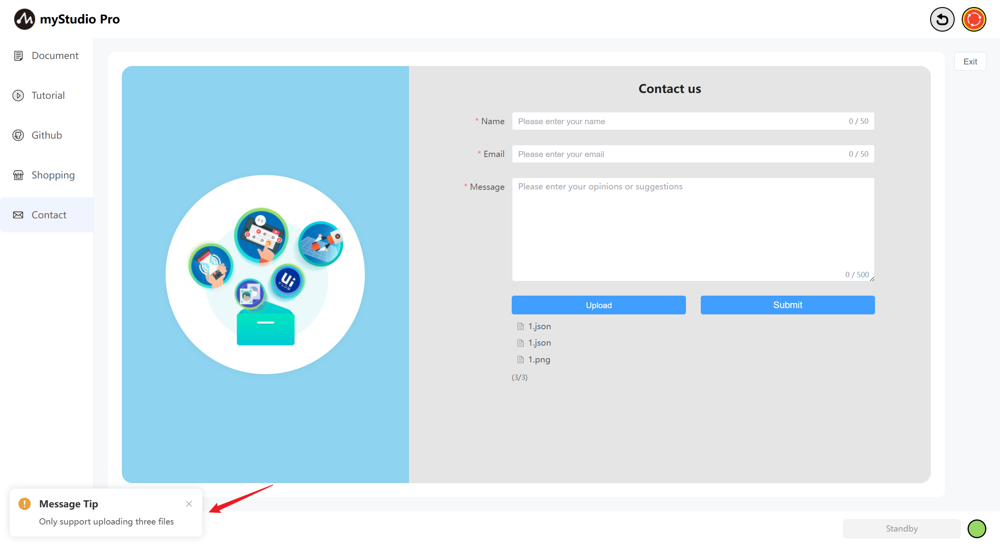
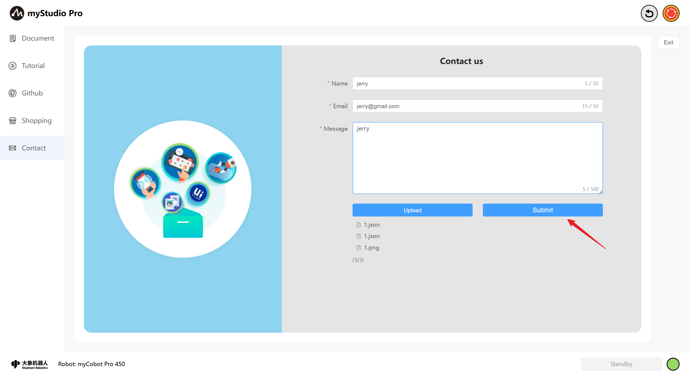

# Resource Link

## 1 Interface Introduction

The homepage is shown below:

The myCobot Pro 450 supports remote upgrades and flashing of the latest versions of the main controller, terminal, and screen firmware. The machine defaults to using the latest firmware version. If a new firmware version is released, myStudio Pro will automatically download the latest firmware information as long as a stable network connection is maintained while using it.

## 2 Document

This function is a webpage redirection link. Clicking it will open the product's Gitbook page in your current browser.

## 3 Tutorial

This function is a webpage redirection link. Clicking it will open the official video tutorial in your current browser. The English version will redirect to YouTube, and the Chinese version will redirect to Bilibili, with the corresponding links accessed in an embedded manner.

## 4 Github

This function is a webpage redirection link. Clicking it will open the official Github page in your current browser.

## 5 Shopping

This function is a webpage redirection link. Clicking it will open the purchase page for the corresponding product in your current browser. The Chinese version will redirect to Taobao, and the English version will redirect to Shopify, with the corresponding links accessed in an embedded manner.

## 6 Contact

If you have any questions or ideas, you can contact us here.

Function Introduction:

#### Name

You can enter your nickname here.

> This is a required field. If you submit without filling it in, you will receive a message indicating that you are not there.

#### Email

You can enter your email address here.

> This is a required field. You can enter your email address here so that our staff can reply to you. If you submit without filling it in, you will receive a message indicating that you are not there.

#### Message

Enter your comments here.

> This is a required field. Enter your questions or thoughts here. If you submit without filling it out, you will receive a prompt.

#### Upload

> Click this button to upload files. You can upload a maximum of 3 files, and each file must not exceed 1MB.

> After clicking, a pop-up window will appear allowing you to select files.

> If the file you select exceeds 1MB, clicking "**Open**" will fail, and a pop-up window will warn you that the file is too large.

> When you are uploading more than three files, a pop-up window will warn you.

> Note: Only .log, .json, video, and image files are supported for uploading.

#### Submit

> Click the `Submit` button to submit all information. This step may take a long time, please be patient.

[← Previous Chapter](./5.3.3-quickmove.md) | [Next Chapter →](./5.3.5-setting.md)