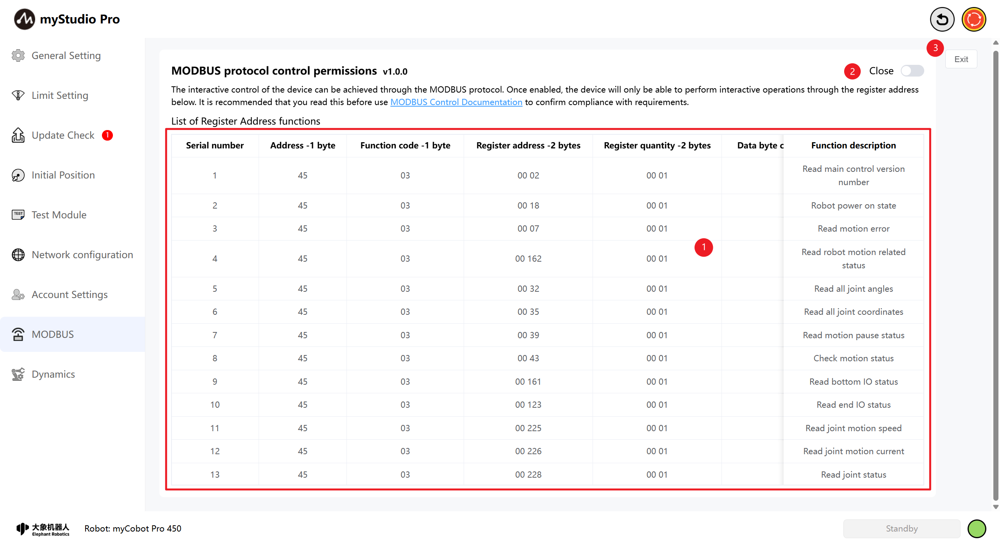
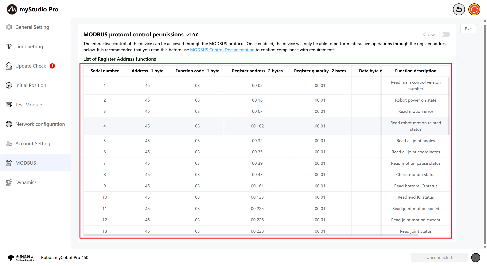
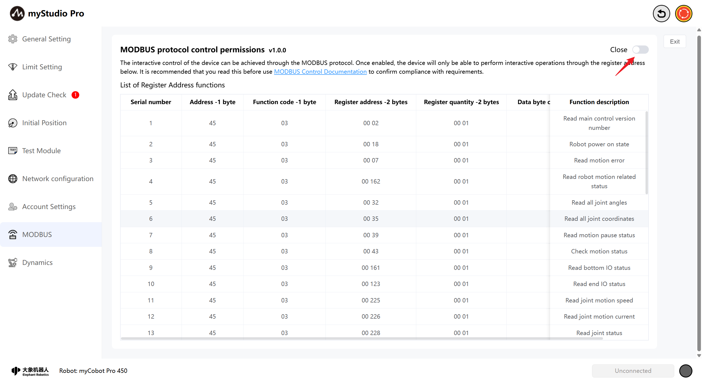
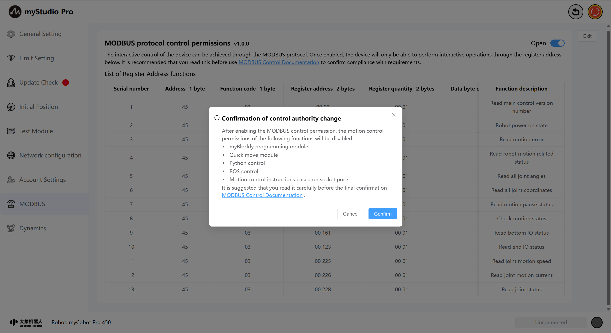
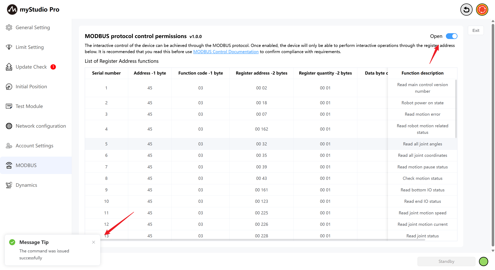
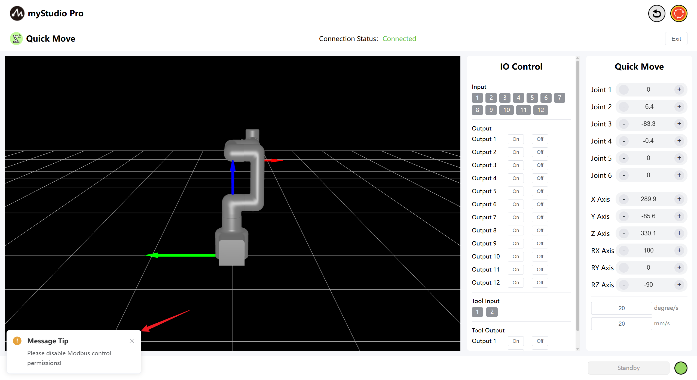
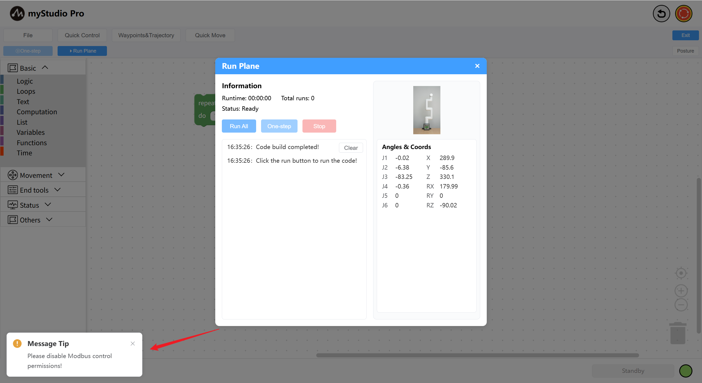
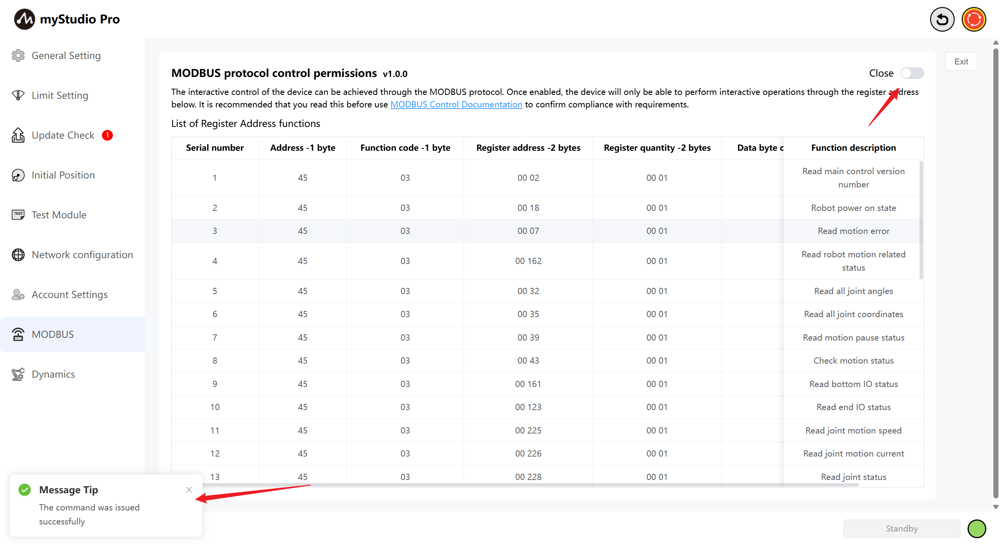
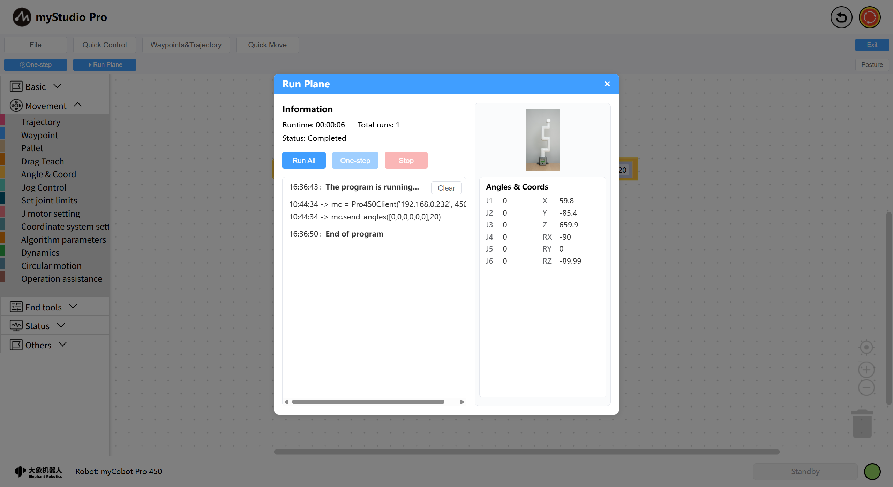

# MODBUS

*Before Starting*

> *1. Ensure the machine is powered on*

> *2. Ensure the machine connection and communication are normal*

> *3. Ensure the machine is in zero position*

> *4. The machine server is running*

## 1. Interface Introduction

| Serial Number | Explanation |
| ------ | ------------------------------------------------------ |
| 1 | A comprehensive list of Modbus register address functions, including Modbus read and write protocols. |
| 2 | The Modbus control permission switch button allows for the on/off control of Modbus permissions through this button. |
| 3 | Exit Settings. |

## 2. Register Address Function List

The table presents the reading and writing protocols of Modbus, including address, function code, register and function description, etc. By previewing this function table, you can use the Modbus protocol.

## 3. Authorization Control

On this page, you can switch the control permissions for Modbus. When you need to enable Modbus control, a confirmation pop-up window for control permission change will be displayed. In this pop-up window, the motion control permissions that will be disabled when enabling Modbus will be shown.

When you click the `Confirm` button at the bottom right of the pop-up window, the Modbus control will be truly activated. Once the Modbus permission is successfully enabled, a message will appear on the page, and the switch at the top right will change to the `Open` position.

When Modbus permission is enabled, the motion control permission of myStudio Pro will be disabled, including functions such as myBlockly programming and rapid movement. Limit position settings, parameter modifications, packaging of postures, emergency stop, etc. will not be affected. When the system detects that Modbus is in the enabled state and attempts to perform motion control operations, a prompt message will be displayed at the bottom left of the control device's interface.

At this point, if you want to restore the motion control function of myStudio Pro, simply turn off the Modbus control and the motion control will be restored.

Control status of the rapid movement module:

My Blockly programming control status:

At this point, if you want to restore the motion control function of myStudio Pro, simply turn off the Modbus control and the motion control will be restored.

[← Previous Chapter](./5.3.5-setting.md) | [Next Chapter →](./5.3.7-Q&A.md)