# Pro450 System Image Burning Instructions

**Note:** After the system image is burned, each joint of the robotic arm needs to be **recalibrated at its zero position** before it can be used normally.

This section will guide you on how to use a burning tool on your PC to correctly burn the system image to the Pro450 controller. Please follow the steps strictly to ensure a safe and successful burning process.

## 1 Preparation

Before starting the flashing process, please ensure the following hardware and software are ready:

### Hardware Requirements

- One Windows PC

- Dual-ended USB data cable

- Pro450 robotic arm

- Stable power supply (ensure the device is powered on)

- Emergency stop switch

- Network cable (for connecting the robotic arm to the PC)

### Software Requirements

- Official system image file

- Flashing tool (e.g., RKDevTool_Release_v3.15, subject to availability)

- Corresponding USB driver (usually a USB-to-serial driver for the device)

>> 🔔 Tip: It is recommended to place all tools in the same folder and avoid Chinese characters or spaces in the path.

### Network Configuration

- MyCobot Pro 450 Default IP Address: `192.168.0.232`

- Default Port Number: `4500`

- **Note:** The PC's network card IP address needs to be set to the **same subnet** (e.g., `192.168.0.xxx`, where `xxx` is any number between 2 and 254, and it cannot conflict with the robotic arm).

- Example:

- Robotic Arm IP: `192.168.0.232`

- PC IP: `192.168.0.100`

- Subnet Mask: `255.255.255.0`

- **Verification**: After completing the network configuration, you can execute the following command in the PC terminal. If it successfully returns data packets, the network connection is normal:

  ``bash
  ping 192.168.0.232
  ```

## 2 System Image Download

Click to download the image:[myCobot_Pro_450_buildroot_20251110.img](http://192.168.1.20/18-OS-img/myCobot%20Pro%20450/myCobot_Pro_450_buildroot_20251110.img)

## 3 Install USB Driver

- Click to download the driver:[DriverAssitant_v5.12.zip](https://download.elephantrobotics.com/software/MyCobot%20Pro%20450/DriverAssitant_v5.12.zip)

- After downloading the driver, extract and open the provided `DriverAssitant_v5.12` folder.

- Double-click `DriverInstall.exe` to install.

<video id="my-video" class="video-js" controls preload="auto" width="100%"
poster="" data-setup='{"aspectRatio":"16:9"}'>

<source src="../../resources/3-FunctionsAndApplications/5-BasicApplication/5.9-system_flash/system_driver.mp4"></video>

## 4 Install the burning tool

- Click to download the burning tool:[RKDevTool_Release_v3.15.zip](https://download.elephantrobotics.com/software/MyCobot%20Pro%20450/RKDevTool_Release_v3.15.zip)

- After downloading the driver, extract and open the provided folder `RKDevTool_Release_v3.15/RKDevTool_v3.15_for_window`.

- Double-click `RKDevTool.exe` to run it.

<video id="my-video" class="video-js" controls preload="auto" width="100%"
poster="" data-setup='{"aspectRatio":"16:9"}'>

<source src="../../resources/3-FunctionsAndApplications/5-BasicApplication/5.9-system_flash/system_flash_tool.mp4"></video>

## 5 Connecting the Pro450 Device

- Connect the device to your PC using a double-ended USB cable.

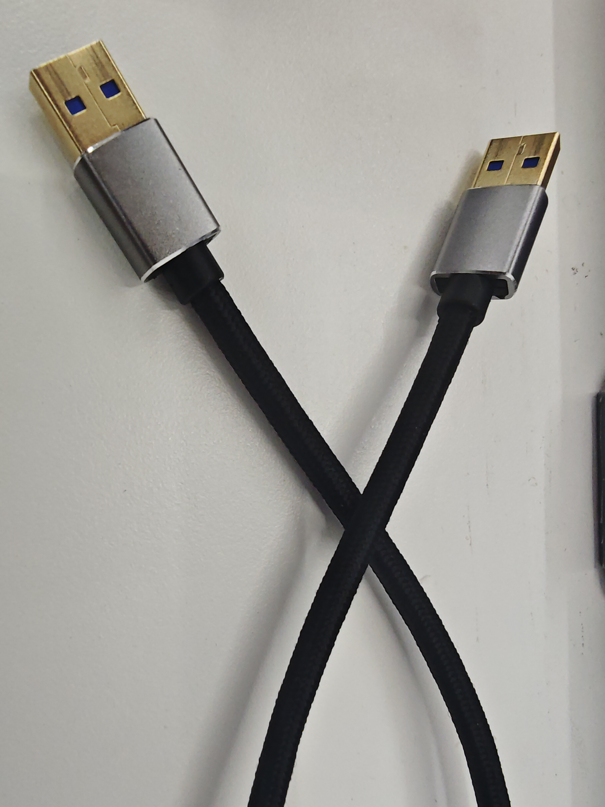

- Connect one end of the double-ended USB cable to your computer and the other end to the USB1 port (the USB port on top) on the Pro450's dock.

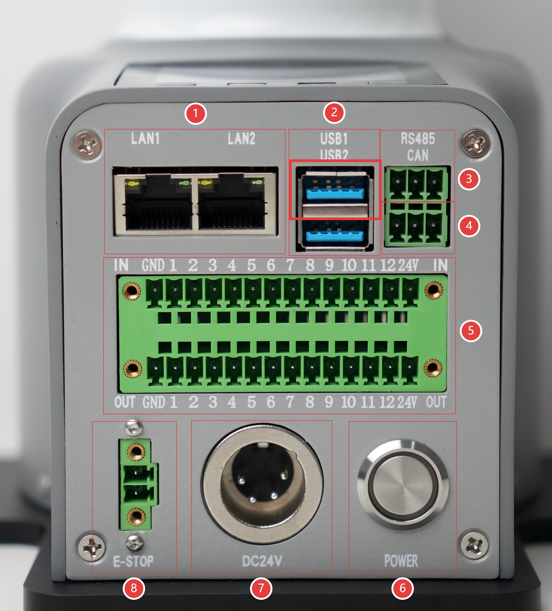

- Ensure the Pro450 is powered on and connected to your computer using an Ethernet cable.

- Remotely SSH into the Pro450 system from your PC to execute the flashing command.

## 6 SSH Remote Connection

Use the `Win + R` shortcut to open the `cmd` command prompt and enter the following command:

`ssh-keygen -R 192.168.0.232`

`ssh root@192.168.0.232`


Follow the prompts to enter `yes`, then enter the login password `root`.

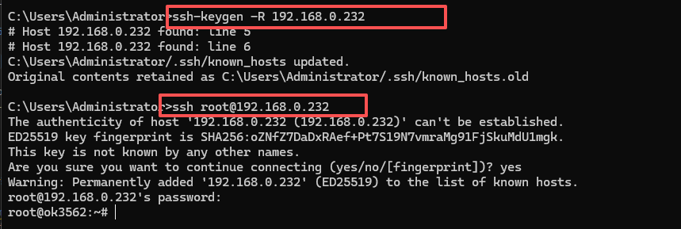

## 7. Start the System Flashing Function

After logging in via SSH, enter the following command to start the system flashing function:

`reboot loader`

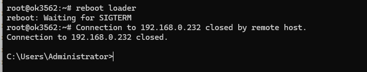

## 8 Start the flashing tool

After starting the system flashing function in **Step 7**, opening the flashing tool will display the following image:

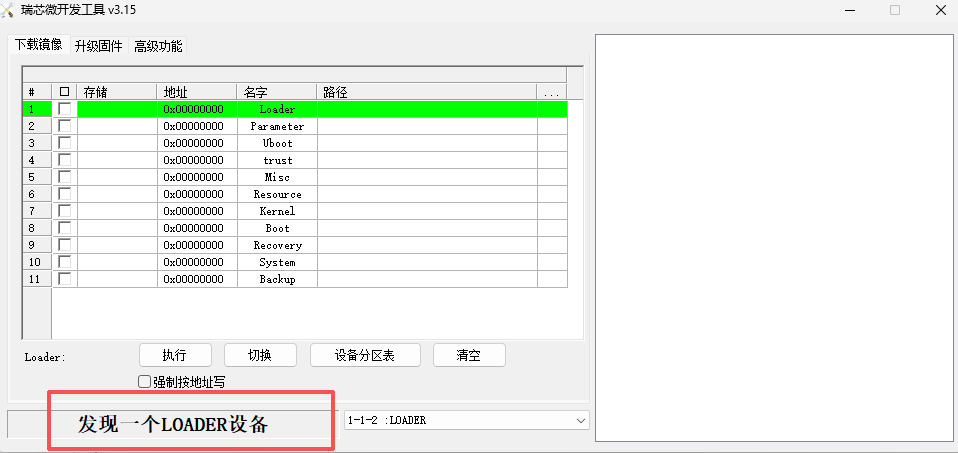

- Click the `Upgrade Firmware` button

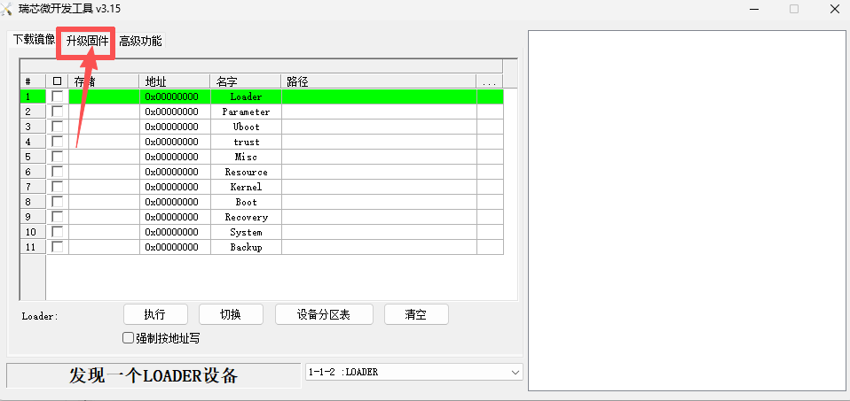

- Click the `Firmware` button to open File Explorer, select the system image file to be flashed, and then click `Open`.

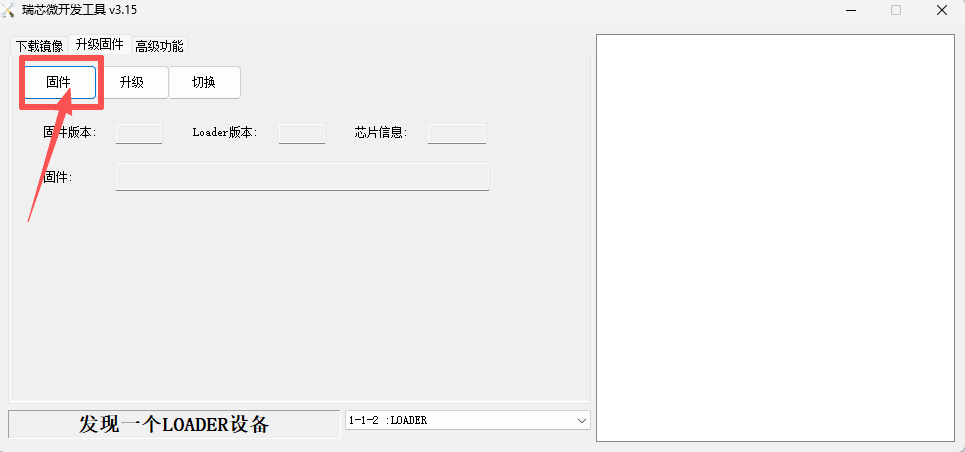

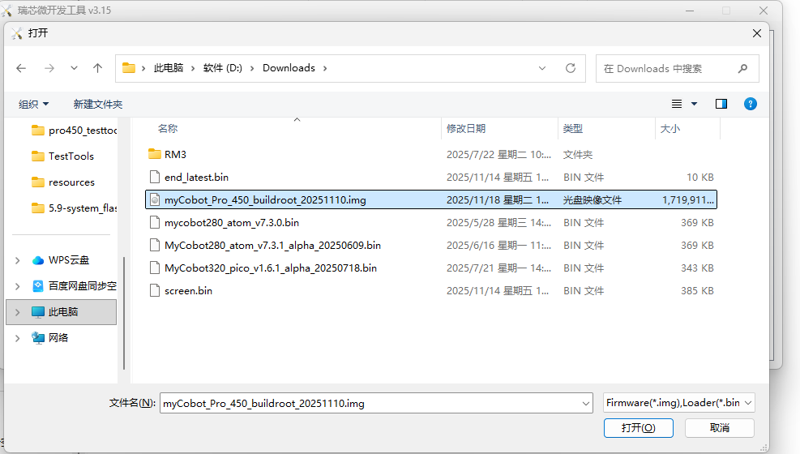

- After selecting the image file, click the `Upgrade` button.

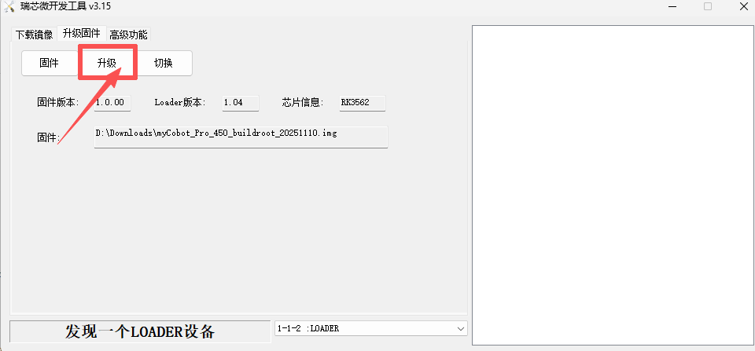

- After the system image is successfully burned, a prompt message will appear on the right side of the burning tool:

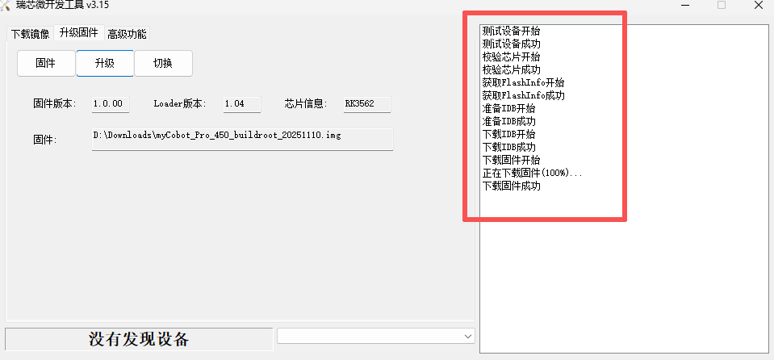

## 9 Verify System Image Burning

After burning the system image, reconnect to the robotic arm system remotely using SSH and enter the following command to check the system version number:

`cat /etc/version`

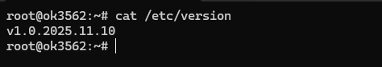

The system image file name is associated with the system version number. If the output version number matches the date name of the image file, it means the system image was successfully burned.

**Note:** After the system image is burned, each joint of the robotic arm needs to be **recalibrated at its zero position** before it can be used normally.