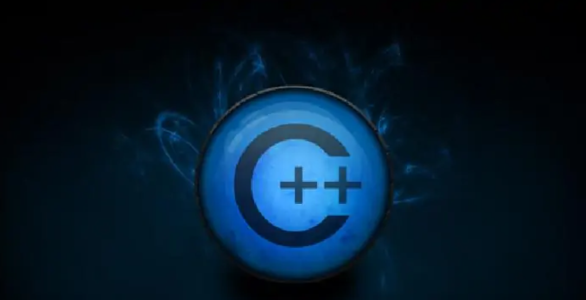

# C++ (RobotDriver / MyCobotPro450)

**Using C++ with our RobotDriver project** (`RobotArm`, etc.), you can perform secondary development on **Linux**, including joint control, coordinate control, and TCP communication with the controller. It applies to **MyCobotPro450**. For capabilities such as gripper and base/tool IO, refer to Python or other clients where applicable.

## What Is C++?

C++ is an extension of C. It supports procedural programming in C style, object-based programming centered on abstract data types, and object-oriented programming with inheritance and polymorphism. 
While C++ is strong at object-oriented programming, it also supports procedural programming, so it can handle projects of different sizes. 
C++ provides both practical high-performance runtime characteristics and stronger language capabilities for large-scale software quality and problem modeling.

**Applicable Device:**

- MyCobotPro450

## Development

### Recommended Environment (Aligned with This Project)

**Ubuntu 20.04 LTS (64-bit)**, **CMake ≥ 3.16**, **gcc/g++ 9.x**, **C++17**. See [Environment Setup](./6.4.1-download.md) for details.

### Compiler

Any **C++17**-capable toolchain is supported, such as **GCC** and **Clang** (recommended versions are listed in [Environment Setup](./6.4.1-download.md)).

## C++ Development Guide (RobotDriver)

You can follow the **6.4.x** documents below, in order, to develop for **MyCobotPro450** with **RobotDriver**:

1. [Environment Setup](./6.4.1-download.md)

2. [Build and Run](./6.4.2-build.md)

3. [Joint Control](./6.4.3-angle.md)

4. [Coordinate Control](./6.4.4-coord.md)

5. [IO Control](./6.4.5-io.md)

6. [Gripper Control](./6.4.6-gripper.md)

7. [API Reference](./6.4.7-API.md)

8. [Examples](./6.4.8-example.md)

---

[← Previous](../6.2-ROS2/6.2.4-Moveit2/README.md) | [Next →](./6.4.1-download.md)
