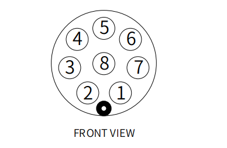

# 机器人参数说明

> 第一章中，我们探讨了产品的卖点及其设计理念，为您提供了对产品高层次理解的全景视角。现在，让我们进入第二章——机器人参数说明。这一章节将是您理解产品技术细节的关键。详细了解这些技术参数，不仅可以帮助您充分认识到我们产品的先进性和实用性，而且还能够确保您能够更有效地利用这些技术来满足您的具体需求。

## 1. 机器人规格参数

| 指标       | 参数 |
| :-----------: | :---------: |
| 名称         | 全谐波协作机械臂 |
| 型号         | myCobot Pro 450 |
| 自由度       | 6          |
| 有效负载     | 1 Kg       |
| 工作半径     | 450mm      |
| 重复定位精度 | ±0.1mm  |
| 重量         | <5Kg       |
| 电源输入     | 24V，9.2A       |
| 工作温度     | 0-45℃     |
| 通信         | TCP/IP-Socket MODBUS Ethernet IP    |

---

## 2. 结构尺寸参数
> ！本章以毫米为距离单位，以度为角度单位。

### 2.1 产品尺寸和工作空间
<!--  -->

### 2.2 关节运动范围
**硬件关节运动范围**

| 关节       | 范围 |
| :--------: | :----------:|
| J1        | -360 ~ +360     |
| J2        | -135 ~ +135      |
| J3  | -135 ~ +135                   |
| J4        | -150 ~ +150 |
| J5   | -360 ~ +360                   |
| J6   | -360 ~ +360         |

**软件关节运动范围**

| 关节       | 范围 |
| :--------: | :----------:|
| J1        | -165 ~ +165     |
| J2        | -120 ~ +120      |
| J3  | -158 ~ +158                   |
| J4        | -165 ~ +165 |
| J5   | -165 ~ +165                   |
| J6   | -175 ~ +175         |
### 2.3 孔位安装
- 机器人底座安装法兰，底座同时兼容乐高科技件安装方式和M4螺丝安装方式。

- 机器人末端安装法兰，机械臂末端同时兼容乐高科技件孔与螺丝螺纹孔。

## 3. 电气特性参数

### 3.1 机械臂底座电气接口
#### 3.1.1 底座介绍

* 底座正面图：

  

  - ① RJ45：双网口，用于设备联网或连接其他网络设备。
  - ② USB3：高速USB接口，连接电脑或外围设备。
  - ③ RS485：工业串口通信，连接PLC、传感器等。
  - ④ CAN：CAN总线通信，连接驱动器、I/O模块等。
  - ⑤ 功能IO：数字信号输入/输出。
  - ⑥ 电源开关：按下锁定为开机，再次按下释放为关机。
  - ⑦ 24V电源：连接电源适配器。 
  - ⑧ 急停接口：连接外部急停按钮，紧急情况下切断电源，保障安全。

#### 3.1.2 底座接口说明

* 每个接口的定义如下表所示:

| 标签 | 信号名 | 类型 | 功能 |
| :---: | :----: | :--: | :------: |
| 2     | 1-12 | I/O |  24V |   |    

### 3.2 机械臂末端电气接口
#### 3.2.1 机械臂末端介绍

* 机械臂末端侧视图

  

| 编号 | 接口    | 定义 | 功能         | 
|:------:|:----------------:|:-----------:|:-------------------:|
| 12     | M8航空插座 | 末端工具IO接口 |  24V/2A输出，支持短路、反接、雷击、过流、过压保护 |  
|        | M8航空插座 | RS485接口      | 支持配置波特率9600、115200                       |

#### 3.2.2 机械臂末端接口说明

* 每个接口的定义如下表所示:

各个工具I/O端口的定义如下表所示，注意的是，工具I/O是输出是PNP类型，输入为NPN类型。接线方式同底部输出接口一致。

| 编号 | 信号 | 解释             | 配套M8线颜色 |
| :------: | :------: | :-----------------------: | :--------------------------: |
| 1      | GND    | DC24V 负极      | 白                      |
| 2      | OUT1   | 工具输出接口1 | 褐                      |
| 3      | OUT2   | 工具输出接口2 | 绿                      |
| 4      | 485A   |  485标准接口A  | 黄                     |
| 5      | 24V    | DC24V 正极         | 灰                        |
| 6      | IN1    | 工具输入接口1  | 粉                       |
| 7      | IN2    | 具输入接口2             | 蓝                      |
| 8      | 485B   |  485标准接口B | 紫                    |

## 4. 笛卡尔坐标参数

---

[← 上一章](../1-ProductIntroduction/1-ProductIntroduction.md) | [下一章 →](../../2-BasicSettings/3-UserNotes/README.md)
