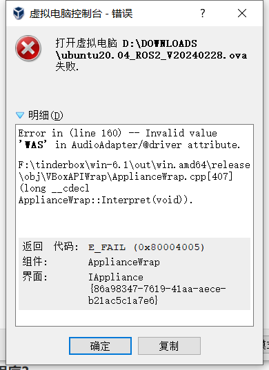

# 软件问题

## 1. mystudio相关

**Q：关于mystudio下载固件的细节**

1. 一般情况下，出厂已经内置固件，除非在机器异常情况，否则无需重新刷固件
2. 下载固件的过程中需要连接网络
3. 选择对应机型的固件，不要选错其他机型

## 2. Python相关

**Q：运行提示缺少库文件Q:遇到报错信息：ModuleNotFoundError: No module named “pymycobot”，如何处理？**

- A1：没有安装pymycobot，对应的解决方法是重新安装pymycobot，指令是`pip3 install pymycobot --upgrade --user`

- A2: 在安装python的过程中没有勾选下图的“Add Pythonxx to PATH”，需要卸载python后重新安装python，并将此选项勾选。
  
- 
  
- A3: 建议使用3.9版本的pyhton，pyhton12会出现不兼容的情况。

**Q：send_coords(coords, speed, mode)中的mode有没有通俗一点的解释？**

- A：线性1代表机械臂末端以直线的方式抵达目标位置，如果因为限位、结构等原因无法走直线，那指令就不会完全执行；
线性0表示末端以任意姿态抵达目标位置，由于没有直线的限制，不容易出现指令不执行的现象。

**Q：set_fresh_mode(mode) 的插补和刷新模式有什么区别？**

- A: 插补0是指起始点和终止点之间规划了很多密集的点位，从而达到控制中间段轨迹的效果。
如何达到程序并行的效果：非插补1就是没有中间段的规划，控制不了轨迹，但是运动会相对平滑。

**Q：在仅改变Z轴的情况下，轨迹不是直上直下的，但是最后落点是只改了Z轴，这个正常吗，如何确保中间轨迹也是直线？**


- 开插补走直线就能确保轨迹了
  ```python
  set_fresh_mode(0) # 开插补
  send_coords(coords, speed, mode=1) # 走直线
  ```

注意一定要开插补之后，在send_coords设置的智能规划路线才有用。
插补是指起始点和终止点之间规划了很多密集的点位，从而达到控制中间段轨迹的效果。
非插补就是没有中间段的规划，控制不了轨迹。

**Q:识别到的目标位置，末端无法到达，怎么判断这个坐标是否可以到达然后处理？**

- A：solve inv kinematics(target coords, current_angles)用这个接口看是否有解就可以了。
  solve_inv_kinematics(target_coords, current_angles)
  - 功能 : 将坐标转为角度。
  - 参数：
    - target_coords: list 所有坐标的浮点列表。
    - current_angles: list 所有角度的浮点列表，机械臂当前角度
  - 返回值: list 所有角度的浮点列表。

## 3. ROS相关

**Q：有没有配置好环境的虚拟机镜像？**

- A：我们有提供一个配置好ROS2环境且内置ROS源码的虚拟机环境，用户可以通过下面这个链接下载，并将虚拟机文件导入VirtualBox，省去自己配置环境的麻烦，当测试ROS案例时建议使用我们已经配置好的虚拟机环境进行验证，避免由于环境配置的原因导致的一些案例运行报错
请参考虚拟机文件导入虚拟机软件的操作步骤视频：https://drive.google.com/file/d/1KeYk_CUgDE46rVn7zbd0EhraIbgt3qZt/view?usp=sharing

  [ROS2虚拟机文件下载](https://download-elephantrobotics.oss-cn-shenzhen.aliyuncs.com/system_images/ubuntu20.04_ROS2_V20240228.zip)

  [虚拟机软件VirtualBox下载](https://www.virtualbox.org/wiki/Downloads)

**Q：导入ROS2虚拟机文件的时候报错怎么处理？**



- A: 这是因为虚拟机软件Oracle VM VirtualBox版本过低导致的，需更新虚拟机软件版本。

**Q：如何重新下载ROS源码包？**

- A：使用指令拉取：
  
  ```bash
  git clone https://github.com/elephantrobotics/mycobot_ros2.git
  ```

  或着手动下载，下载方法进入到ROS源码包地址按照下图进行操作，源码包地址：https://github.com/elephantrobotics/mycobot_ros2

  


**Q: 运行ROS moveit案例发现报错ImprotError：No module named yaml咋办？**


- A：在这个脚本开头第一行，把Python解释器改为python3

**Q：运行虚拟机找不到串口怎么处理？**

- A:使用USB线将M5机械臂与PC连接，打开虚拟机设置→USB设备→添加USB设备→选择串口号QinHeng xxxxx，这个就是机器的串口设备。
如果没有这个设备号，可以通过重新拔插设备获取对应的USB设备号，拔插有串口变化的即对应的机器串口设备号

  

**Q：终端切换到~/catkin_ws/src中使用git安装并更新mycobot_ros时，出现目标路径"mycobot_ros2"已经存在，原因是什么？**
- A：说明`~/catkin_ws/src`中已经存在一个`mycobot_ros2`程序包，需要提前将其删掉，再重新执行git操作即可。

**Q：rosrun运行时，终端报错显示`counld not open port /dev/ttyUSB0：Permission: '/dev/ttyUSB0'`，是为什么？**

- A：串口权限不够，终端输入`sudo chmod 777 /dev/ttyUSB0`赋予权限。

**Q：rosrun运行时，终端提示`Unable to register with master node [http://localhost:11311]: master may not be running yet. Will keep trying`的原因是？**

- A：运行ros程序前，需开启ros节点，终端输入`roscore`。

**Q：rosrun运行时，终端报错显示`counld not open port /dev/ttyUSB0：No such file or directory: '/dev/ttyUSB1'`，是为什么？**

- A：串口有误。需确认当前机械臂的实际串口。可通过`ls /dev/tty*`查看。

**Q：刚克隆下来的mycobot_ros2程序包，然后直接运行rosrun程序，出现`package 'mycobot_pro_450' not found`的错误或者找不到该文件之类的错误？**

- A：刚克隆下来的mycobot_ros2需要构建代码进行ros环境编译。终端输入
  
```bash
cd ~/catkin_ws/
catkin_make
source devel/setup.bash
```

**Q：编译完成后，新开终端运行launch指令时，为什么会出现下面的错误？**

   


 - A1：系统没有添加ros环境变量，所以每次开启新终端都要source：

```bash
cd ~/catkin_ws/
source devel/setup.bash
```

- A2：系统添加ros环境变量，每次开启新终端后无需执行source：

```bash
# noetic为Ubuntu20.04系统
echo "source /opt/ros/noetic/setup.bash" >> ~/.bashrc
source ~/.bashrc
```

- A3：可能是指令中的文件名与实际中mycobot_ros2包里面的文件名不一致，请仔细检查指令是否有误。

## 4 C++相关

**Q：找不到各种dll文件怎么处理？**

- A1：如果myCobotCpp.dll缺失，将之前放到lib目录下的myCobotCpp.dl放到mycobotcppexample.exe所在目录下.
- A2: 如果报缺少QT5Core.dll，打开qt command (菜单栏搜索QT) ，选择msvc2017 64-bit，执行windeployqt--release myCobotCppExample.exe所在目录(如: windeployqt --release D:lvs2019myCobotCpploutlbuildlx64-Releaselbin) 此处执行命令后如果报找不到vs安装路径，请检查vs环境变量的设置.

以上步骤执行后，如果报缺少qt5serialport.dll文件，将gt安装目录处的此文件(路径如: D:lgt5.12.1015.12.10msvc2017 64bin)，拷贝到myCobotCppExample.exe所在目录

**Q：生成myCobotCppExample.exe可执行文件，这个有可能是什么问题？**

选择下图中的启动


---

[← 上一章](./3.4-FAQs.md) | [下一章 →](./3.4.2-hardware.md)