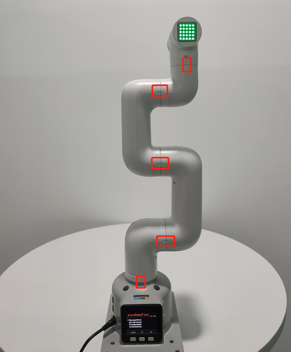

# 硬件问题

**Q：机械臂上电锁不住如何解决？**

1. 检查是否有接上原装电源适配器，或者适配器是否接触良好，可以尝试重新拔插电源适配器

2. 检查关节在断电状态，能否正常转动，会不会出现阻力过大或者过小的情况，初步判断是否内部结构物理断裂，无物理断裂则接着往下检查.

**Q：按下急停后，释放急停锁不住了，怎么让机械臂再次锁住？**

需要给机器重新上电，例如以myblockly给机器上电

**Q: 关节抖动、关节角度偏差过大或关节无力下坠如何优化？**

1. 参考机器人参数介绍章节，检查实际负载是否在机械臂有效负载范围内，负载过大会导致关节抖动，可适当减轻实际关节的负载

2. 将运动模式更改成刷新模式，这样会机械臂的运行轨迹会相对平滑，具体的API，请参考
set_fresh_mode(1)

3. 查看以下链接内容调整pid：https://drive.google.com/file/d/1UWhaaSTuwLFImuEGY1J2tvgxTQDwWxK_/view?usp=sharing
4. 查看gitbook第5章节，对机械臂进行零位校准，也可参考下面链接的校准步骤：https://drive.google.com/file/d/1XtKH-ykKWPH0q9Z_YHwzkgwNKRhstHhi/view?usp=sharing
5. 使用时间较长的机器(3个月以上)可能会出现关节老化产生关节间隙的情况，可按照以下视频，手动掰动关节，查看是否存在关节虚位：https://drive.google.com/file/d/1tXDUALmfw1z0u6lM9uH5hOHivjbRoWxW/view?usp=sharing
6. 如果存在关节老化虚位问题，这种抖动则属于机器自然老化无法避免。

**Q: 什么是关节零位点？**

以下图为例，关节与关节外壳边缘之前会设计有一个拱形槽，这个就是关节零位点

一般校准后零点姿态如下：

**Q：有没有零位校准的方法？**

请参考gitbook第5章节或者下面这个链接：

https://drive.google.com/file/d/1XtKH-ykKWPH0q9Z_YHwzkgwNKRhstHhi/view?usp=sharing

**Q: myCobot的关节的限位？**
- A: 一轴和五轴有限位，一轴顺时针约165°左右，逆时针165°左右。五轴可时针、逆时针可转动约165°

**注意：转动机械臂时应小角度、轻轻地转动，到达限位后就不可用力继续转动。**

**Q：不同版本的机械臂支持什么通信接口？**

- A：基于微处理器的机械臂支持socket通信TCP；基于微控制器的机械臂可以USB转串口通信。

---

[← 上一章](./3.4.1-software.md) | [下一章 →](./3.4.3-other.md)