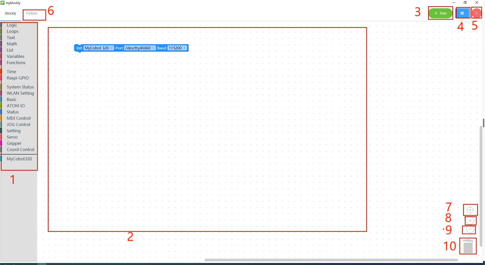
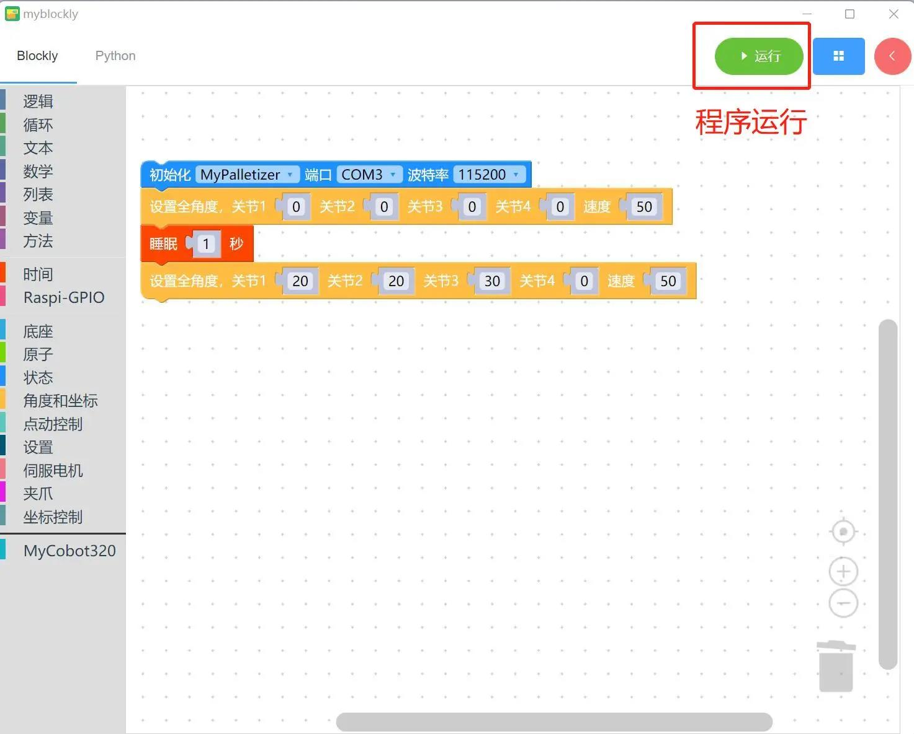

# myBlockly 界面的显示和基本功能的使用

| 编号 | 图解说明                                                                                                                                                                                           |
| :--- | -------------------------------------------------------------------------------------------------------------------------------------------------------------------------------------------------- |
| 1    | 工具箱栏：点击特定类别，选择不同的构建模块                                                                                                                                                         |
| 2    | 工作区：您可以将工具箱中的构件拖到工作区中使用                                                                                                                                                     |
| 3    | 运行按钮：在工作区中运行代码                                                                                                                                                                       |
| 4    | 点击后将弹出以下菜单：  - 保存：保存当前工作区  - 加载：加载已保存的工作区  - 设置：进入设置页面，您可以在此设置语言和主题。                                                        |
| 5    | 点击后，控制面板将弹出。在面板中，您可以通过点击关节控制或坐标控制栏中的 "+/-"来快速控制机械臂的运动。6 点击后，您可以查看工作区中生成的 python 代码。7 将工作区居中。8 放大工作区。9 缩小工作区。 |
| 6    | 点击查看工作区生成的 python 代码                                                                                                                                                                   |
| 7    | 将工作区居中                                                                                                                                                                                       |
| 8    | 放大工作区                                                                                                                                                                                         |
| 9    | 缩小工作区域                                                                                                                                                                                       |
| 10   | 垃圾桶：将工作区中的积木拖到此处可删除积木；同时点击垃圾桶可查看并恢复已删除的积木                                                                                                                 |

## **程序运行**

拖动想要的方法模块，编辑自己的程序（如上图所示），每个模块结构相结合在一起（有ki的声音），再点击“运行”就可以将代码上传到机械臂当中运行了。

**注意：**操作机械臂运动的程序是需要时间来完成的，所以在一个动作之后需要接上一个`睡眠`模块，给机械臂运动的时间再进行下一个运动。（自己因情况决定所需的时间，机械臂默认设定跑myBlockly最低的睡眠时间不低于0.5s）否则会导致机械臂无法达到理想的运动。

点击左上角“Python”选项可以查阅对应的Python代码，如下图所示。

## **程序保存和加载**

MyBlockly 的程序以 \*.json 格式保存。点击界面右上角的蓝色方框。当出现 "保存 "选项时，点击它保存程序。

同时点击蓝色方框并点击 "加载 "选项，导入已保存的程序。

 
 
 
 
 

> **基本功能演示完成后，您可以在以下页面查看其他信息 [here](https://download-elephantrobotics.oss-cn-shenzhen.aliyuncs.com/software/myblockly/README/myblockly%E4%BD%BF%E7%94%A8%E8%AF%B4%E6%98%8E%E4%B9%A6-en.pdf)**

---

[← 上一章](./5.1.2-install_uninstall.md) | [下一章 →](./5.1.4-Q&A.md)