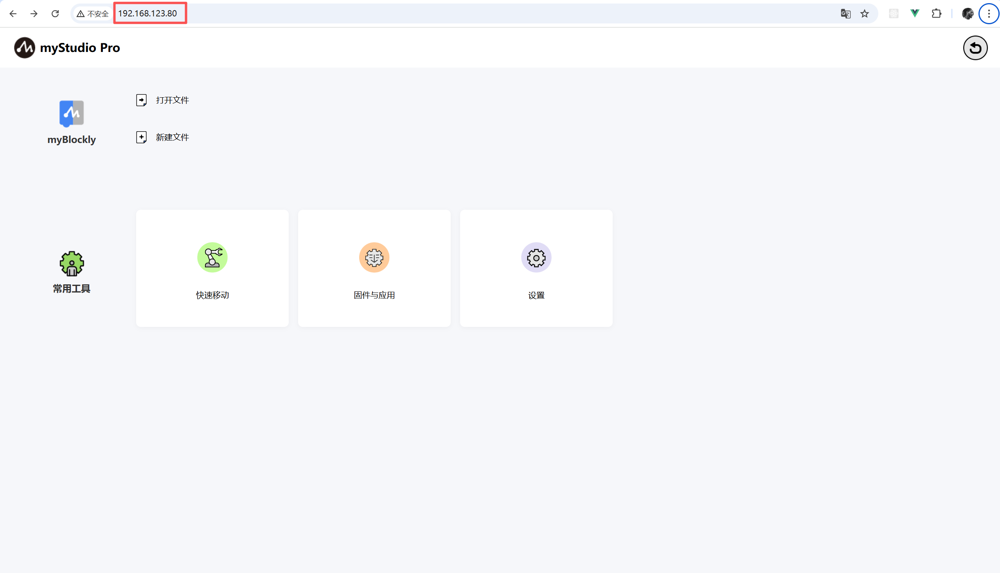
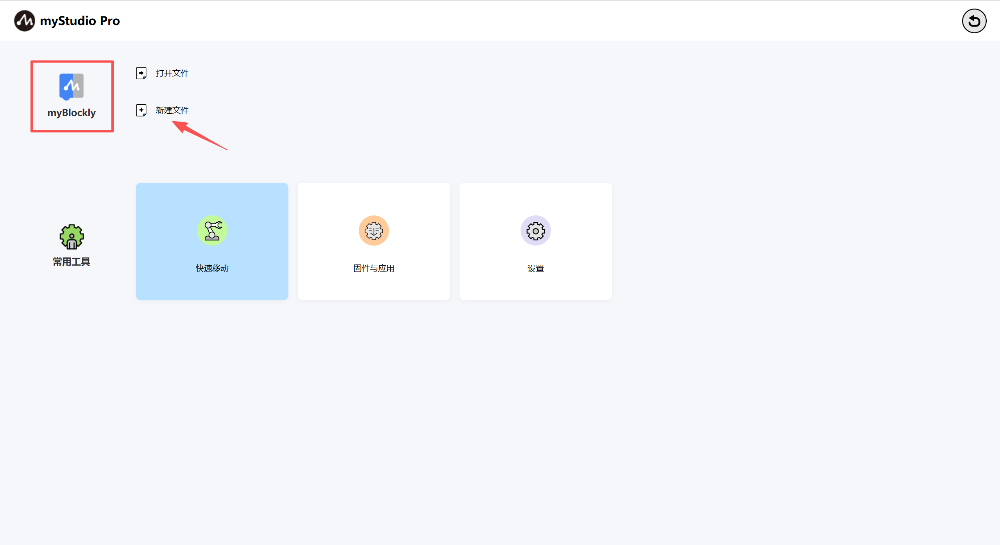
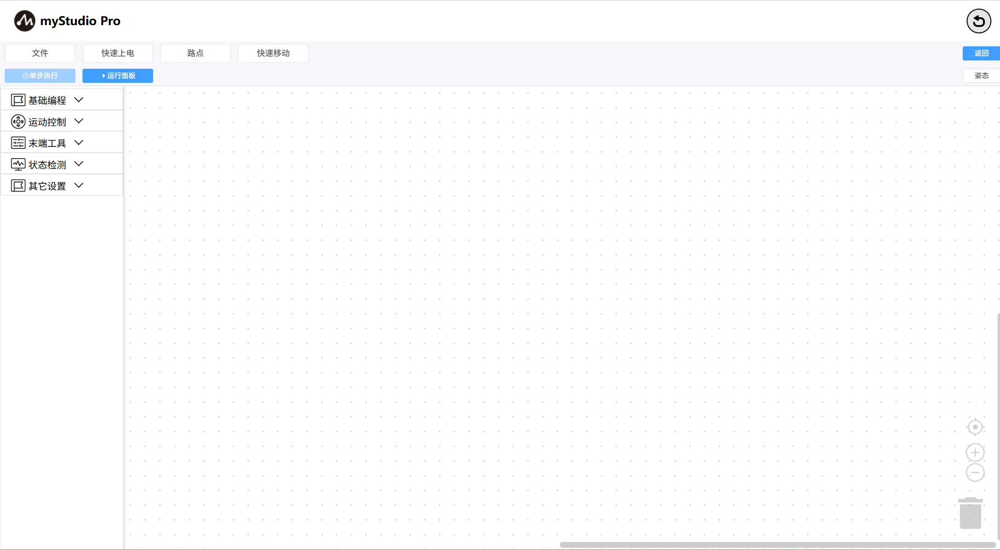

# 首次使用

在浏览器上通过ip访问即可，首页加载完成后系统会自动与机器建立连接

点击`blockly`图标，或者点击`新建文档`按钮即可进入`blockly`编程页面
> 当然，如果您也可以通过选择点击`打开文件`按钮加载您保存好的工作区（关于如何保存工作区，请点击这里）。
> 这里的通过点击`blockly`图标和点击`新建文档`按钮进入`blockly`编程页面的操作相当于是新增工作区。

`blockly`主页如下图所示

[← 上一页](../README.md) |[下一页 →](./5.1.1.2-interfaceDescription.md)