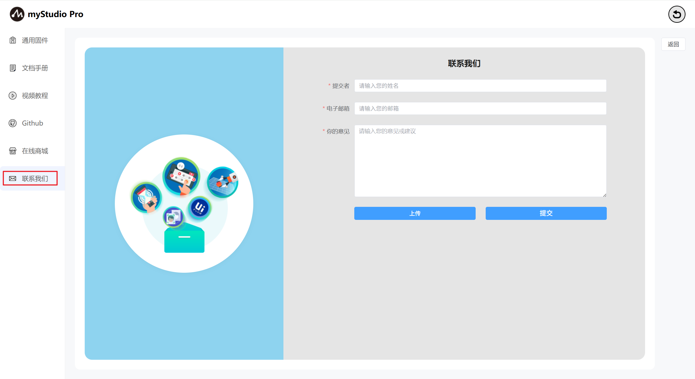
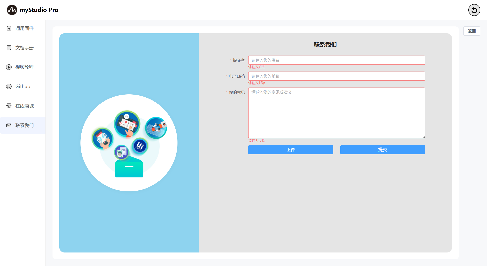
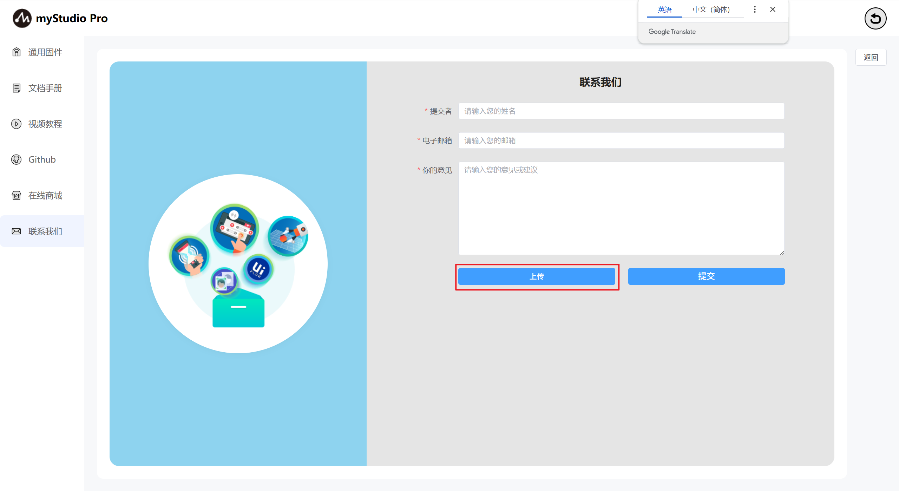
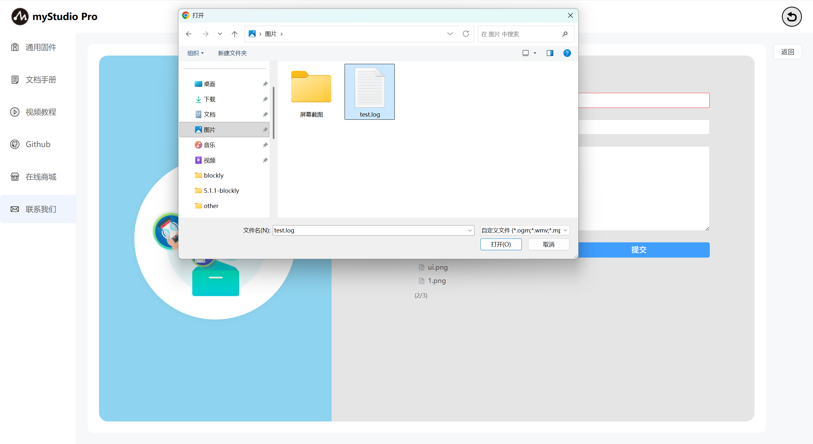
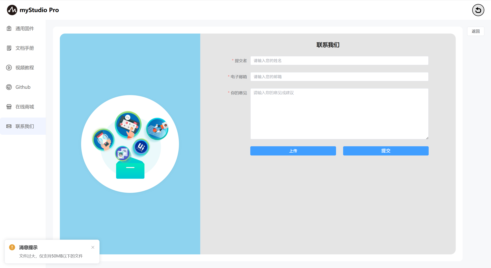
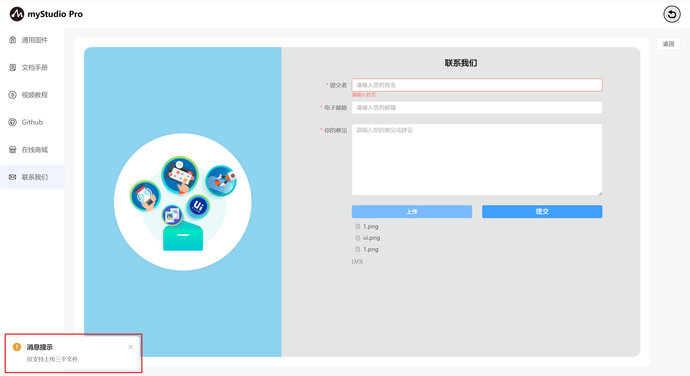

# 设置
### 1 界面介绍

### 2 通用固件

### 3 文档手册

### 4 视频教程

此功能为网页跳转链接，点击以后，会自动打开默认的浏览器并且打开官方的视频号。英文版本会跳转到YouTube，中文版本会跳转到bilibili。

### 5 Github

此功能为网页跳转链接，点击以后，会自动打开默认的浏览器并且打开官方Github。

### 6 在线商城

此功能为网页跳转链接，点击以后，会自动打开默认的浏览器并且打开对应产品的购买界面。中文版本会跳转到淘宝，英文版本的会跳转到

### 7 联系我们

如果你有任何的问题或者想法，可以通过这里来联系我们。

功能介绍：

### 名称

这里可以输入你的昵称

> 此处是必填项，如果你不填直接提交，会有对应文字提示您。

### 电子邮箱

> 此处是必填项，这里可以输入你的邮箱地址，方便官方人员后续回复您，如果你不填直接提交，会有对应文字提示您。。

### 您的意见

> 此处是必填项，这里可以输入您的问题或者想法，如果你不填直接提交，会有对应文字提示您。

### 上传

> 点击此按钮，可以上传文件，最多上传3个文件，并且每个文件不得超过50M。

> 点击以后会弹窗以供选择文件。

> 如果你选中的文件大小超过50M，在点击"**打开**"以后，会打开失败，并且弹窗提示你文件过大。

> 当你要上传的文件数量超过3个时，会弹窗提示你。

