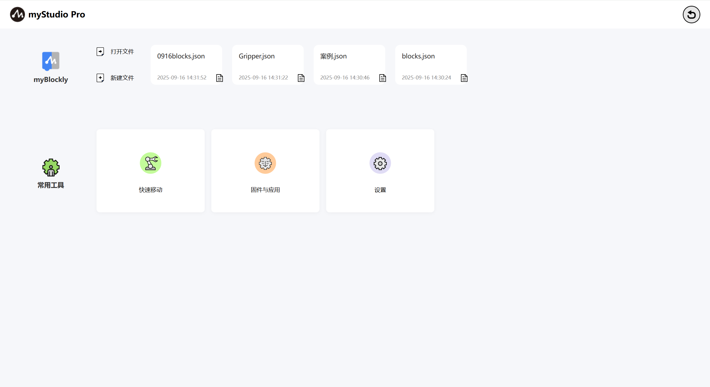
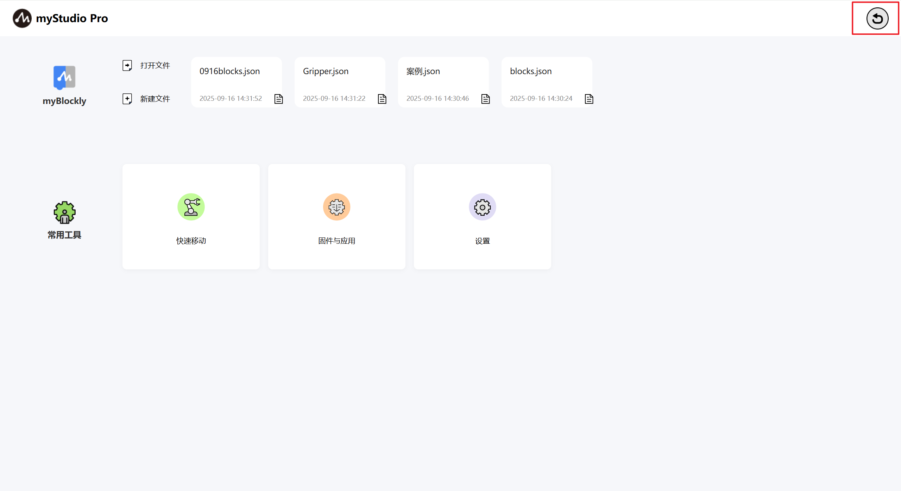
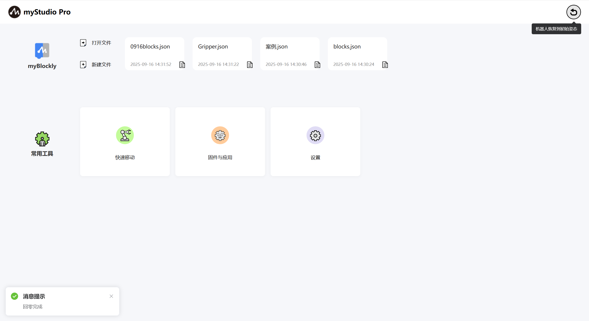
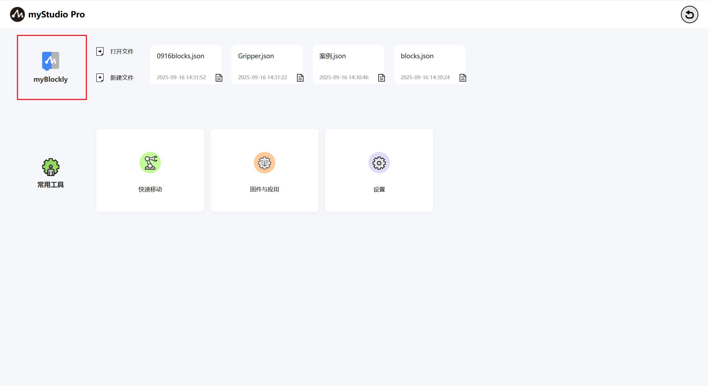
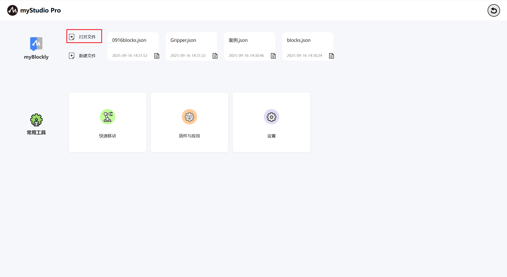
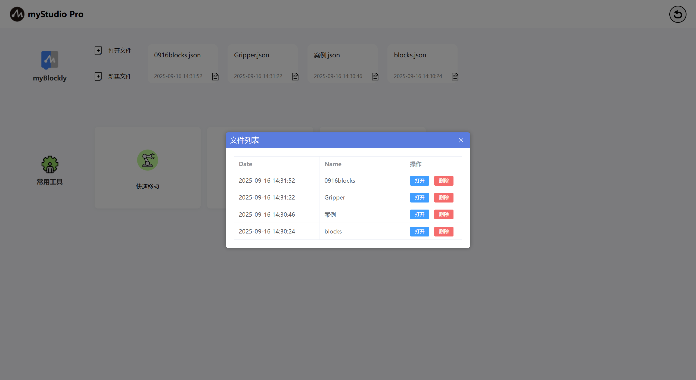
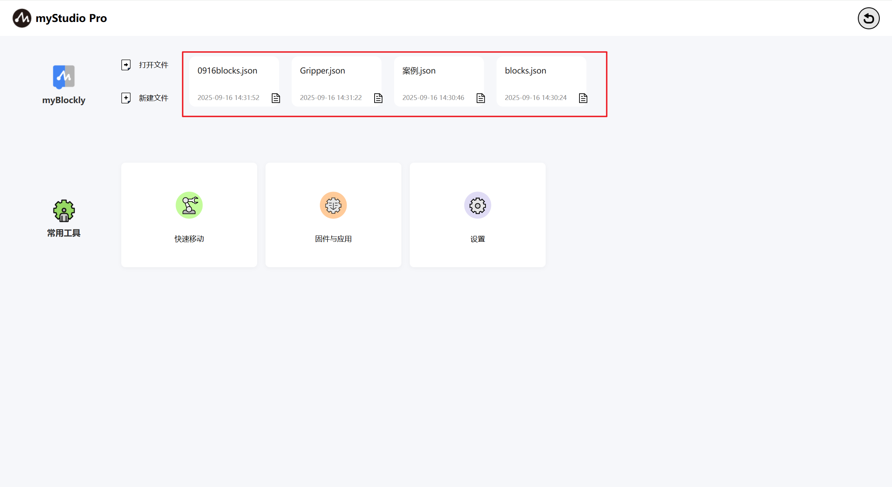
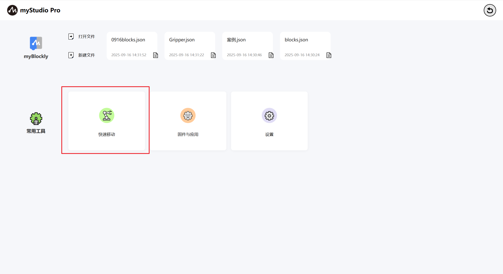
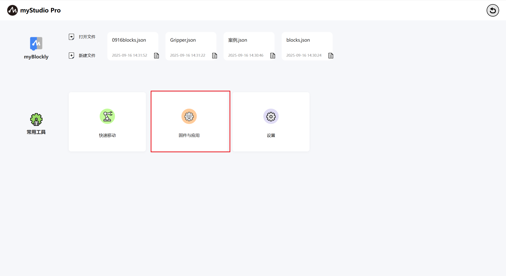
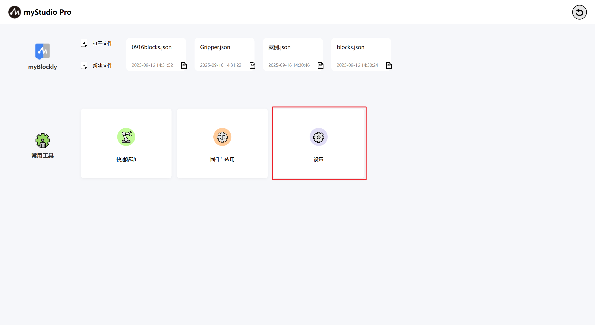

# myStudio 界面的显示和基本功能的使用

打开软件，主界面如下图所示

界面功能介绍，界面分成两个区域：

> 1. 回零
> 2. 功能实现

### 回零

此按钮功能为：控制机器人所有关节都回到零位位置。

**注意**：此按钮功能生效的前提的已经成功连接机器人的通信。鼠标左键长按点击此按钮以后，机器人开始执行回零指令，鼠标长按松开回零指令停止执行。

回零完成以后，会弹窗提示完成回零。

### 功能实现

这里可以选择你想要使用的功能，功能包含如下：

> 1. [blockly 图形化编程](./5.1.5-blockly/5.1.5.1-blocklyFirstUse.md)
> 2. 快速移动
> 3. 固件与应用
> 4. 设置

### myBlockly
`myBlockly`是一个完全可视的模块化编程界面，属于图形化编程语言，适合初级用户熟悉编程。使用者以拖拽拼图的方式开发出应用程序，即可创造出简单及复杂的功能。支持图形化代码的保存、加载、单步调试执行、执行指定的单个积木块等功能。

> 注意：想要使用 myBlockly 必须要先连接设备通信。

此处为可点击按钮，鼠标左键点击以后，会跳转到[myBlockly 图形化编程界面](./5.1.5-blockly/5.1.5.1-blocklyFirstUse.md)

#### 打开文件

此处为可点击按钮，可以通过导入 JSON 文件自动加载 blockly 积木块。

鼠标左键点击以后，会弹窗一个可以选择文件的弹窗，选择通过 blockly 保存的 JSON 文件可以加载该文件，打开 myBlockly 并且在编程界面自动载入对应的积木块。

#### 新建文件

此按钮与[**myBlockly**](./5.1.3-interface_description.md#myblockly)"功能一样。

#### 快捷载入历史保存的 blockly 文件

当你在使用过 myBlockly 编程并且已经保存过 blockly 文件，如下图示位置会显示保存的文件名称以及保存时间，显示数量最多为 4 个，如果超过 4 个，只显示最新保存的 4 个。鼠标左键点击可以打开 myBlockly 并且自动加载选中的 blockly 文件。

### 常用工具

#### 快速移动

功能：提供机器人 IO 快捷控制以及关节角度、坐标的快捷控制

快速移动[功能详细介绍](./5.1.6-quickmove/5.1.6.1-quickmovefirstuse.md)

#### 固件与应用

功能：提供机器人嵌入式固件的更新升级、产品使用手册、官方视频、官方 GitHub 官方在线商城以及意见反馈功能。

固件与应用[功能详细介绍](./5.1.7-firmware/5.1.7.1-firmware_main.md)

### 设置

功能：应用以及机器人基本信息的展示以及更改功能

设置[功能详细介绍](./5.1.8-setting/5.1.8.1-setting_main.md)

---

[← 上一章](./5.1.2-install_uninstall.md) | [下一章 →](./5.1.4-Q&A.md)