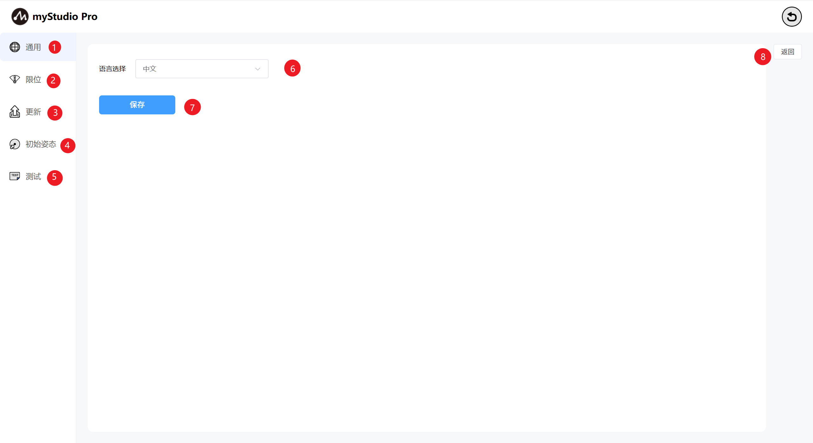
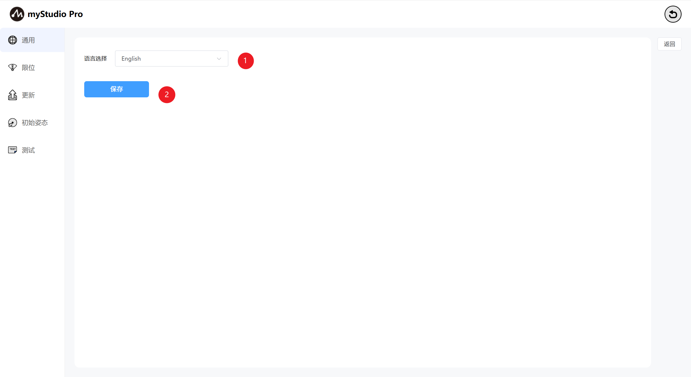
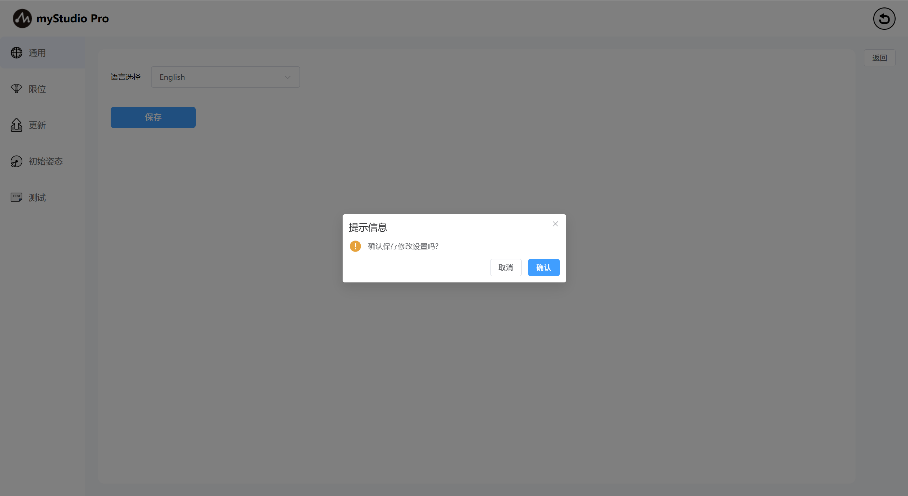
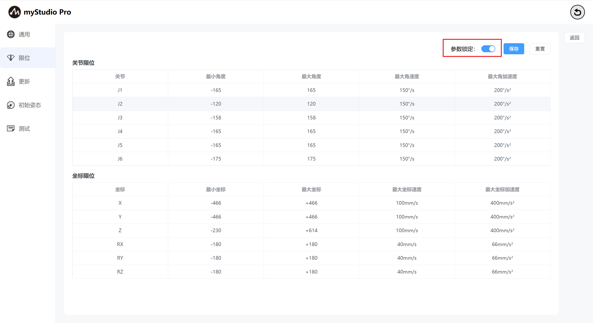
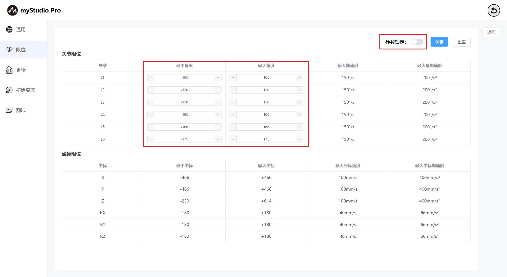

# 设置
### 1  界面介绍

| 序号 | 功能介绍                   |
| ---- | -------------------------- |
| 1    | 通用设置模块，主要设置语言 |
| 2    | 限位设置模块               |
| 3    | 检查更新模块               |
| 4    | 初始姿态模块               |
| 5    | 测试模块                   |
| 6    | 语言选择模块               |
| 7    | 设置保存按钮               |
| 8    | 退出设置                   |

### 2 通用设置

点击 `通用` 图标按钮，将进入语言设置页面，语言选择支持中文和英文。

选择对应语言之后，点击 `保存` 按钮，会出现二次确认提示信息弹窗，点击确认，即可成功设置语言。

## 3 限位设置

> 注意：限位参数修改仅支持关节的最小角度和最大角度，其它参数均不支持修改。

点击 `限位` 图标按钮，将进入关节限位设置页面。`限位设置` 界面默认显示当前机械臂的关节限位和坐标限位的相关参数。

`参数锁定` 按钮默认处于锁定状态，按钮颜色为蓝色，代表不能修改限位参数。

当处于参数锁定状态时，点击 `参数锁定` 按钮，按钮颜色变成灰色，此时处于开锁状态，代表可以修改限位参数（仅能修改最小角度和最大角度的数值）。

点击 `保存` 按钮，即可将当前限位页面的参数保存到本地文件（json文件），并且设置机械臂的关节限位。

根据弹窗的提示定义文件名。

## 4 检查更新

点击 `更新` 图标按钮，将进入检查更新状态页面。

更新页面主要检查机械臂的Atom固件版本状态。

如果检查到机械臂的Pico固件不是最新版本时，将会提示需要更新固件信息。
