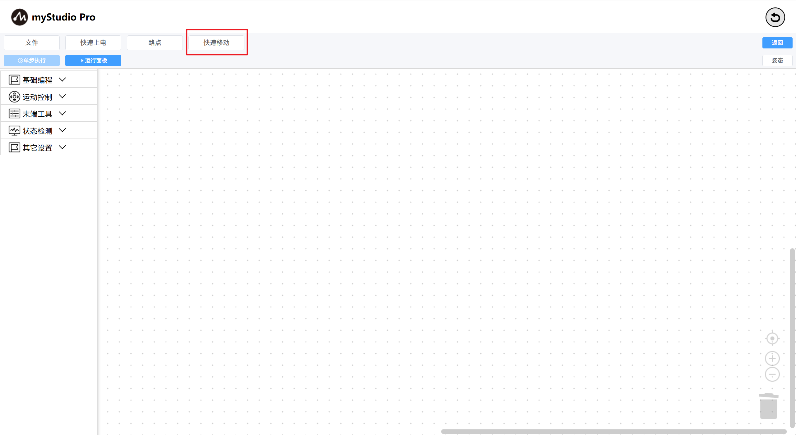

# 快速移动

什么是 **快速移动** ？简单来讲就是，无需编程，仅通过鼠标点击的方式快速控制机器人移动。

> 备注：myStudio 中有两个 **快速移动** 控制面板，两者功能相差不大

**第一步：点击快速移动**按钮，打开 **快速移动** 面板，等待机器人数据返回。

如果没有数据全为零，请检查是否已连接机械臂，机械臂是否正常

**第二步：**尝试点击`-` / `+`按钮控制机械臂的不同关节。

**第三步：**控制坐标。

首先需要先将 关节 4 移动到 -90左右的位置，如下图。

然后就可以点击不同坐标轴的`-` / `+` 按钮来控制坐标了

对于其它功能，请查阅[快速移动](https://github.com/elephantrobotics/myStudio3.0_docs/blob/main/2-quickmove/2.1-quickmovefirstuse.md)

[← 上一页](./5.1.5.3-littleCase.md) |[下一页 →](./5.1.5.6-useCoords.md)