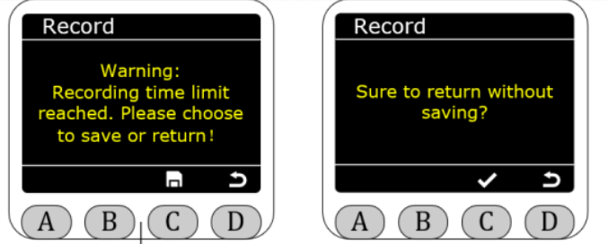
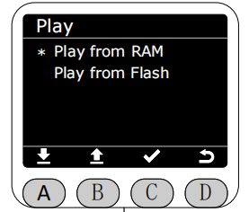
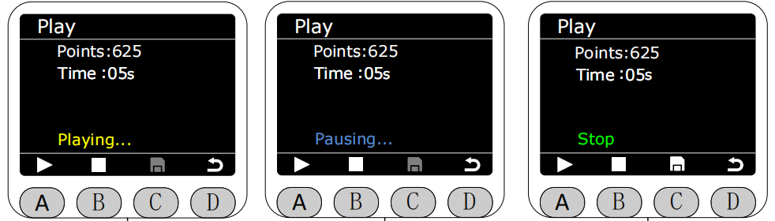
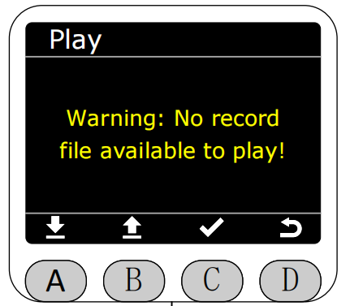

# **(DragTeach)拖动示教功能**

在Program界面将星号选择为拖动示教功能，按下C键进入拖动示教功能

#### ***在此之前需要说明的是Web端中的生产文件夹中是已经发布的轨迹文件，而测试文件夹中的是还未发布的轨迹文件。*** 

选择Record功能，按下C键进入录制界面，进入时默认为停止状态，此时可以直接退出界面，按下A键即可开始录制，录制时末端灯带为黄色常亮。录制和暂停时不允许保存。

**最长的录制时间为120s**，可在录制过程中按下A键暂停录制，此时末端灯带为蓝色常亮。

按下B键停止录制，此时末端灯带为绿色常亮。停止录制下后可以按下C键进行保存。

保存方式可以选择保存在RAM或者保存在Flash中，若保存在RAM中，则机器重启后录制的轨迹文件会丢失。

***若保存在Flash中，则机器重启后录制的轨迹文件不会丢失，同时保存在Flash中的轨迹文件会同步上传至Web端的测试文件夹中，命名为tpr-1。***

***每一次保存到Flash的文件均为覆盖保存，即只保留最新录制并保存至Flash的轨迹文件，Web端同理。***

若录制时间超过最大时长限制或不保存直接退出，会弹出警告界面。此时末端灯带为红灯闪烁，间隔1s。

保存轨迹文件后，可在拖动示教(DragTeach)界面中选择Play功能播放最新保存的轨迹文件。

播放路径可选择从RAM播放或从Flash播放。

进入播放界面后，按下A键即可开始播放，此时末端灯带为黄灯闪烁，间隔1s。播放状态下再次按下A键可暂停播放，此时灯带为蓝色常亮。按下B键即可停止播放。

***轨迹的播放默认为无限循环播放***,停止播放后，可选择是否上传至BlocklyRunner，若选择上传，该轨迹文件会存放至Web端的生产文件夹中，***保存在RAM中的文件无法被上传至Web端的生产文件夹中，只能在拖动示教界面中播放。保存在Flash中的文件可以被上传至Web端的生产文件夹中。***

当两种播放路径都没有文件可供播放时显示警告,如其一路径没有,另一路径有,点击时也会提示相应的警告。此时末端灯带红灯闪烁，间隔1s

[← 上一章](./5.4.1-home.md) |[下一页 →](./5.4.3-blocklyrunner.md)
