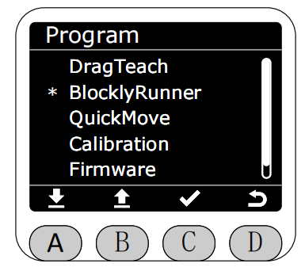
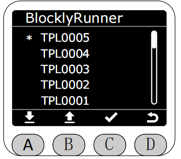
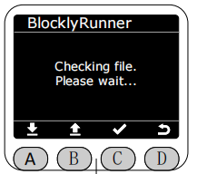
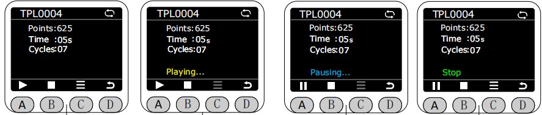
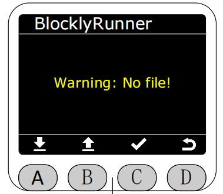

# ***BlocklyRunner功能***

在Program界面将星号选择为BlocklyRunner功能，按下C键进入BlocklyRunner功能，

进入BlocklyRunner功能后，会先检查Web端的生产文件夹中是否有已发布的轨迹文件
 

若有，则会在BlocklyRunner界面中显示已发布的轨迹文件，可以选择播放已发布的轨迹文件。

选择已发布的轨迹文件后，会先检查该轨迹文件的状态。

 

若文件正常，按下A键即可开始播放，播放状态下再次按下A键可暂停播放。按下B键即可停止播放。

***播放时在屏幕的右上角会显示当前的轨迹文件的播放循环状态，灰色表示单次循环播放，白色表示无限循环播放，默认为无限循环播放。可在轨迹文件还没有开始执行或停止执行的时候，可按下C键的菜单选项对轨迹文件进行删除，单次播放，循环播放的操作。***进行删除操作后，Web端生产文件夹中对应的轨迹文件也会同步删除。

若没有已发布的轨迹文件或轨迹文件有损坏则会提示相应的错误。

[← 上一章](./5.4.1-dragteach.md) |[下一页 →](./5.4.4-quickmove.md)