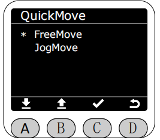

# 快速移动(QuickMove)

在Program界面将星号选择为QuickMove功能，按下C键进入QuickMove功能。

进入QuickMove功能后，可选择自由移动或关节点动。

自由移动(FreeMove)模式下,默认实时显示机械臂的角度数据,长按末端两侧的按钮即可自由拖动机械臂,**此时会松开所有电机的制动器,请注意安全**,按下C键可实时显示当前机械臂的坐标数据。

关节点动(JogMove)模式下,实时显示机械臂的角度数据，可选择点动角度或点动坐标模式。

选择想要点动的关节控制机械臂关节运动,被选中的关节会高亮显示。单点点动时,步距角为0.1°,长按点动时,关节会以10的速度转动,运动至限位附近时会自动停下。

[← 上一页](./5.2.3-blocklyrunner.md) |[下一页 →](./5.2.5-calibration.md)