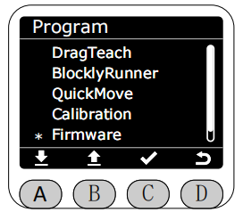

# ***(版本显示)Firmware功能***

在Program界面将星号选择为Firmware功能，按下C键进入Firmware功能，

进入Firmware功能后,会显示当前机械臂的所有版本信息
RobotID对应机械臂的唯一标识符,用于区分不同的机械臂。
Screen对应minirobot的版本
System对应系统版本
Soft对应Web+后端+运动控制版本(如: 1.0.1 + 1.0.2 + 1.0.3 = 1.101.102.103)
Tool对应末端版本

[← 上一章](./5.4.4-quickmove.md) |[下一页 →](./5.4.6-firmware.md)
