# 快速移动

*开始之前*

> *1、确保机器已上电*
> 
> *2、确保机器连接正常、通信正常*
> 
> *3、确保机器处于零位状态*
> 
> *4、机器服务端已开启*

## 1 界面介绍

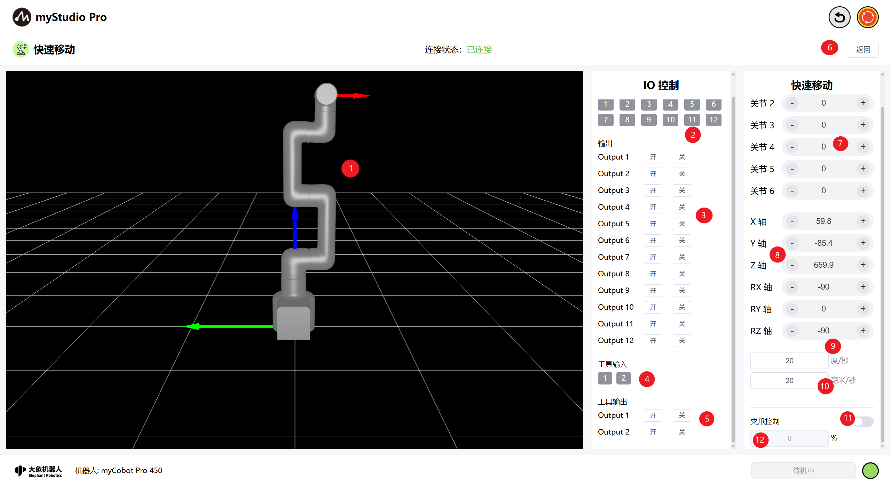

| 序号 | **说明**                                                     |
| ---- | ------------------------------------------------------------ |
| 1    | myCobot Pro 450 3D仿真模型（坐标系红色箭头：X，绿色箭头：Y，蓝色箭头：Z）  |
| 2    | 底部IO引脚号1-12，输入，属于安全模块检测项                      |
| 3    |底部IO引脚号1-12，输出，可以点击开关按钮进行设置输出              |
| 4    | 末端IO引脚号1、2，输入                                       |
| 5    | 末端IO引脚号1、2，输出，可用于控制F100力控夹爪                  |
| 6    | 退出快速移动界面                                             |
| 7    |  角度控制，通过点击 `+` `-` 按钮，对机械臂进行关节角度控制，数值代表当前机械臂的关节角度信息，也可以直接修改数值进行关节控制                           |
| 8    |  坐标控制，通过点击 `+` `-`按钮，对机械臂进行坐标控制，数值代表当前机械臂的坐标姿态信息，也可以直接修改数值进行坐标控制 |
| 9    | 设置机械臂关节的运动步长，默认 20 度/秒 |
| 10    | 设置机械臂坐标的运动步长，默认 20 毫米/秒                   |
| 11    | 夹爪控制开关，可关闭/开启夹爪控制模式，默认关闭状态                  |
| 12    | 夹爪角度值输入框，可通过该输入框下发角度                  |

## 2 角度控制
在角度控制区域中，通过点击`+` `-`按钮，对机械臂进行关节角度控制，数值代表当前机械臂的关节角度信息，也可以直接修改数值进行关节控制，输入限位范围内的位置，然后点击`Enter`，即可进行控制。

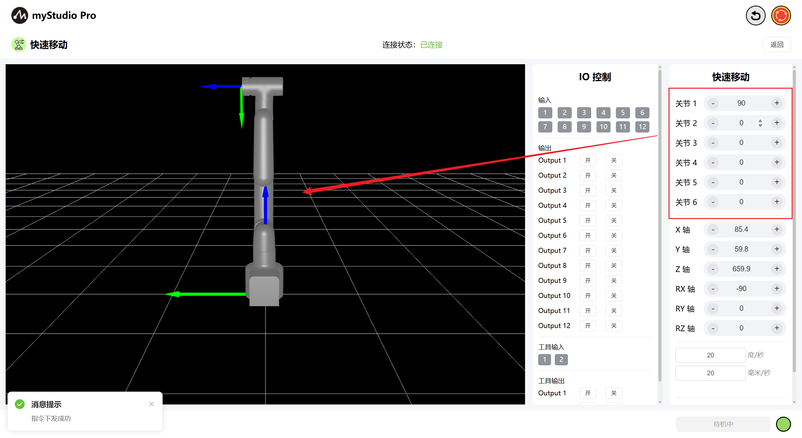

## 3 坐标控制
在使用坐标控制之前，需要将 关节3 移动到-90左右的角度位置。

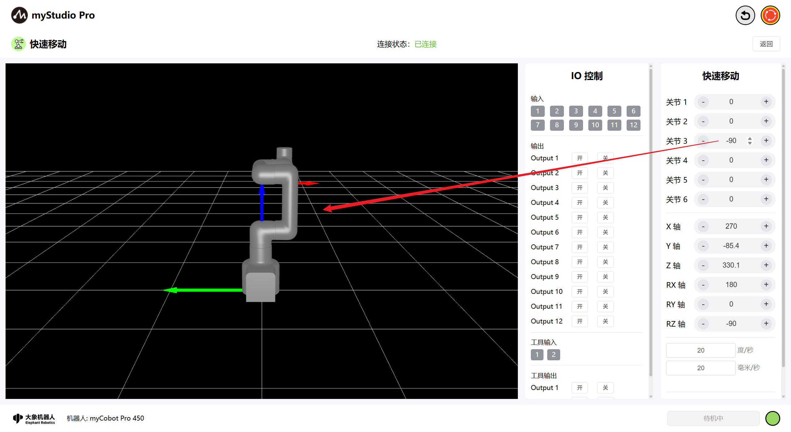

在坐标控制区域中，通过点击 `+` `-` 按钮，对机械臂进行坐标控制，数值代表当前机械臂的坐标姿态信息，也可以直接修改数值进行坐标控制，输入限位范围内的位置，然后点击`Enter`，即可进行控制。

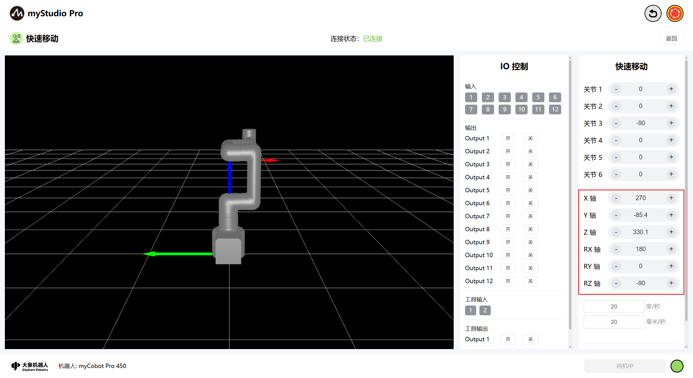

## 4 持续移动

以通过长按 对应区域的`+` `-` 按钮，可以控制机器人按照指定的角度/坐标进行持续移动。

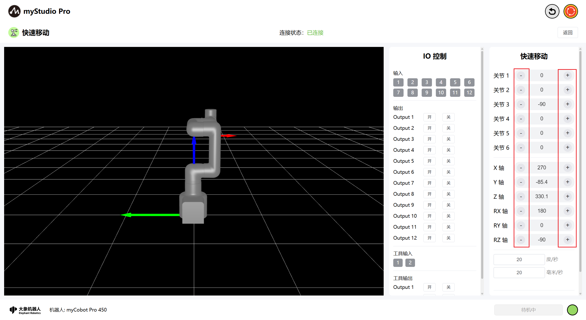

> 注意： 当长按操作持续运动到关节限位处时会自动停止。

注意：控制坐标时需要先将机械臂运动至坐标控制姿态。

## 5 IO 控制

### 5.1 底部IO

设置底部IO引脚号 1-12 输出，用户可以自定义控制执行器。例如可以自定义控制夹爪、吸泵。

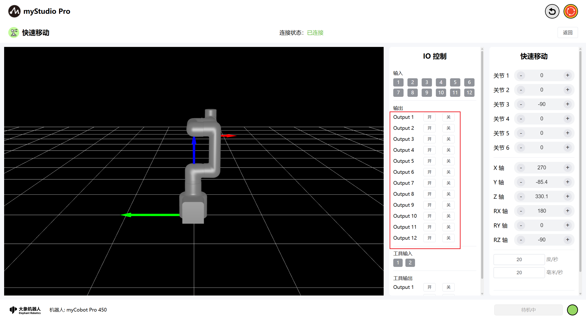

点击 `开` `关` 按钮进行设置。

### 5.2 末端IO

设置末端IO引脚号 1-2 输出，可以控制F100力控夹爪，前提必须正常连接标配F100力控夹爪才可正常控制。

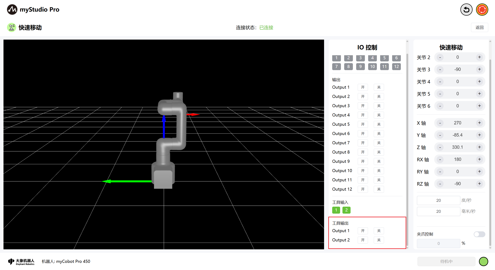

通过点击 关 开 按钮，打开F100力控夹爪。

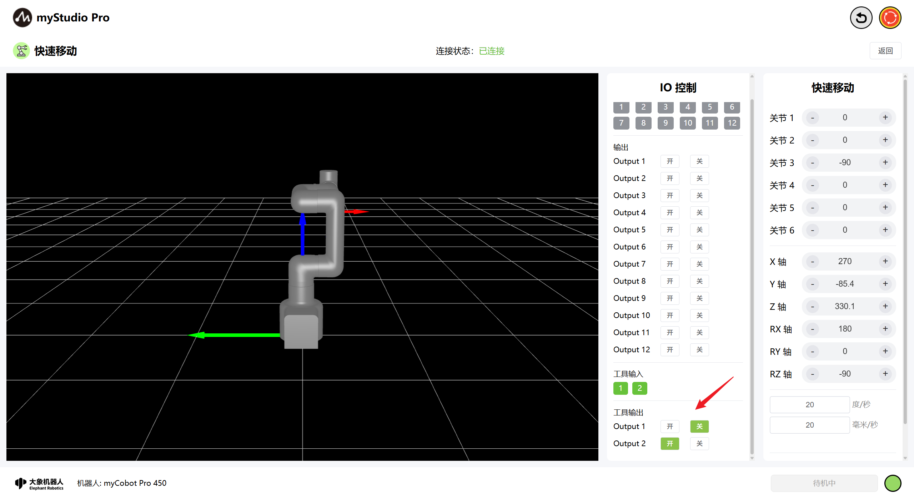

通过点击 开 关 按钮，关闭F100力控夹爪。

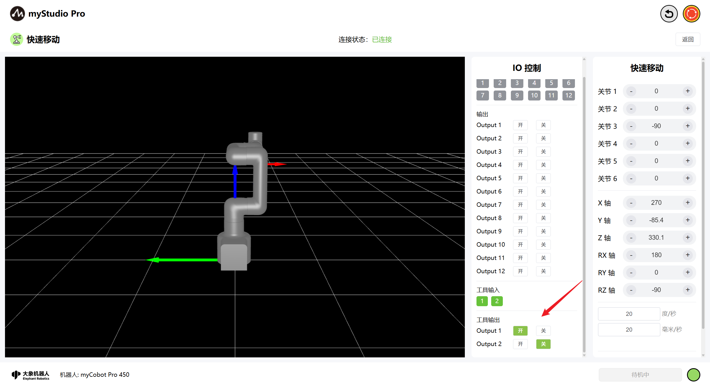

## 6 夹爪控制

> 注意：
> 
> 1、使用该功能前请确保机械臂已连接标配的F100力控夹爪。
>
> 2、检查F100力控夹爪当前控制协议是否为modbus，且开启了modbus控制。当且仅当满足两条件才可正常使用该功能。

夹爪默认状态为`关闭`状态

> 1、夹爪角度控制输入框不可输入
>
> 2、3D仿真模型机械臂末端不装配夹爪

点击切换按钮，会对机械臂进行末端夹爪连接检测，当检测到没有连接夹爪时页面将进行消息提示，如下。

**出现该消息提示除上述注意点2外，注意点3也会造成该问题，请确保连接和夹爪配置无误！**

若均无问题还是无法开启/控制夹爪，请联系售后。

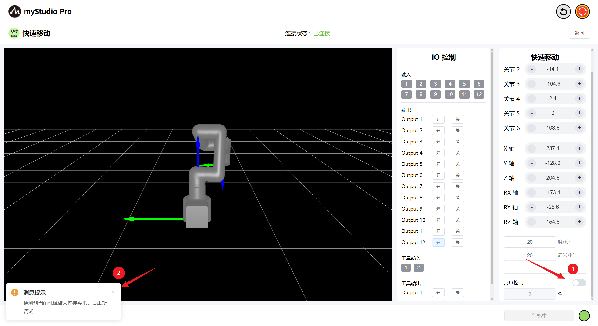

当夹爪按钮开启成功时，输入框可进行编辑（范围0-100%）、3D仿真模型将渲染夹爪，同时实时回显夹爪实际的控制角度。

> 1、夹爪角度控制输入框可用
>
> 2、3D仿真模型机械臂末端渲染夹爪

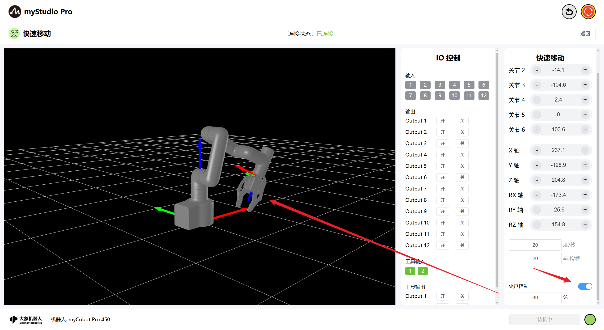

此时，您可以通过夹爪控制输入框输入您想控制的角度，输入数值后，点击空白处/点击Enter按键，将进行指令下发，下发成功后页面会有对应的消息提示。同时夹爪会运动至下发的角度，3D模型末端夹爪将进行仿真运动。

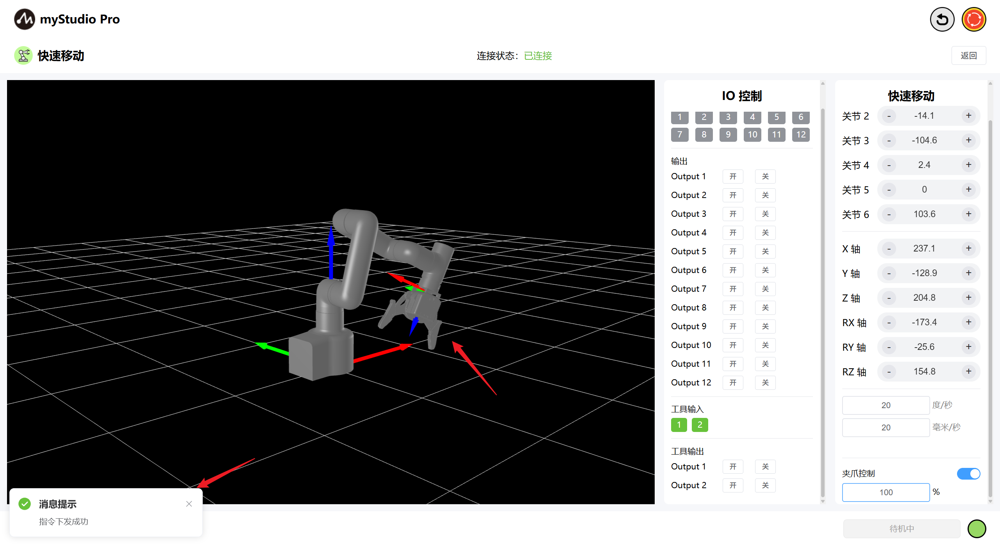

按照上述操作步骤，您可以进行F100力控夹爪控制。当您手动关闭控制按钮/离开快速移动页，再次进入后均会重置页面的状态恢复至默认（关闭）状态。

[← 上一章](./5.3.2-myBlockly.md) | [下一章 →](./5.3.4-resource.md)