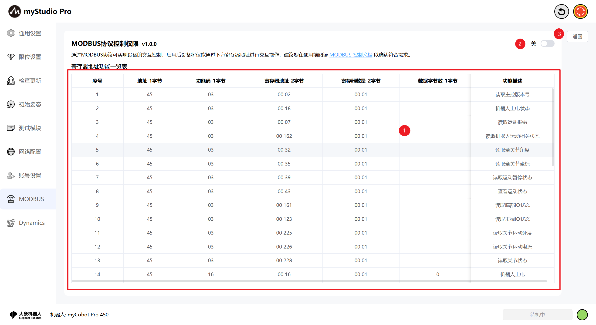
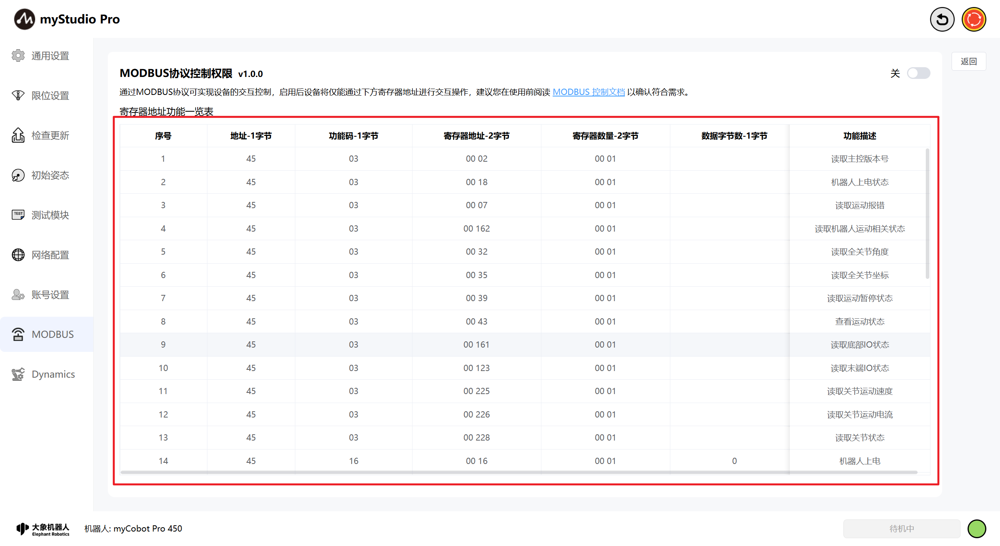
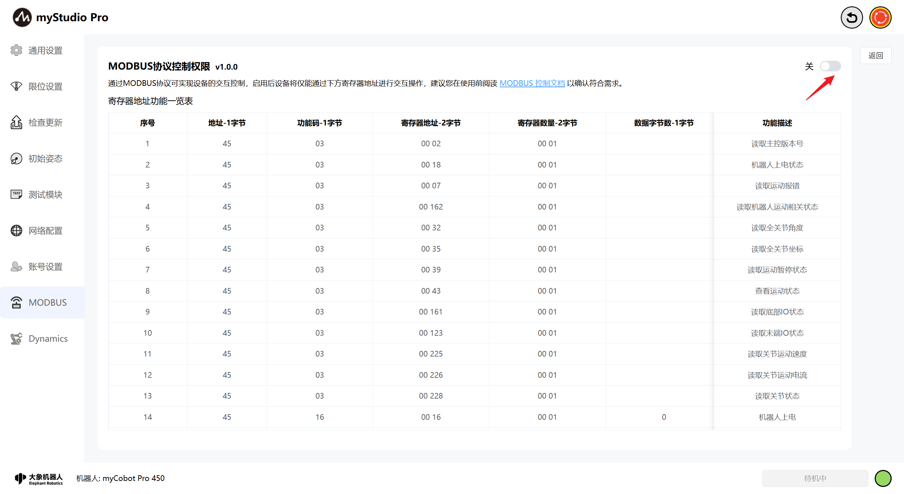
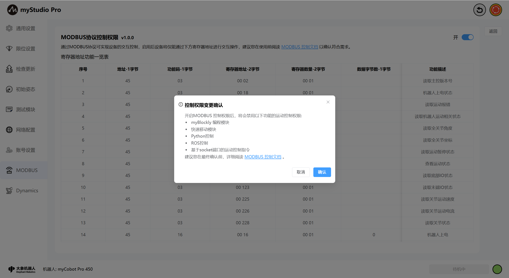
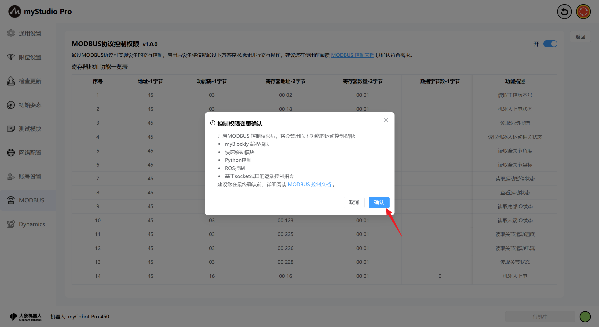
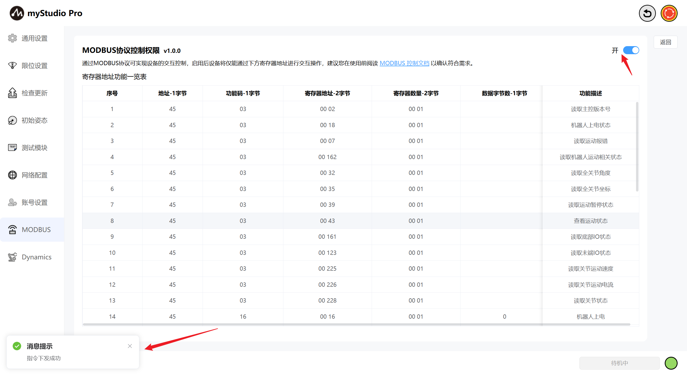
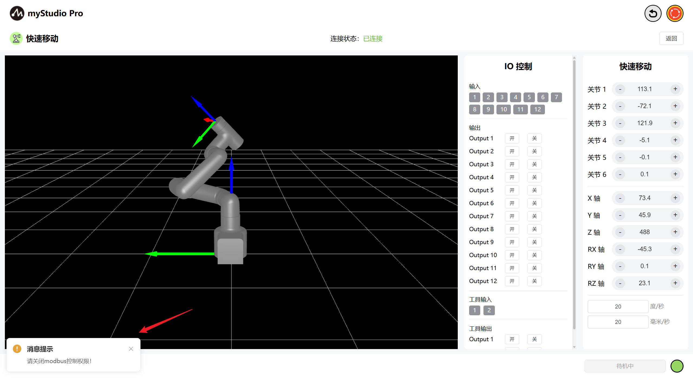
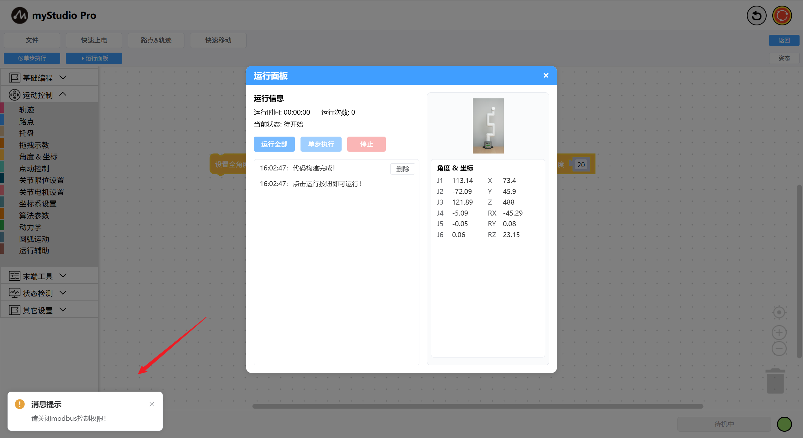
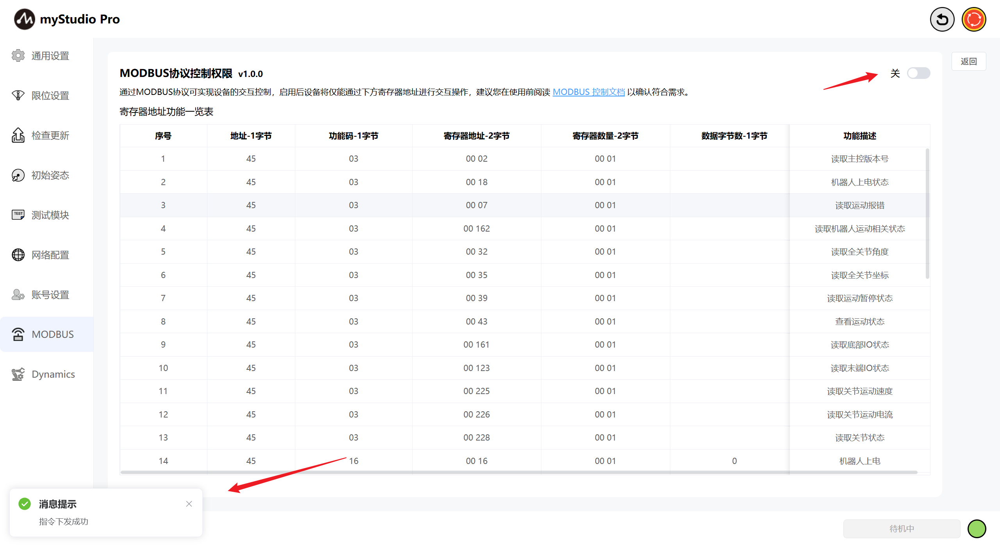
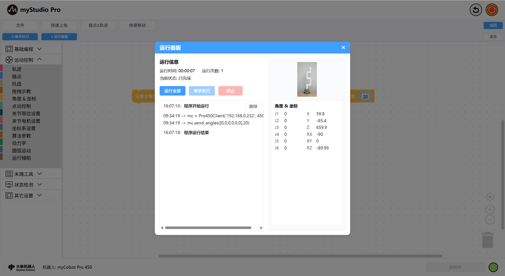

# MODBUS

## 1 界面介绍

| 序号 | 说明 |
| ------ | ------------------------------------------------------ |
| 1 | modbus寄存器地址功能一览表，包括modbus读写协议。 |
| 2 | modbus控制权限切换按钮，可通过该按钮对modbus权限进行开关控制。 |
| 3 | 退出设置 |

## 2 寄存器地址功能一览表

表格展示了modbus的读写协议内容，包括地址、功能码、寄存器和功能描述等内容，可通过预览该功能表对modbus协议进行使用。

## 3 权限控制

在该页面可进行modbus的控制权限进行切换，当需要开启modbus控制时，会展示控制权限变更确认弹窗，在弹窗中会展示开启modbus时将被禁用的运动控制权限。

当点击弹窗右下角的确认按钮时，将会真正开启modbus控制，当modbus权限开启成功时页面会有消息提示，同时右上角开关转变为开启状态。

modbus权限开启时myStudio Pro的运动控制权限将被禁用，如myBlockly编程、快速移动等功能。限位设置、参数修改、打包姿态、急停等不受影响，检测到modbus处于开启阶段并尝试进行运动控制操作时，可控制设备的页面左下方将显示提示信息。

快速移动模块控制状态：

myBlockly编程控制状态：

此时，若想恢复myStudio Pro本身的运动控制功能，可将modbus控制关闭即可恢复运动控制。

[← 上一章](./5.3.5-setting.md) | [下一章 →](./5.3.7-Q&A.md)