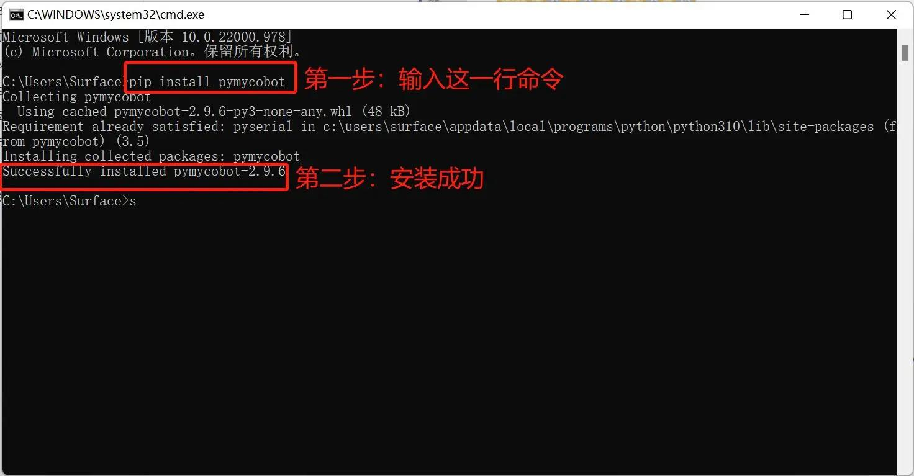

# Q&A

本章列出了使用 myStudio Pro 控制机械臂的常见问题，以供参考。

**Q1：运行 myBlockly 时，出现错误信息 `ModuleNotFoundError: No module named 'pymycobot'`**

A: 这是因为在设置 Python 环境时没有安装 pymycobot 库。要安装 pymycobot 库，需要打开终端（Win 键 + R 键），输入 `pip install pymycobot --upgrade --user`点击回车键，即可看到 "成功安装 pymycobot"。



**Q2：由于未添加 `sleep` 方法模块，机械臂没有响应？**

A: 操作机械臂的程序需要一定时间才能完成，因此在完成一个动作后，需要连接一个 `sleep` 模块，让机械臂在进行下一个动作前有足够的时间（所需时间取决于具体情况和机器，机械臂的默认设置是运行 myBlockly 时休眠时间最短不少于 0.5 秒），否则机械臂将无法实现理想的动作。

**Q3: SSH无法连接**

A：该情况一般是网线连接不良导致，可先拔出PC端网线再重新插上连接，当控制面板检测出连接时（一般是`以太网`），然后打开`Windows 命令提示符`，使用`ping`命令进行检查，正常输出信息时再进行`SSH`连接尝试。以上步骤无法解决，尝试对机器重启再操作。

**Q4：浏览器输入 IP 后一直处于加载阶段或访问失败？**

A: 请确认 PC 与机械臂处于同一局域网（可在PC终端ping机械臂ip），尝试更换浏览器（推荐 Chrome / Edge），刷新缓存（Ctrl + F5）

**Q5：在myBlockly编程中使用积木块无法控制夹爪？**

A：请确认F100力控夹爪控制方式，myCobotPro 450控制夹爪需要使用`modbus`控制方式，将F100力控夹爪正确设置后再尝试。


**Q6: 在检查更新页驱动下载时显示下载失败，无法正常下载？**

A：使用“检查更新页”功能前，请确保您的机械臂已连接至互联网。请注意：此处要求的是机械臂本体联网，而非访问myStudio Pro的设备。未联网时将无法正常下载软件驱动。此外，网络质量也会影响功能使用，较慢的网络连接可能导致驱动下载失败。为确保功能正常，请预先检查网络状况。

**Q7: 在Dynamics页预览完成点击标定按钮，标定过程中出现标定失败？**

A：请确保在预览过程中设备未发生任何碰撞。如确认无误后进行重新标定若问题依旧存在，请联系售后寻求解决方案。

**Q8：软件驱动升级过程中升级失败？**

A：请确保在升级过程中机械臂通电正常，再尝试重新升级。如升级均失败，请联系售后寻求解决方案。

**Q9: 低版本更新到最新版本的MyStduioPro(v2.210.1212)**

1. 可以通过烧录[最新系统镜像](../5.4-SystemUpdate.md)来使用新版本MyStduioPro
2. 手动升级安装包
    - 下载软件包
        - [app-v2.1.0.zip](https://download-elephantrobotics.oss-cn-shenzhen.aliyuncs.com/software/webApp/data/v2.1/app-v2.1.0.zip)
        - [api-v2.1.0.tar.gz](https://download-elephantrobotics.oss-cn-shenzhen.aliyuncs.com/software/webApp/data/v2.1/api-v2.1.0.tar.gz)
        - [MyCobotPro](https://download-elephantrobotics.oss-cn-shenzhen.aliyuncs.com/software/webApp/firmware_bin/basic/v1.2.12/MyCobotPro)
    -  在PC通过`MobaXterm`或者`Xftp`软件将下载好的软件上传至机械臂

    - 在PC端通过ssh连接至机械臂， 路径: /root/
        ```shell
        ssh root@192.168.0.232
        ```

    - 执行以下指令，解压api.tar.gz
        ```shell
        rm -rf /opt/webapp/api/*
        tar zxvf ./api-v2.1.0.tar.gz -C /opt/webapp/api/
        cp -r /opt/webapp/api/api-v2.1.0/resources /opt/webapp/api/
        ln -sfn /opt/webapp/api/api-v2.1.0/launcher.sh /opt/webapp/api/launcher.sh
        ```

    - 执行以下指令，解压app.tar.gz
        ```shell
        rm -rf /opt/webapp/app
        unzip ./app-v2.1.0.zip -d /opt/webapp/app/
        ```

    - 安装MyCobotPro    
        ```shell
        mv ./MyCobotPro /root/MyCobot450/bin/MyCobotPro
        chmod +x /root/MyCobot450/bin/MyCobotPro
        ```
    - 重启机械臂之后即可使用最新版本
---

[← 上一章](./5.3.6-modbus.md) | [下一章 →](../5.4-SystemUpdate.md)