# 什么是 myStudio Pro？

**myStudio Pro** 是一款一站式机器人编程控制软件，支持可视化编程交互、快捷移动控制、拖动教学、机器人状态查询配置，在myStudio Pro中主要有`myBlockly`、`快速移动`、`资源链接`、`设置`四个功能模块。

**myBlockly** 在功能/设计上类似于麻省理工学院的儿童编程语言 Scratch。

使用 **myBlockly** 时，用户可以通过拖动模块来构建代码逻辑。这个过程就像搭积木一样。

从用户的角度来看，**myBlockly** 是一个简单易用的可视化代码生成工具。从开发人员的角度来看，**myBlockly** 是一个文本框，其中包含用户输入的代码。

在文本框中生成代码的过程，就是用户在 **myStudio Pro** 中的**myBlockly**中拖动代码的过程。

**快速移动**

快速移动功能可以快速将机械臂移动到指定位置，可设置末端和底部IO的读写状态，或通过快速移动操作区实现关节，坐标的步进、持续运动。

**资源链接**

资源链接功能可以方便用户快速访问到相关的资源链接，例如固件下载、联系我们、文档链接等。

**设置**

设置功能可以方便用户对软件进行一些基本设置，例如语言设置、限位设置等。

# myStudio Pro 界面的显示和基本功能的使用

打开软件，主界面如下图所示

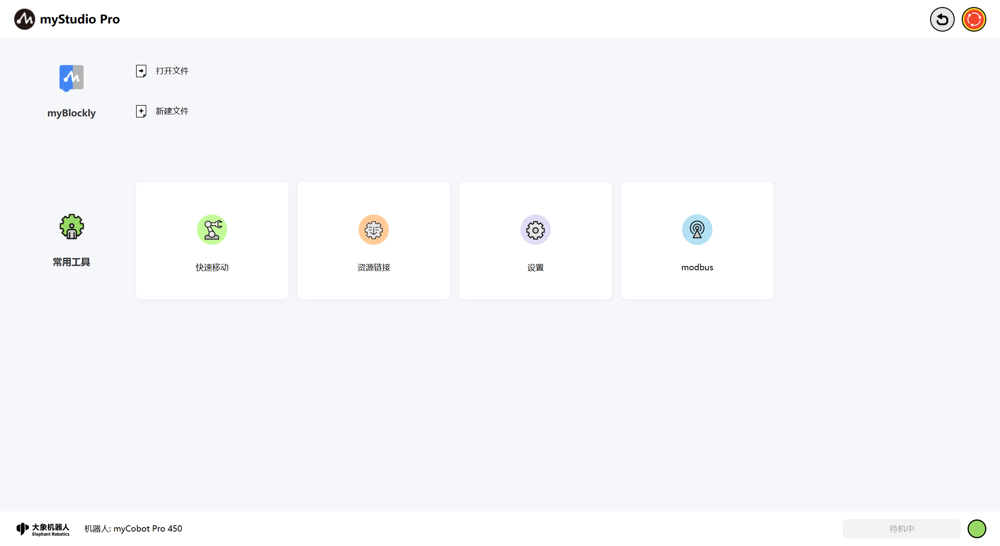

界面功能介绍，界面分成两个区域：

1. 回零与上下电
2. 功能实现
3. 信息展示

> 注意：软件会自动与机器进行通信连接，若右下角显示未连接请检查PC与机器网络连接是否通畅，或尝试将机器重启。

### 回零

此按钮功能为：控制机器人所有关节都回到零位位置。

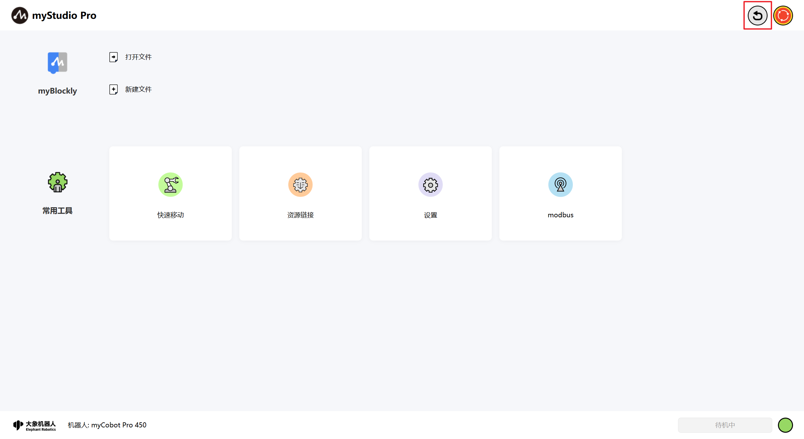

**注意**：此按钮功能生效的前提的已经成功连接机器人的通信。鼠标左键长按点击此按钮以后，机器人开始执行回零指令，机械臂将缓慢移动至零位，鼠标长按松开即回零指令停止执行。

回零完成以后，会弹窗提示完成回零。

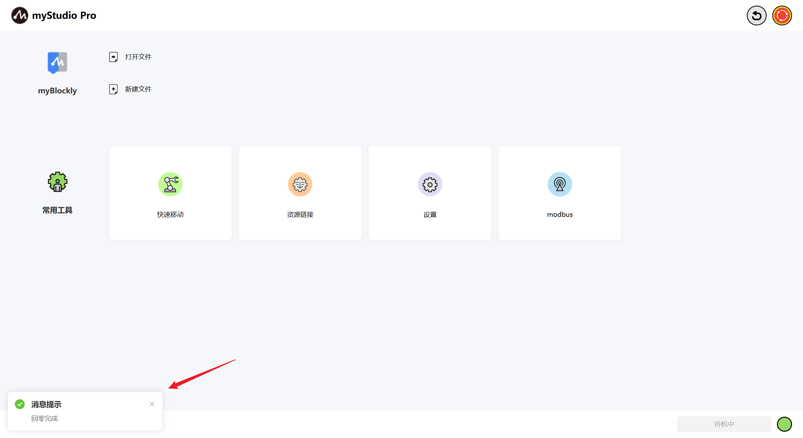

### 软急停

此按钮功能为：控制机器人整机掉电。访问页面时，会检测当前机器人是否上电，如果已经上电，此按钮为红色状态；如果未上电，此按钮会改为绿色状态并且会以弹窗的形式提示机器人未上电，可以通过点击此按钮来上电。

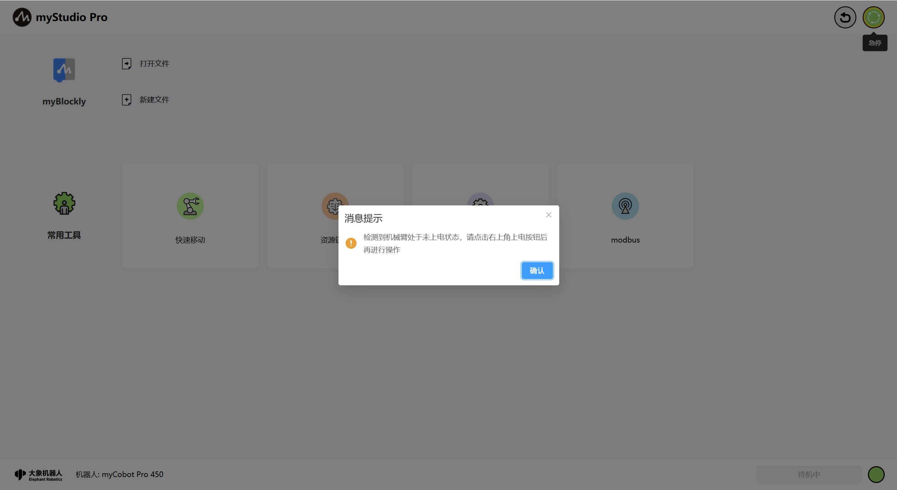

#### 上电

当此按钮为绿色图案时，此按钮的功能为上电。鼠标左键点击此按钮以后，机器人开始执行上电指令，应用整个界面会被一层透明浅灰色的阴影覆盖，上电未结束之前，不得点击界面内的其他功能，并且应用中心位置会显示正在上电的转圈图案提示。

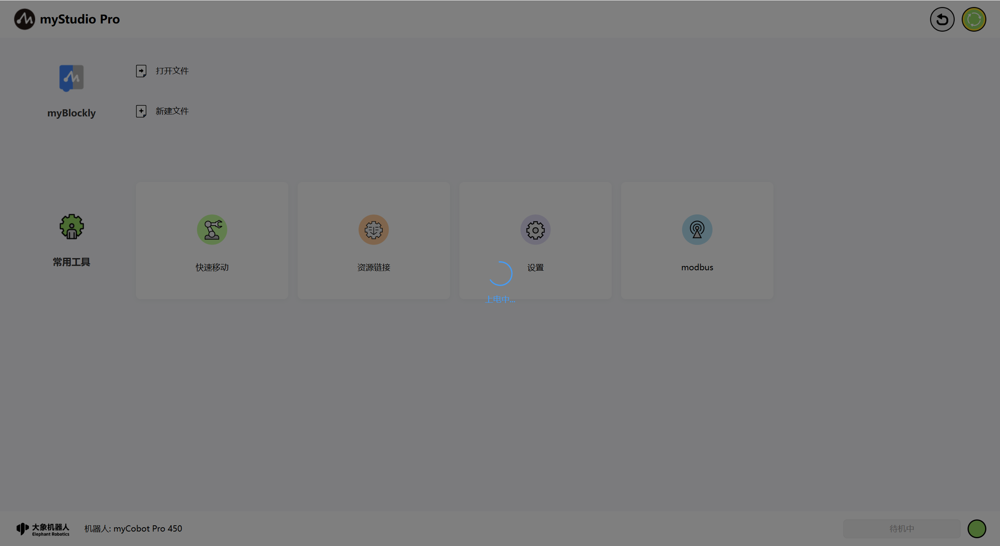

上电完成以后, 图标会变成红色并且弹窗提示。

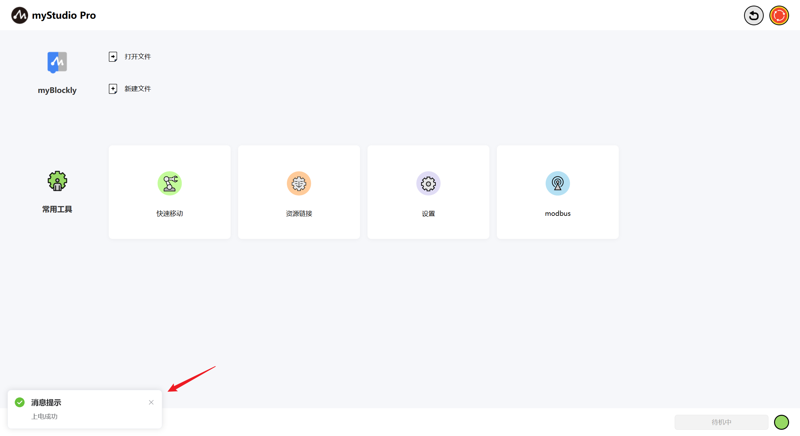

#### 下电

当此按钮为红色图案时，此按钮的功能为下电。鼠标左键点击此按钮以后，机器人开始执行下电指令。

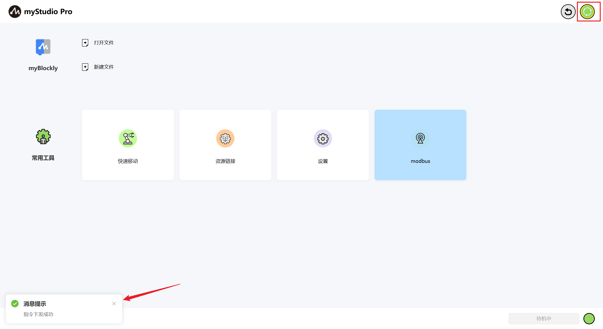

下电完成以后, 图标会变成绿色并且弹窗提示。

### 功能实现

这里可以选择你想要使用的功能，功能包含如下：

> 1. [myBlockly 图形化编程](./5.3.2-myBlockly.md)
> 2. 快速移动
> 3. 固件与应用
> 4. 设置

### myBlockly
`myBlockly`是一个完全可视的模块化编程界面，属于图形化编程语言，适合初级用户熟悉编程。使用者以拖拽拼图的方式开发出应用程序，即可创造出简单及复杂的功能。支持图形化代码的保存、加载、单步调试执行、执行指定的单个积木块等功能。

> 注意：想要使用 myBlockly 必须要先连接设备通信。

#### myBlockly

此处为可点击按钮，鼠标左键点击以后，会跳转到[myBlockly 图形化编程界面](./5.3.2-myBlockly.md)

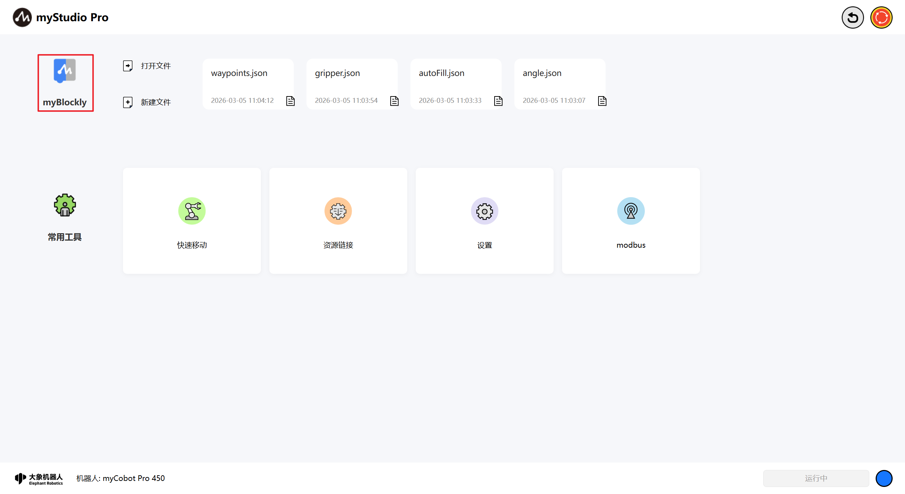

#### 打开文件

此处为可点击按钮。

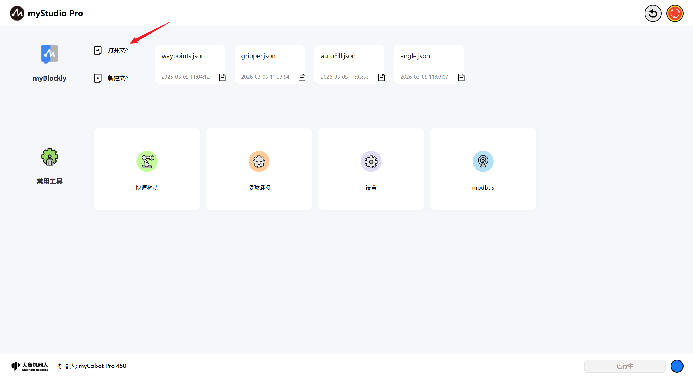

点击后会自动跳转到myBlockly并打开文件管理列表，可以基于文件列表进行 JSON 文件相关操作。

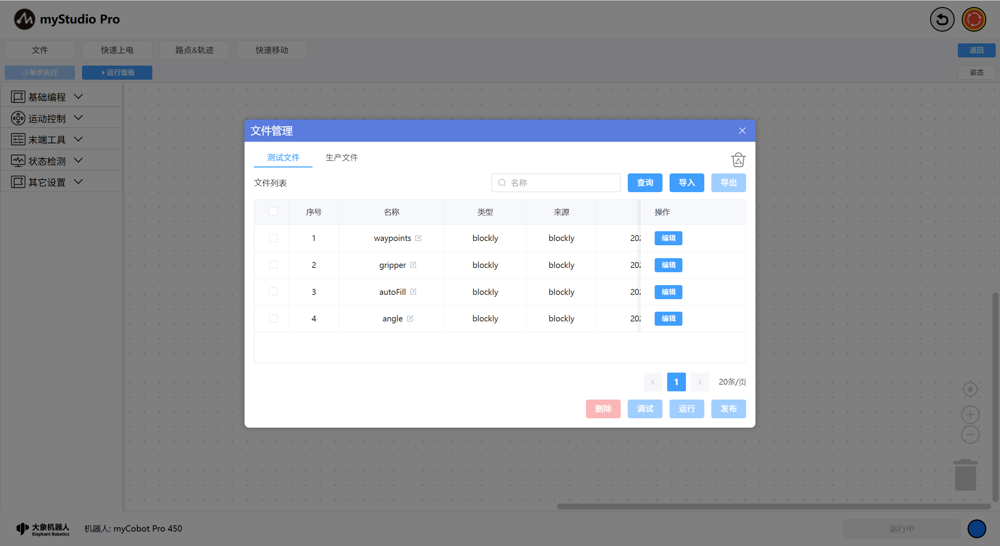

#### 新建文件

此按钮与[**myBlockly**](./5.1.3-interface_description.md#myblockly)"功能一样。

#### 快捷载入历史保存的 blockly 文件

当你在使用过 myBlockly 编程并且已经保存过 blockly 文件，如下图示位置会显示保存的文件名称以及保存时间，显示数量最多为 4 个，如果超过 4 个，只显示最新保存的 4 个。鼠标左键点击可以打开 myBlockly 并且自动加载选中的 blockly 文件。

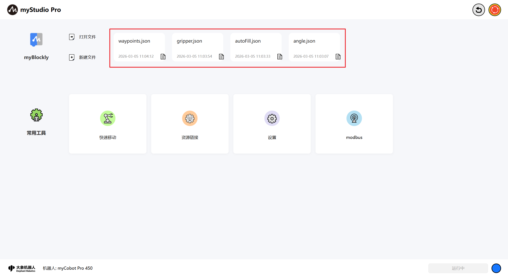

### 常用工具

#### 快速移动

功能：提供机器人 IO 快捷控制以及关节角度、坐标的快捷控制

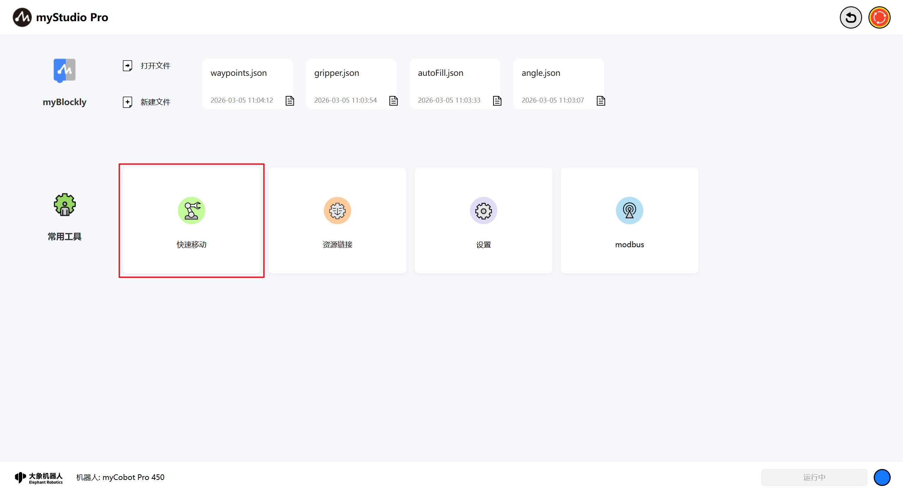

快速移动[功能详细介绍](./5.3.3-quickmove.md)

#### 资源链接

功能：提供机器人嵌入式固件的更新升级、产品使用手册、官方视频、官方 GitHub 官方在线商城以及意见反馈功能。

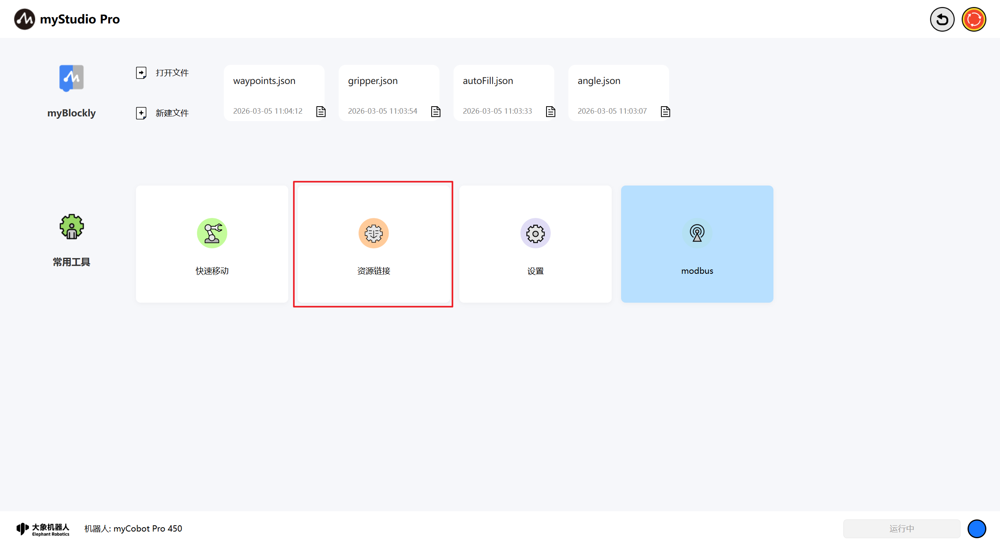

资源链接[功能详细介绍](./5.3.4-resource.md)

### 设置

功能：应用以及机器人基本信息的展示以及更改功能

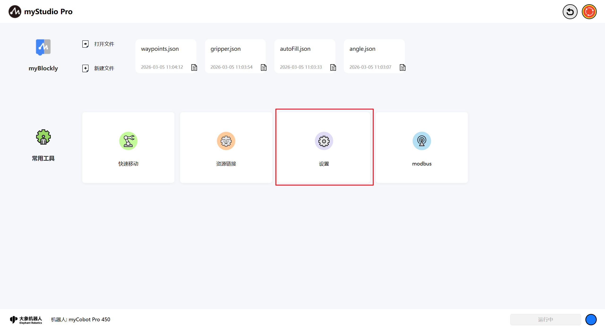

设置[功能详细介绍](./5.3.5-setting.md)

### 信息展示

应用的底层部分，包含大象机器人公司的 logo、当前机器的类型、警报提示以及当前机器人的运行状态。

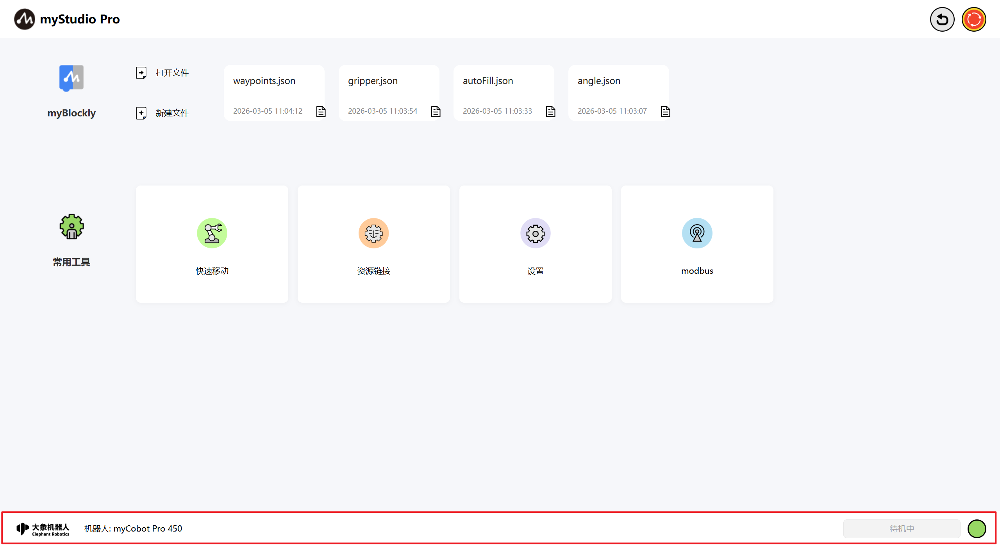

#### 报警提示

功能：展示机器人错误信息，并且鼠标左点击可以打开错误日志窗口。

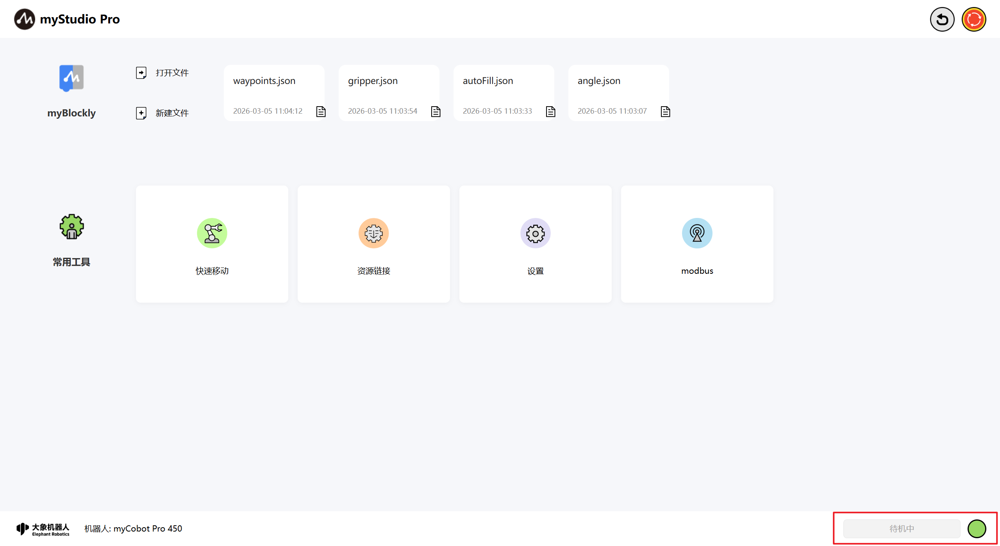

鼠标左键点击，打开错误日志窗口。

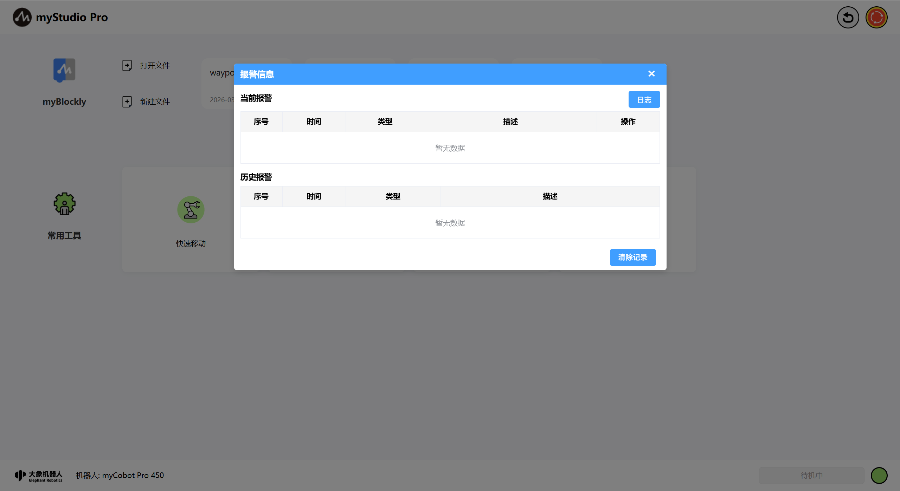

如果机器人在运行的过程中报错，应用就会捕获异常并且显示在错误日志界面中，错误日志表格内含义如下：

- number：错误日志序号
- time：错误发生的时间
- type：出现的错误类型
- description：错误描述信息

应用捕获到错误以后，首先会弹窗提示并且会给出解决方案，如果你不想处理错误，也可以忽略错误，忽略的同一个错误信息，如果未断开连接或者未进入到错误日志界面清除，本次应用内将不再弹窗提示。当你断开连接并且重新连接设备或者进入到错误日志界面，点击"清除"按钮以后，会重新弹窗提示并且保存到错误日志表中。

### 机器人状态

功能：显示当前机器人的运行状态

| Color | meaning                                                     |
| ---- | ------------------------------------------------------------ |
| | 未连接 |
|     | 正常待机 |
|     | 正在运动 |
|     | 机器异常  |

---

[← 上一章]() | [下一章 →](./5.3.1-myStudioFirstUse.md)