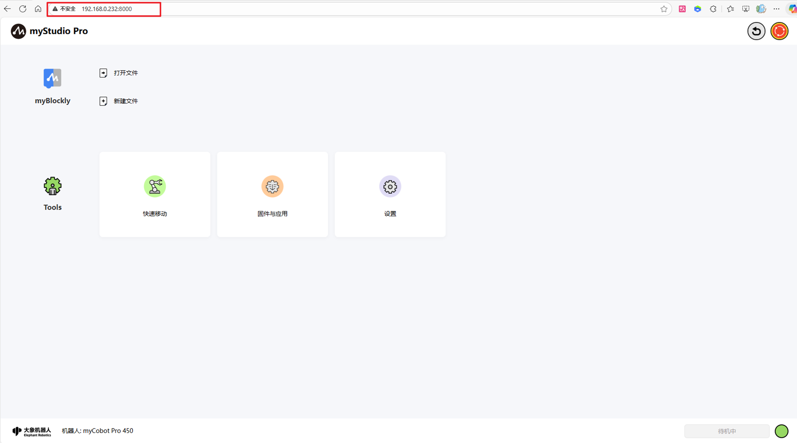
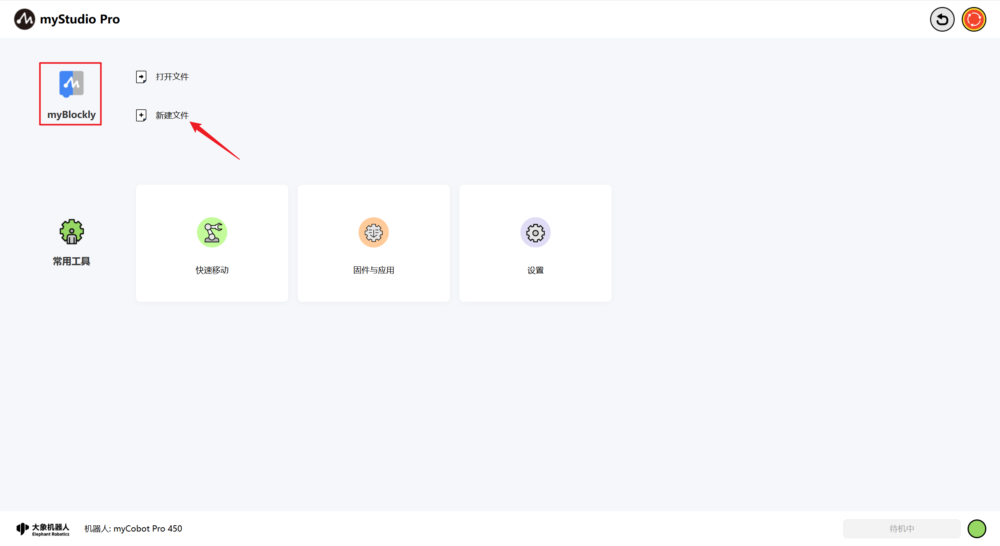
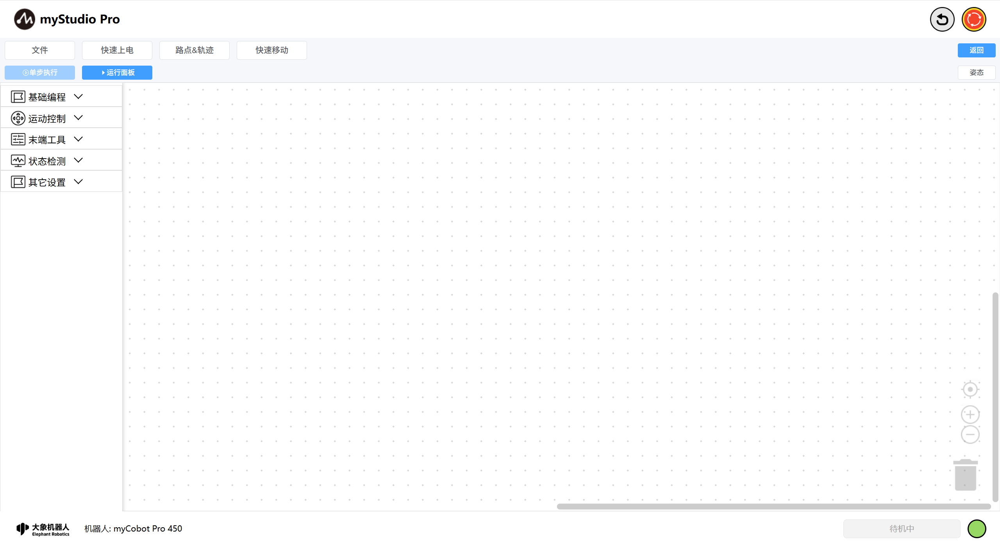

# 首次使用

`myStudio Pro`已配置到机器系统中，您可以使用PC电脑打开浏览器并通过`ip:8000`访问，首页加载完成后系统会自动与机器建立连接（默认静态ip：192.168.0.232:8000）。

您可以点击`blockly`图标，或者点击`新建文档`按钮即可进入`blockly`编程页面
> 当然，如果您也可以通过选择点击`打开文件`按钮会自动跳转到blockly编程页面，同时加载您保存好的文件内容包括工作区、路点、轨迹文件（关于如何保存工作区，[请点这里](./5.5.3-littleCase.md)） 
> 
> 这里的通过点击`blockly`图标和点击`新建文档`按钮进入`blockly`编程页面的操作相当于是新增工作区。

`blockly`主页如下图所示:

[← 上一页](../5.4-Q&A.md) |[下一页 →](./5.5.2-interfaceDescription.md)