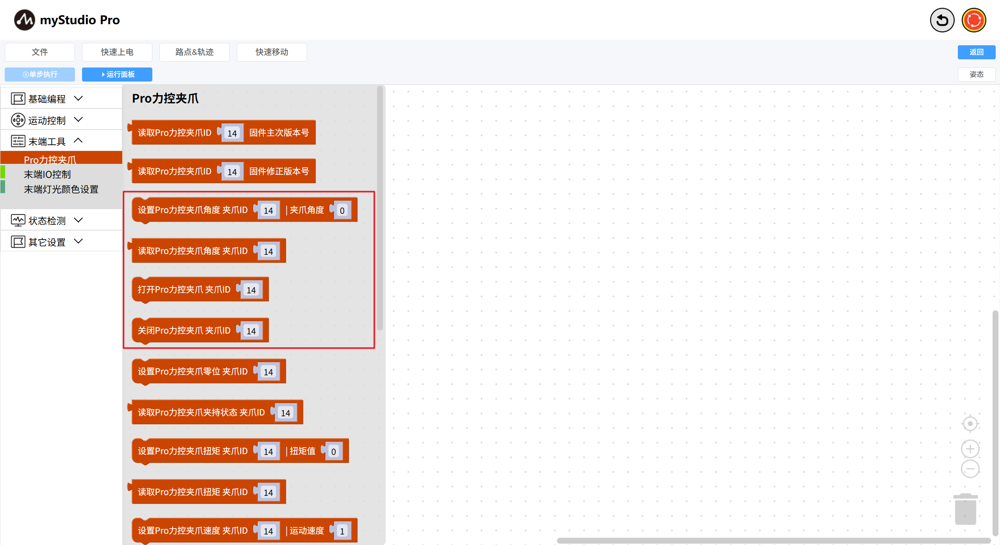
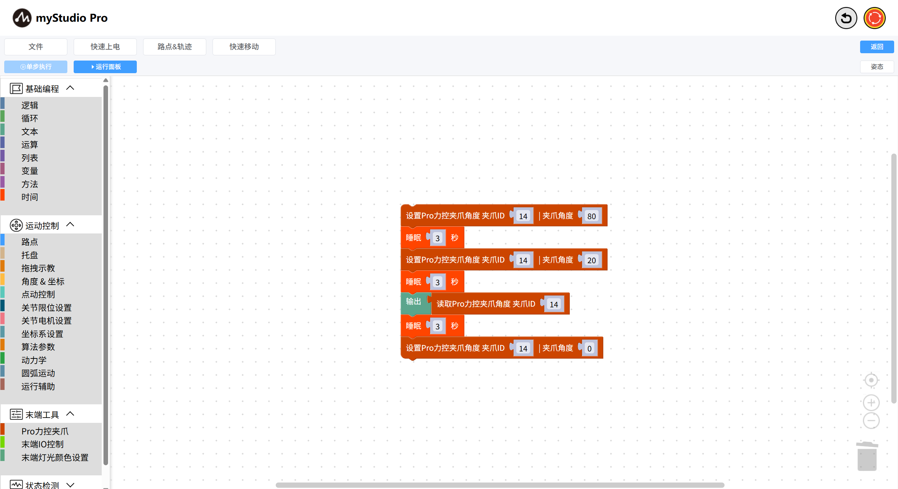

# 夹爪的使用

*开始之前*

> *1、确保机器已上电*
> 
> *2、确保机器连接正常*
> 
> *3、服务端已开启*

本章介绍如何使用`blockly`控制连接机械臂的Pro力控夹爪。

### API display

我们将用到以下积木块

1: `设置Pro力控夹爪角度`：使夹爪以指定的角度进入指定的状态（张开或闭合）

参数介绍：

该积木块有两个可以调整的参数：

- 夹爪ID参数：默认14
- 夹爪角度参数：表示需要设置的角度，取值范围0~100

2: `读取Pro力控夹爪角度`：读取当前夹爪的角度值

该积木块有一个可以调整的参数：

- 夹爪ID参数：默认14

### 小案例

图形代码如下：

- 代码的执行效果：
  - 控制Pro力控夹爪到达值为 `80` 的位置
- 等待 3 秒
  - 控制Pro力控夹爪到达值为 `20` 的位置
- 等待 3 秒
  - 读取当前Pro力控夹爪的角度值
- 等待 3 秒
  - 控制Pro力控夹爪到达值为 `0` 的位置

**注意**:

如果您无法从以上的示例中控制夹爪，请确保您的Pro力控夹爪通信方式是`modbus`协议控制。

设置完成后，然后再次运行小案例代码。

[← 上一页](./5.5.9-waypoint.md) |[下一页 →](../5.6-quickmove/5.6.1-quickmovefirstuse.md)