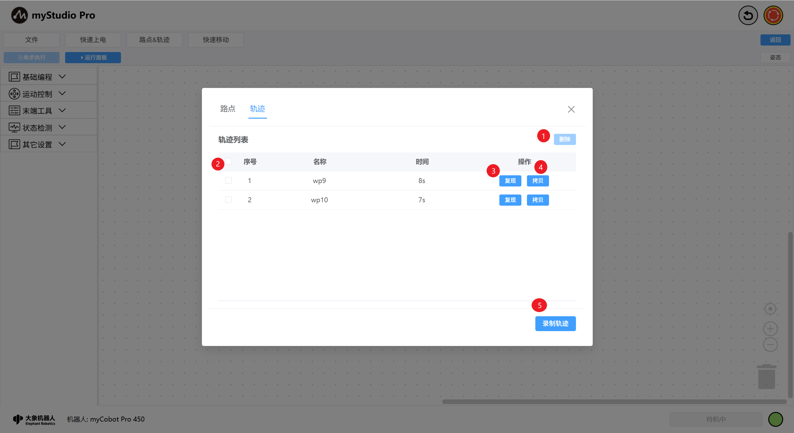
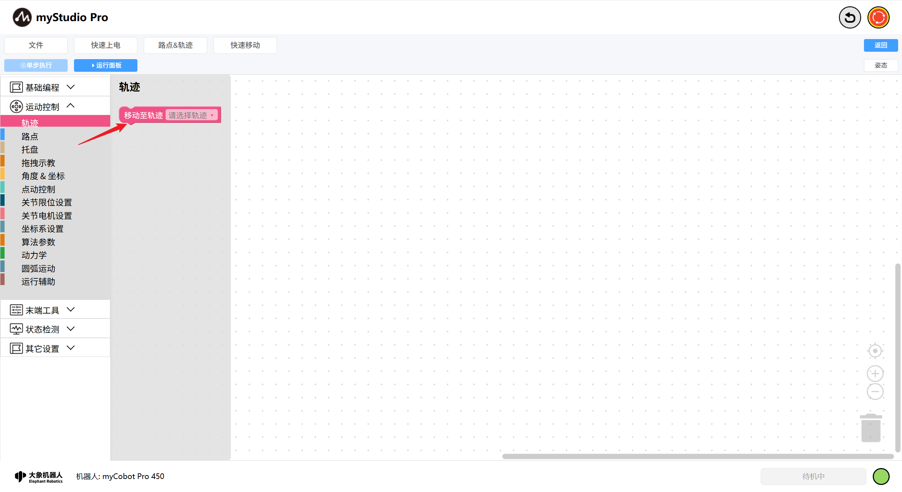
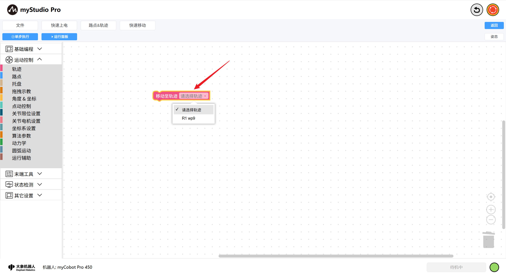
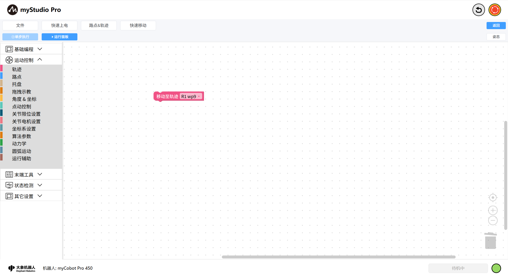
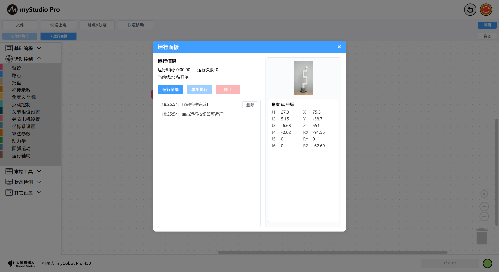
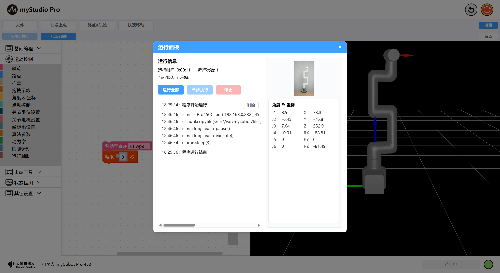

# 轨迹

*开始之前*

> *1、确保机器已上电*
> 
> *2、确保机器连接正常*
> 
> *3、服务端开启*

本章介绍如何使用轨迹功能来控制机械臂，实现拖动示教。

功能描述：通过`录制多条轨迹数据（机械臂的关节）`信息，快速控制机械臂到达每一个轨迹点位置。打开轨迹列表页面，点击录制轨迹按钮，机械臂各关节将放松，手动拖动机械臂录制轨迹，点击停止录制等待轨迹保存，保存完成即轨迹录制完成。

| 序号 | 说明                                                         |
| ---- | ------------------------------------------------------------ |
| 1    | 先选择需要删除的轨迹，至少勾选一条数据按钮可用，点击删除即可将所有勾选的轨迹删除。 |
| 2    | 列表数据勾选列，功能1以该功能为前提。     |
| 3    | 点击“复现”按钮，可以对该轨迹进行复现操作。   |
| 4    | 点击“拷贝”按钮，可以把当前轨迹拷贝至测试文件工作区。 |
| 5    | 点击“录制轨迹”按钮，机械臂会二次确认是否进行轨迹录制操作，确认后可开始录制（最长60s，超过将自动停止录制）。   |

再`blockly`中选择轨迹积木块，加入到程序编程区。在工作区中点击轨迹积木块的下拉菜单可选择当前轨迹列表页面中的数据。

选择完成后打开运行面板，点击运行全部，可以积木块运行的方式对该轨迹进行复现。

程序运行完成后，轨迹复现完成。当然，您也可以配合其他积木块进行更复杂的程序编程。

[← 上一页](./5.5.11-dragTeach.md) | [下一页 →](../5.6-quickmove/5.6.1-quickmovefirstuse.md)