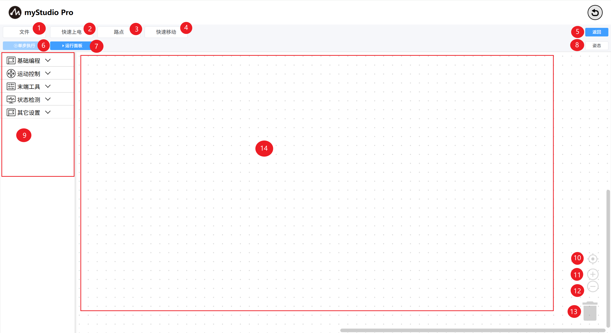

# blockly主界面介绍

| 序号 | 功能介绍                                                     |
| ---- | ------------------------------------------------------------ |
| 1    | 文件：可以进行 加载、保存、新建工作区 的操作；               |
| 2    | 快速上电：机械臂释放/抱紧关节；                              |
| 3    | 路点：快速创建示教点并运行；                                 |
| 4    | 快速移动：用于快速控制机械臂运动；                           |
| 5    | 返回：退出`blockly`主界面                                    |
| 6    | 单步执行：选中某个积木块，可以单击该按钮，只执行当前选中的积木块； |
| 7    | 运行面板：打开运行面板，在此面板可以运行、调试工作区代码；   |
| 8    | 姿态：打开姿态页面，可以看到3D模型的实时仿真运动姿态；       |
| 9    | 工具箱（toolbox）：提供构建好的积木块供用户使用；            |
| 10   | 工作区校准：点击后 工作区（workspace）会回到原点；           |
| 11   | 放大：放大 工作区（workspace）；                             |
| 12   | 缩小：缩小 工作区（workspace）；                             |
| 13   | 垃圾箱（trashcan）：可将工作区中的积木块拖动到此处删除，也支持从此处取出已删除的积木块； |
| 14   | 工作区（workspace）：可将工具箱（toolbox）中的积木块拖动到此处 进行编程； |

[← 上一页](./5.5.1-blocklyFirstUse.md) |[下一页 →](./5.5.3-littleCase.md)