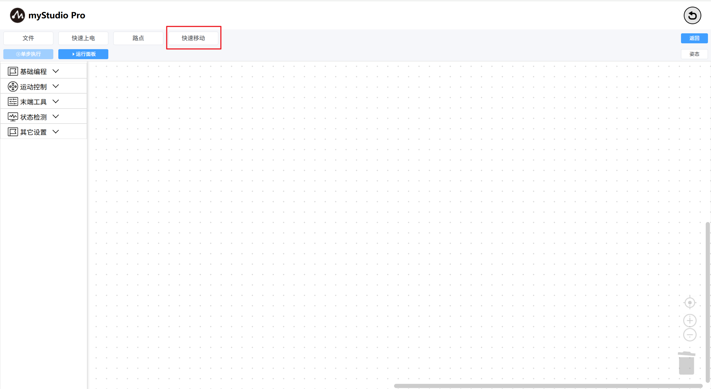

# 快速移动

*开始之前*

> *1、确保机器已上电*
>
> *2、确保机器连接正常*
>
> *3、服务端已开启*

什么是 **快速移动** ？简单来讲就是，无需编程，仅通过鼠标点击的方式快速控制机器人移动。

> 备注：myStudio 中有两个 **快速移动** 控制面板，两者功能相差不大

**第一步：点击快速移动**按钮，打开 **快速移动** 面板，等待机器人数据返回。

如果没有数据全为零，请检查是否已连接机械臂，机械臂是否正常

**第二步：** `-` / `+`按钮控制机械臂的不同关节，支持单点、长按持续移动和直接修改角度、坐标并按下`Enter`回车控制。

**第三步：** 控制坐标。

首先需要先将 关节 3 移动到 -90左右的位置，如下图。

然后就可以点击不同坐标轴的`-` / `+` 按钮来控制坐标了

对于其它功能，请查阅[快速移动](../5.6-quickmove/5.6.1-quickmovefirstuse.md)

[← 上一页](./5.5.4-autofill.md) |[下一页 →](./5.5.6-useCoords.md)