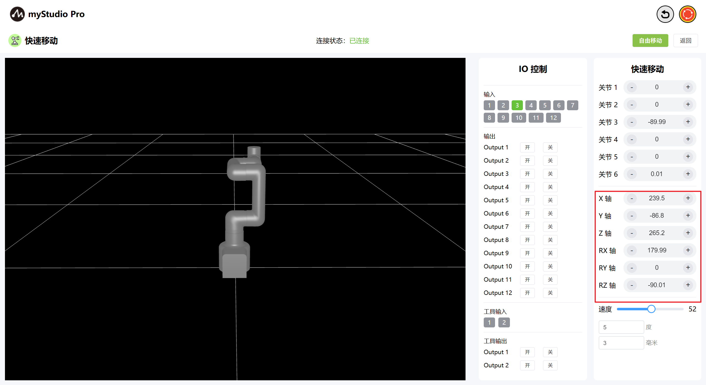
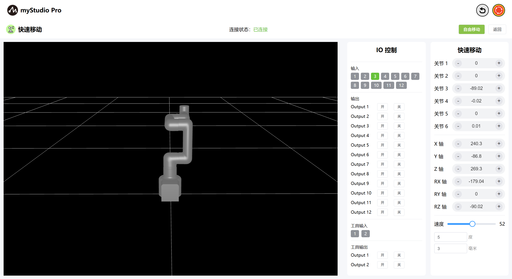
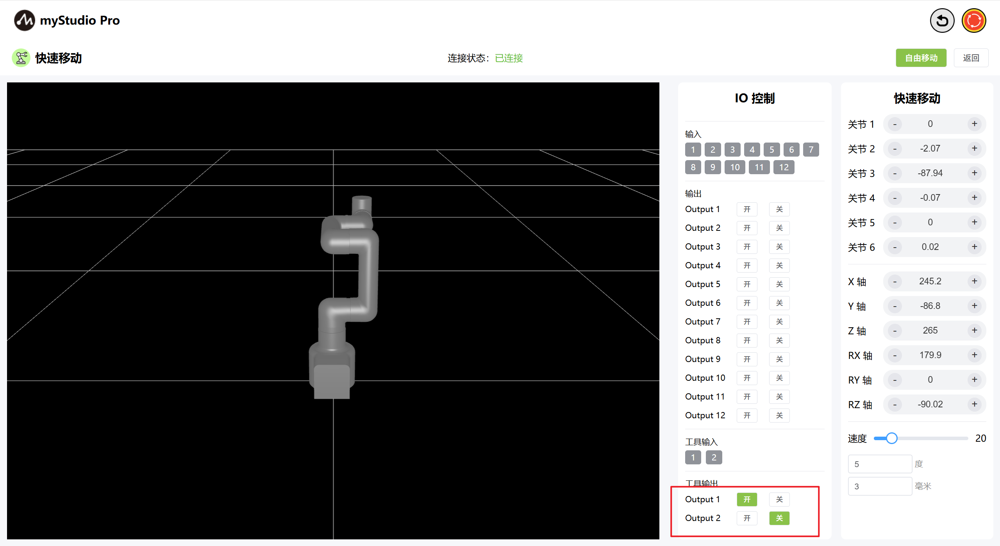
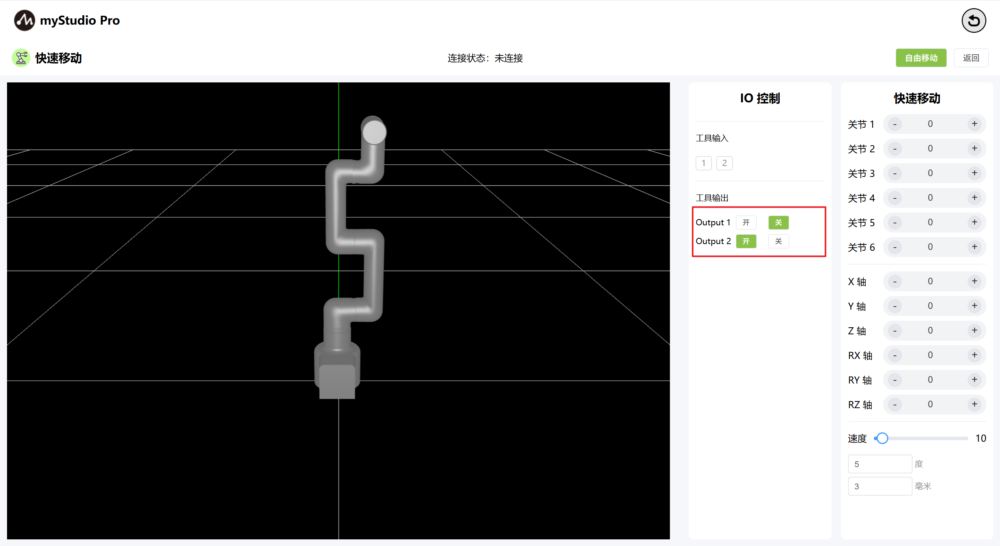

# 快速移动

*开始之前*

> 1、确保机器已上电
> 
> 2、确保机器连接正常、通信正常
> 
> 3、确保机器处于零位状态
> 
> 4、机器服务端已开启

### 1 界面介绍

| 序号 | **说明**                                                     |
| ---- | ------------------------------------------------------------ |
| 1    | MyCobotPro450 3D仿真模型                                    |
| 2    | 末端IO引脚号1、2，输入                                       |
| 3    | 末端IO引脚号1、2，输出，可用于控制Pro力控夹爪                  |
| 4    | 打开自由移动模式                                             |
| 5    | 退出快速移动界面                                             |
| 6    | 角度控制，通过点击 `+` ` `- 按钮，对机械臂进行关节角度控制，数值代表当前机械臂的关节角度信息，也可以直接修改数值进行关节控制 |
| 7    | 坐标控制，通过点击` + ` `- `按钮，对机械臂进行坐标控制，数值代表当前机械臂的坐标姿态信息，也可以直接修改数值进行坐标控制 |
| 8    | 设置机械臂的运动速度，默认 10 mm/s                           |
| 9    | 角度步长，调整角度时每次增加或减小的角度值                   |
| 10   | 坐标步长，调整坐标姿态时每次增加或减小的坐标值               |

### 2 角度控制
在角度控制区域中，通过点击`+` `-`按钮，对机械臂进行关节角度控制，数值代表当前机械臂的关节角度信息，也可以直接修改数值进行关节控制。

### 3 坐标控制
在使用坐标控制之前，需要将 关节3 移动到-90左右的角度位置。

在坐标控制区域中，通过点击 `+` `-` 按钮，对机械臂进行坐标控制，数值代表当前机械臂的坐标姿态信息，也可以直接修改数值进行坐标控制。

### 4 自由移动

通过点击 自由移动 按钮，打开自由移动模式，界面按钮颜色变成橘黄色，代表机器处于自由移动模式状态，可进行机器的拖拽移动。

按钮变为黄色：

当自由移动按钮处于黄色状态时，再次点击该按钮，则代表关闭自由移动模式。

### 5 IO 控制

#### 5.1 末端IO

设置末端IO引脚号 1-2 输出，可以控制Pro力控夹爪。

通过点击 开 关 按钮，打开Pro力控夹爪。

通过点击 关 开 按钮，关闭Pro力控夹爪。

[← 上一页](../5.5-blockly/5.5.10-gripperUse.md) | [下一页 →](../5.7-firmware/5.7.1-firmware_main.md)