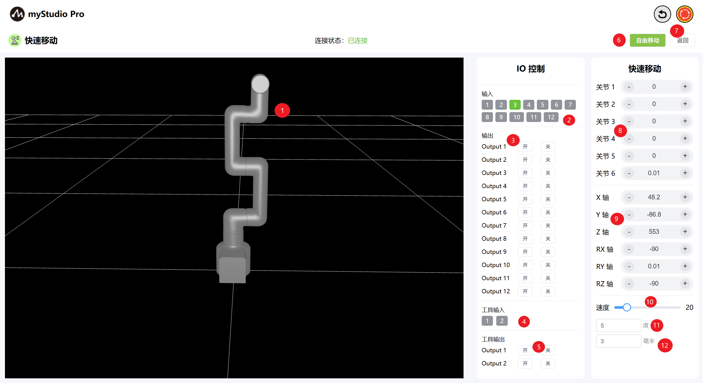
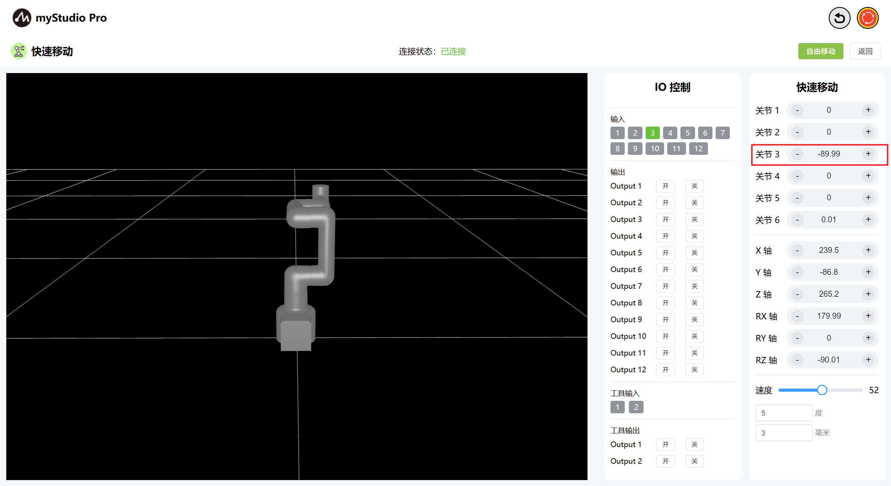
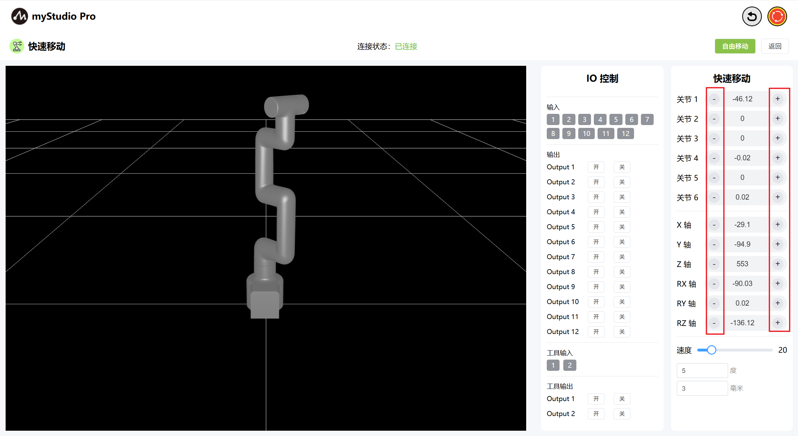

# 快速移动

*开始之前*

> *1、确保机器已上电*
> 
> *2、确保机器连接正常、通信正常*
> 
> *3、确保机器处于零位状态*
> 
> *4、机器服务端已开启*

### 1 界面介绍

| 序号 | **说明**                                                     |
| ---- | ------------------------------------------------------------ |
| 1    | MyCobotPro450 3D仿真模型                                    |
| 2    | 底部IO引脚号1-12，输入，属于安全模块检测项                      |
| 3    |底部IO引脚号1-12，输出，可以点击开关按钮进行设置输出              |
| 4    | 末端IO引脚号1、2，输入                                       |
| 5    | 末端IO引脚号1、2，输出，可用于控制Pro力控夹爪                  |
| 6    | 打开自由移动模式                                             |
| 7    | 退出快速移动界面                                             |
| 8    | 角度控制，通过点击 `+` ` `- 按钮，对机械臂进行关节角度控制，数值代表当前机械臂的关节角度信息，也可以直接修改数值进行关节控制 |
| 9    | 坐标控制，通过点击` + ` `- `按钮，对机械臂进行坐标控制，数值代表当前机械臂的坐标姿态信息，也可以直接修改数值进行坐标控制 |
| 10    | 设置机械臂的运动速度，默认 10 mm/s                           |
| 11    | 角度步长，调整角度时每次增加或减小的角度值                   |
| 12   | 坐标步长，调整坐标姿态时每次增加或减小的坐标值               |

### 2 角度控制
在角度控制区域中，通过点击`+` `-`按钮，对机械臂进行关节角度控制，数值代表当前机械臂的关节角度信息，也可以直接修改数值进行关节控制。

### 3 坐标控制
在使用坐标控制之前，需要将 关节3 移动到-90左右的角度位置。

在坐标控制区域中，通过点击 `+` `-` 按钮，对机械臂进行坐标控制，数值代表当前机械臂的坐标姿态信息，也可以直接修改数值进行坐标控制。

### 4 自由移动

通过点击 自由移动 按钮，打开自由移动模式，界面按钮颜色变成橘黄色，代表机器处于自由移动模式状态，可进行机器的拖拽移动。

按钮变为黄色：

当自由移动按钮处于黄色状态时，再次点击该按钮，则代表关闭自由移动模式。

### 5 持续移动

以通过长按 对应区域的`+` `-` 按钮，可以控制机器人按照指定的角度持续移动。

注意： + - 按钮每次长按 3 秒后，需要松开按钮，重新长按，再继续操作持续移动。

### 6 IO 控制

#### 6.1 底部IO

设置底部IO引脚号 1-12 输出，用户可以自定义控制执行器。例如可以自定义控制夹爪、吸泵。

点击 `开` `关` 按钮进行设置。

#### 6.2 末端IO

设置末端IO引脚号 1-2 输出，可以控制Pro力控夹爪。

通过点击 开 关 按钮，打开Pro力控夹爪。

通过点击 关 开 按钮，关闭Pro力控夹爪。

[← 上一页](../5.5-blockly/5.5.10-gripperUse.md) | [下一页 →](../5.7-firmware/5.7.1-firmware_main.md)