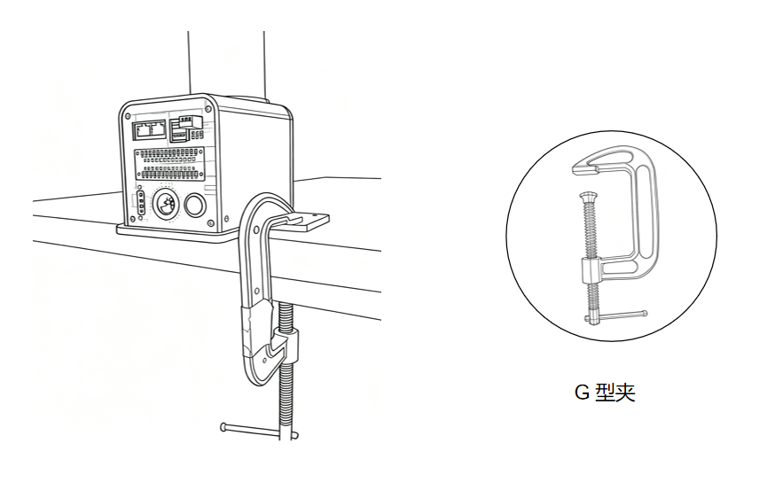
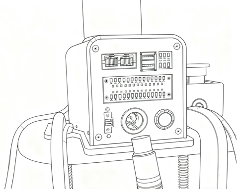
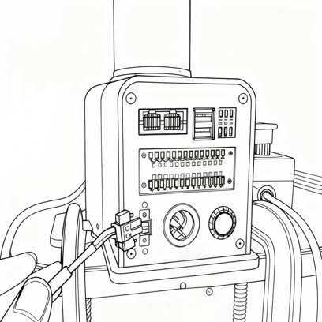
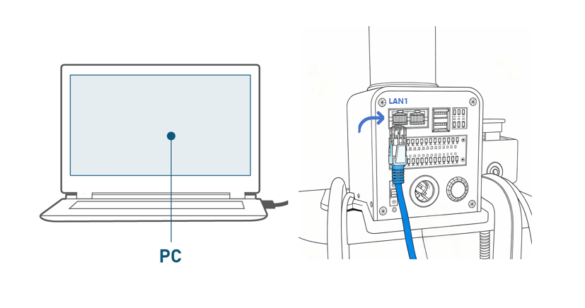

# 初次使用机械臂指南
## 安装方式
1.在开始组装之前，请清理工作台，并准备好需要用到的工具。

  -  工作环境：水平放置在承重至少大于机械臂自重 3 倍的桌面上且不小于机械臂的工作范围，并有足够的安装、使用、维护和修理空间。

  -  工具清单：mycobot pro 450  机械臂主体、产品配件包、产品使用指南等。

2.将.把机器臂平放在桌面上并正向放到桌面边，用G型夹固定。

3.结构安装完成后，方可进行下一步的电源连接。
> **注意:**
> 1. 在底座安装台上调整机器人位置时，请勿在底座安装台上直接推拉机器人，以免造成划伤。 
> 2. 手动移动机器人时，请勿对机身易损部位施加外力，以免对机器人造成不必要的损坏。

## 连接电源

> 准备工具：已安装好底座安装台的mycobot pro 450 机械臂、DC24V 直流电源、急停按钮等。

> **注意：**
> 1. 请确认您已完成上述的结构安装，并将机械臂底座固定在桌面上，以确保操作安全。
> 2. 请按照下列图示流程，将电源适配器与机械臂上对应的接口进行连接：

步骤 1：
将直流电源（请确保使用官方适配器，或者DC24V15A 以上供电能力的直流电源）与mycobot pro 450 机械臂上对应的DC 圆形接口相连，适配器另一端链接110-220V电源插座。

步骤 2：
将急停按钮与mycobot pro 450 机械臂上对应的接口相连。

步骤 3：
将mycobot pro 450机械臂上对应的LAN1接口与上位机相连。

步骤 4：
按下开关键开机。

> **注意：**
> 1. mycobot pro 450必须使用外部电源供电，以提供足够的电力
> 2. 额定电压:24V
> 3. 额定电流:10A
> 4. 插头类型: DC24V  MIC4（NEUTRIK XLR NC4FX equivalent）

## 夹爪安装及使用

可以参考以下链接：

- [夹爪安装](https://docs.elephantrobotics.com/docs/myGripper-F100-cn/4-FirstInstallAndUse/4-FirstInstallAndUse.html)
- [夹爪使用](./5.5-blockly/5.5.10-gripperUse.md)

[← 上一章](../../2-BasicSettings/4-FirstInstallAndUse/4.3-PowerOnDetectionGuide.md) | [下一章 →](./5.1-myStudioFirstUse.md)