# 外骨骼摇操做 MyCobot Pro 450 夹取木块案例
## 1. 准备工作
### 1.1 准备材料
- MyCobot Pro 450 机械臂
- 40X40cm 木块
- USB转type-C 数据线
- 笔记本电脑
- 网线
- 力控夹爪
- MyController S570 外骨骼及配套背心

### 1.2 准备步骤
1. **静态IP配置及启动客户端**
   - 将网线连接MyCobot Pro 450与电脑，并按下机械臂电源开关按钮。
   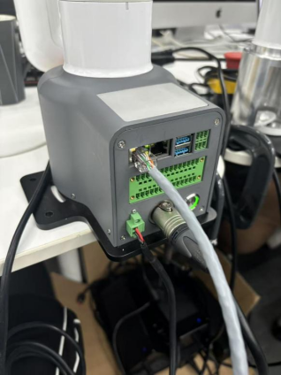
   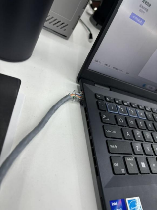
   - 打开电脑控制面板-->网络和Internet-->网络和共享中心-->更改适配器设置-->以太网。 鼠标右键点击以太网，点击属性，双击如图箭头所示

   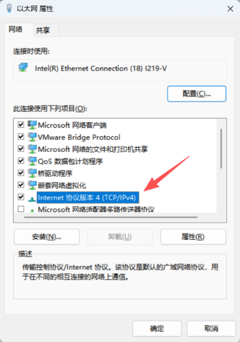

   - 将IP配置如下图所示，配置后点击确定

   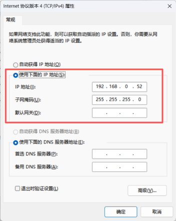

   - 打开如下图所示软件

   

   - 打开软件后
   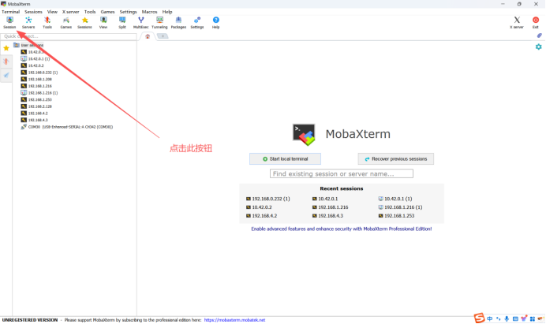
   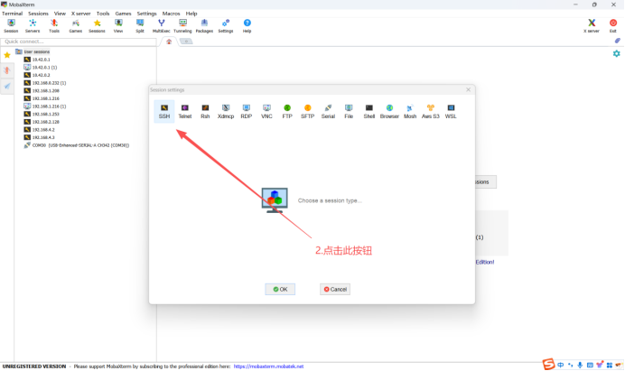
   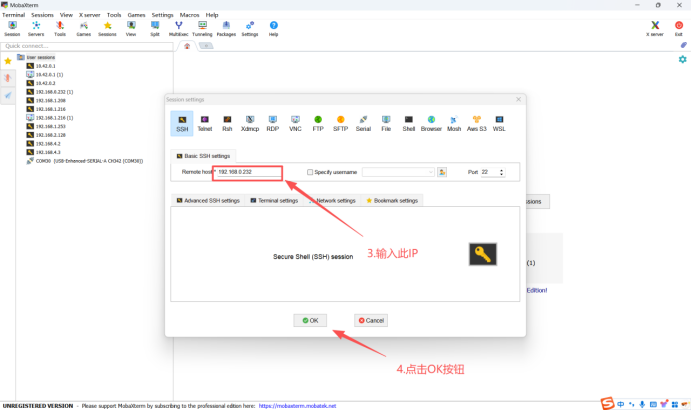
   - 进入如下界面即为正常
        - 用户名：root
        - 密码：root
   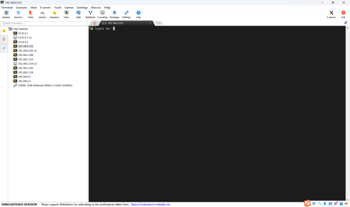
   - 进入系统如下图所示
   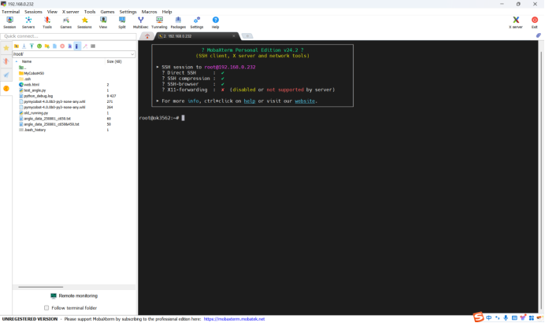
   - 输入指令cd ./MyCobot450/bin/ 将路径切换至bin目录下
   
   - 输入./MyCobotPro 后回车，听到刹车声，证明机器正常启动
     - （注意：若提示“Permission denied”，要输入chmod +x ./MyCobotPro后回车，再执行一次 ./MyCobotPro 的操作）
    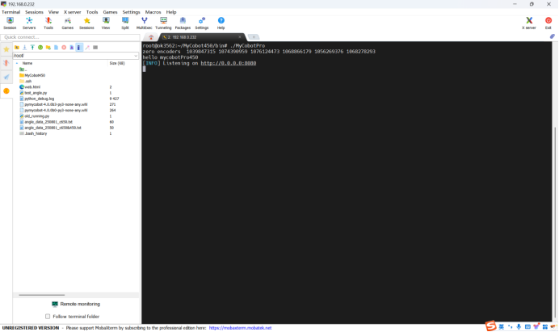


2. **外骨骼连接**
    - 穿戴好背心后，将外骨骼与配套背心连接，按下外骨骼电源开关按钮后，将USB转type-C数据线连接至外骨骼与电脑上。
    
    - 打开电脑的设备管理器，确定外骨骼的串口号，例如此处的COM5
    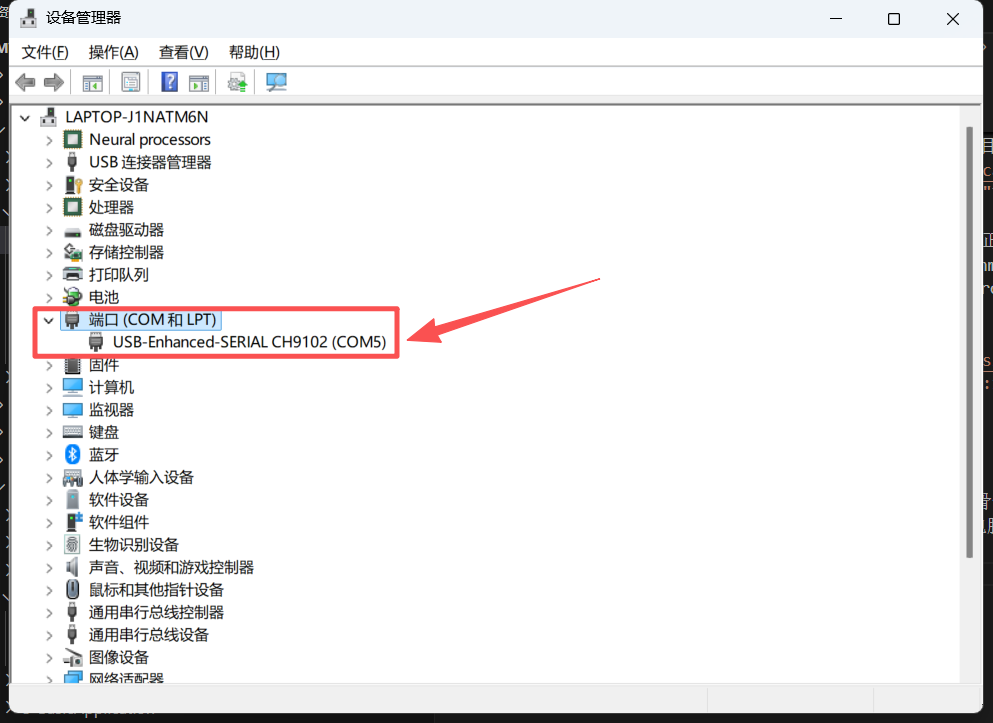

## 2.源码
**创建一个python文件并将下列源码拷贝至文件中,pymycobot库版本使用4.0.1及以上版本**
```python
import os
import threading
import time
import serial
from Pro450.pymycobot import Exoskeleton, Pro450Client
from pymycobot.utils import get_port_list

Pro450 = Pro450Client("192.168.0.232", 4500)
# 修改对应的外骨骼串口号
obj = Exoskeleton("COM7")
Pro450.set_fresh_mode(1)


# 控制夹爪函数
def open_gripper():
    Pro450.set_pro_gripper_open()
    Pro450.set_pro_gripper_open()


def close_gripper():
    Pro450.set_pro_gripper_close()
    Pro450.set_pro_gripper_close()


def control_arm(arm):
    while True:
        if arm == 2:
            arm_data = obj.get_arm_data(2)
            x, y = arm_data[11], arm_data[12]
            red_btn = arm_data[9]
            blue_btn = arm_data[10]
            mercury_list = [
                -arm_data[1] - 40, arm_data[0], -arm_data[3] - 20, arm_data[5] + 40,
                arm_data[4] + 70, arm_data[6] - 50
            ]

            Pro450.send_angles(mercury_list, 100)

            if red_btn == 0:
                threading.Thread(target=open_gripper, args=()).start()

            elif blue_btn == 0:
                threading.Thread(target=close_gripper, args=()).start()


def main():
    # threading.Thread(target=control_arm, args=(1,)).start()  # 左臂
    threading.Thread(target=control_arm, args=(2,)).start()  # 右臂
    while True:
        time.sleep(1)


if __name__ == "__main__":
    main()
```

## 3.效果展示
<video src="../../resources/3-FunctionsAndApplications/7.ExamplesRobotsUsing/demo.mp4" controls="controls" width="800" height="500"></video>
