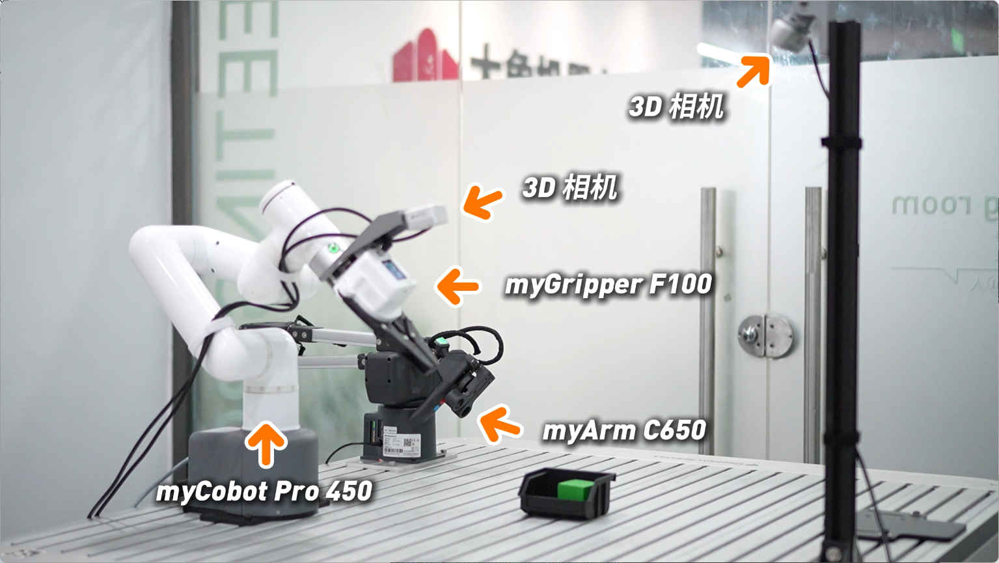
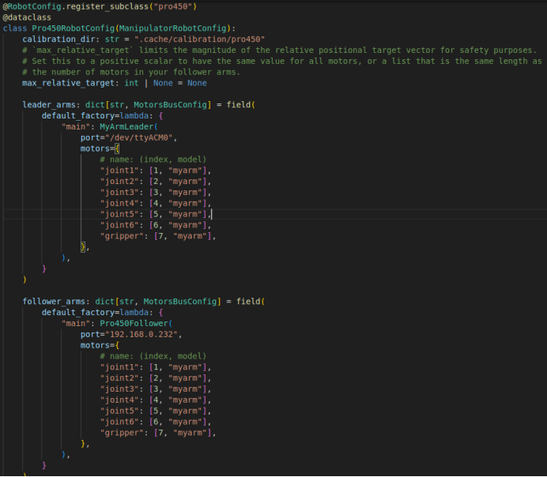
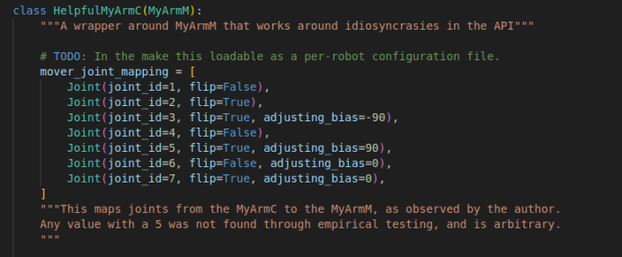
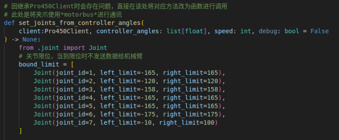
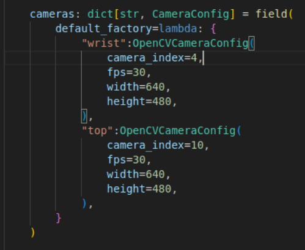

# ACT模仿学习训练案例
## 1.准备工作
### 1.1 准备材料
- MyCobot Pro 450 机械臂
- MyArm C650 机械臂
- 电脑（3080及以上版本显卡、Ubuntu 22.04及以上版本、ROS2）
- 顶部摄像头 D405
- 腕部摄像头 D435
- 力控夹爪
- 顶部摄像头支架
- USB转type-C数据线

### 1.2 硬件连接
- 顶部摄像头连接到 电脑上
- 腕部摄像头连接到 电脑上
- 力控夹爪连接到 MyCobot Pro 450 的末端接口上
- 腕部摄像头连接在 MyCobot Pro 450 的末端上
- MyArm C650 通电后再用type-C数据线连接到电脑上
- 启动 MyCobot Pro 450 机械臂并启动系统中的客户端（若不会启动客户端请参考[机器人复合案例](7.1.md) ）
- 顶部摄像头支架连接顶部摄像头
    - 如下图所示
    

### 1.3 机械臂固件版本
- Pro450：
    - basic version：1.0（及以上版本）
- C650：
    - basic version：1.20（及以上版本）

## 2.项目配置
### 2.1 项目拉取
- 项目网址：[https://github.com/elephantrobotics/ER-ALOHA/tree/lerobot_pro450](https://github.com/elephantrobotics/ER-ALOHA/tree/lerobot_pro450)
- 终端输入：git clone https://github.com/elephantrobotics/ER-ALOHA.git
- 将项目拉取下来后在文件夹内新建一个终端，输入： git switch lerobot_pro450

### 2.2 配置对应接口
- 确定MyArm C650机械臂串口名称，终端输入：**ls /dev/ttyACM***  
- 给串口权限，终端输入：**sudo chmod a+rw /dev/ttyACM***（串口名称）
- 确定两个摄像头串口名称，终端输入：**ls /dev/video***
- 给摄像头权限，终端输入：**sudo chmod a+rw /dev/video***（串口名称）

- 根据识别到的MyArm C650机械臂串口名称，修改ER-ALOHA/lerobot/common/robot_devices/robots
/configs.py文件中的串口名称，如图所示位置


### 2.3 初始化环境和路径
- 在终端输入：
    - **conda activate lerobot_pro450**
    - **cd ~/lerobot_pro450**

### 2.4 遥操性能验证
- 在激活的虚拟环境下的终端中输入：
    ```python
    python lerobot/scripts/control_robot.py \
        --robot.type=pro450 \
        --robot.cameras='{}' \
        --control.type=teleoperate
    ```
**当遥操的映射关系不满足预期时，打开在虚拟环境中全局搜素，搜索mover_joint_mapping，对应修改文档的映射关系（acton_ai/controller_wrapper.py）如下图位置**


**当遥操的限位不满足预期时，打开在虚拟环境中全局搜素，搜索bound_limit，对应修改文档的限位关系（ER-ALOHA/acton_ai/connection_utilities.py）如下图位置**


### 2.5 验证摄像头是否正常
- 在激活的虚拟环境下的终端中输入：
    ```python
    python lerobot/common/robot_devices/cameras/opencv.py
    ```
**注意输出的摄像头图像是否和配置文件中一致
（ER-ALOHA/lerobot/common/robot_devices/robots/configs.py）如下图所示**


## 3.采集数据
- 在激活的虚拟环境下的终端中输入：
    ```python
    python lerobot/scripts/control_robot.py \
        --robot.type=pro450 \
        --control.type=record \
        --control.fps 30 \
        --control.single_task="Fold the Clothes." \
        --control.repo_id=$USER/fold_clothes \
        --control.num_episodes=10 \
        --control.warmup_time_s=1 \
        --control.episode_time_s=300 \
        --control.reset_time_s=60
    ```
**在录制一个片段（episode）时，按下右箭头键 -> 可提前退出，并进入环境重置（resetting the environment）阶段。  
在重置环境时，按下右箭头键 -> 可提前退出，并进入下一个片段的录制。  
按下左箭头键 <- 可提前退出并重新录制当前片段。  
按下退出键 esc 可停止数据录制  
此案例录制了一百次数据集**

## 4. 可视化数据集
- 在激活的虚拟环境下的终端中输入：
    ```python
    python lerobot/scripts/visualize_dataset.py \
        --repo-id $USER/fold_clothes \
        --episode-index 0
    ```

## 5. 策略网络训练
- 在激活的虚拟环境下的终端中输入：
    ```python
    python lerobot/scripts/train.py \
        --dataset.repo_id=$USER/fold_clothes \
        --policy.type=act \  
        --policy.device=cuda \
        --output_dir=outputs/train/fold_clothes \
        --steps=100000 \
        --save_freq=50000 \
        --job_name=fold_clothes
    ```
**注意dataset.repo_id的值，需要和采集数据时的repo-id保持一致**

## 6. 策略网络推理
- 在激活的虚拟环境下的终端中输入：
    ```python
    python lerobot/scripts/control_robot.py \
        --robot.type=pro450 \
        --control.type=record \
        --control.fps=15 \
        --control.single_task="Fold the Clothes." \
        --control.repo_id=$USER/eval_fold_clothes \
        --control.tags='["tutorial"]' \
        --control.warmup_time_s=3 \
        --control.episode_time_s=120 \
        --control.reset_time_s=120 \
        --control.num_episodes=10 \
        --control.push_to_hub=false \
        --control.policy.path=outputs/train/fold_clothes/checkpoints/010000/pretrained_model
    ```
**注意control.policy_path的值，需要和策略网络训练时的output_dir保持一致**

## 7. 结果展示
<video src="../../resources/3-FunctionsAndApplications/7.ExamplesRobotsUsing/demo_ACT.mp4" controls="controls" width="800" height="500"></video>

