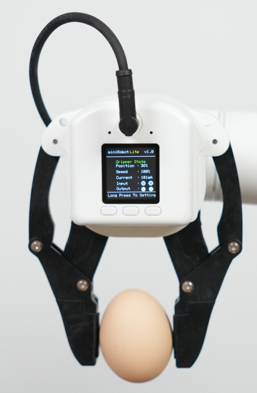

# myGripper F100 力控夹爪

## 1 产品图片


## 2 规格参数说明

| **名称**     | **myGripper F100 力控夹爪**      |
| :----------- | :-------------------------------------- |
| 材料         | PC、PBT                       |
| 尺寸        | 156X106X61mm                       |
| 工艺技术     | 注塑                                |
| 夹取范围     | 0-100毫米（默认指尖）                                |
| 重复性精度   | 0.5 mm                                  |
| 使用寿命     | 30万次开合                                    |
| 驱动模式     | 电驱动                                  |
| 传动方式   | 齿轮+连杆                             |
| 尺寸         | 158x105x55mm                            |
| 重量         | 340 g                               |
| 额定负载   | 500g                                  |
| 工作电压   | 24V                                 |
| 固定方法     | 螺丝固定                                |
| 使用环境要求 | 常温常压                                |
| 控制接口     | RS485/IO 控制/按键控制                        |
| 适用设备     | ER myCobot 320系列,ER Mercury系列,ER myCobot Pro 600,ERmyCobot Pro 630,ER myCobot Pro 450,其他通用机器人 |

## 3 工作原理
在电机的驱动下，机械手的手指表面做直线往复运动，实现打开或关闭动作。通过设置夹持力矩，使工件的冲击最小，定位点可控，夹紧可控。

## 4 使用场景
实验操作：在科研实验中，完成试管、器皿等的抓取和移动，确保实验的安全和准确性。
教育演示：作为教学工具，帮助学生理解机器人抓取原理，培养实践能力。
物料搬运：在模拟生产线或仓储中，搬运各种规格的物料，提高工作效率。

## 5 安装方式

用螺丝和垫片将夹爪连接件安装到机械臂末端法兰


再用螺丝将夹爪安装在连接件上


最后用M8航空线将夹爪和机械臂就行连接


## 6 python控制方式

### 基于450末端IO 控制
基于IO控制的方式只能控制夹爪全开全合

```python
from pymycobot import ElephantRobot
import time
mc=ElephantRobot("192.168.1.159",5001)
mc.start_client()

def gripper_open():
    mc.set_digital_out(16,0)
    mc.set_digital_out(17,1)

def gripper_close():
    mc.set_digital_out(16,1)
    mc.set_digital_out(17,0)


if __name__=="__main__":
    gripper_open()
    time.sleep(2)
    gripper_close()
    time.sleep(2)
```

### 基于USB转485模块控制

**注意**：使用该方式控制夹爪，需要将连接夹爪的M8航空线的一端接到USB转485模块上。即M8航空线带插头的一端连接夹爪，一端连接USB转485模块和24V电源。

**接线说明：**


连接夹爪端的 24V，GND, 485_A(T/R+,485+) , 485_B(T/R-,485-)共 4 根线，电源为24V直流稳压电源或是630底部IO的24V，将模块的 USB 插口插入到电脑的 USB 接口


485A 接入 485 转 USB 模块 A+;

485B 接入 485 转 USB 模块 B-;

24V 接入 24V 直流稳压电源正极/630底部IO的24V;

GND 接入 24V 直流稳压电源负极/630底部IO的GND

**驱动库安装**
[点击下载驱动库](https://github.com/elephantrobotics/elegripper)


### 串口依赖库安装
在电脑终端执行下面命令，安装依赖库
```bash
pip install pyserial
```
### API说明

### get_firmware_version()

- **功能:** 获取夹爪固件主版本号
- **参数:** 无
- **返回:** `(int)`固件主版本号

### get_modified_version()

- **功能:** 获取夹爪固件次版本号
- **参数:** 无
- **返回:** `(int)`固件次版本号

### get_gripper_Id()

- **功能:** 获取夹爪ID
- **参数:** 无
- **返回:** `(int)`夹爪ID


### get_gripper_baud()

- **功能:** 获取夹爪波特率
- **参数:** 无
- **返回:**`(int)` 0-5
    - `0`: 115200
    - `1`: 1000000
    - `2`: 57600
    - `3`: 19200
    - `4`: 9600
    - `5`: 4800

### get_gripper_value()

- **功能:** 获取夹爪的当前位置数据信息
- **参数:** 无
- **返回:** `(int)`夹爪的当前位置数据

### get_gripper_status()

- **功能:** 获取夹爪的当前状态
- **参数:** 无
- **返回:**`(int)` 0-3
    - `0`:  正在运动
    - `1`: 停止运动，未检测到夹到物体
    - `2`: 停止运动，检测到夹到了物体
    - `3`: 检测到夹到物体以后，物体掉落

### get_gripper_speed()

- **功能:** 获取夹爪的当前速度
- **参数:** 无
- **返回:** `(int)`夹爪的当前速度

### get_gripper_P()

- **功能:** 获取夹爪PID的P值
- **参数:** 无
- **返回:** `(int)`夹爪PID的P值

### get_gripper_I()

- **功能:** 获取夹爪PID的I值
- **参数:** 无
- **返回:** `(int)`夹爪PID的I值

### get_gripper_D()

- **功能:** 获取夹爪PID的D值
- **参数:** 无
- **返回:** `(int)`夹爪PID的D值

### get_gripper_cw()

- **功能:** 获取夹爪顺时针可运行误差
- **参数:** 无
- **返回:** `(int)`夹爪顺时针可运行误差

### get_gripper_cww()

- **功能:** 获取夹爪逆时针可运行误差
- **参数:** 无
- **返回:** `(int)`夹爪逆时针可运行误差

### get_gripper_mini_pressure()

- **功能:** 获取夹爪最小启动力
- **参数:** 无
- **返回:** `(int)`夹爪最小启动力

### get_gripper_io_open_value()

- **功能:** 获取夹爪Io张开角度
- **参数:** 无
- **返回:** `(int)`夹爪Io张开角度

### get_gripper_io_close_value()

- **功能:** 获取夹爪Io闭合角度
- **参数:** 无
- **返回:** `(int)`获取夹爪Io闭合角度

### get_gripper_queue_count()

- **功能:** 获取夹爪当前队列的数据量
- **参数:** 无
- **返回:** `(int)`夹爪当前队列的数据量

### get_gripper_vir_pos()

- **功能:** 获取夹爪舵机虚位数值
- **参数:** 无
- **返回:** `(int)`夹爪舵机虚位数值
  
### get_gripper_protection_current()

- **功能:** 获取夹爪夹持电流
- **参数:** 无
- **返回:** `(int)`夹爪夹持电流


### set_gripper_Id(value)

- **功能:** 设置夹爪ID号
- **参数:** 
  - `value`: `(int)` 夹爪ID，取值范围 `1-254`
- **返回:**`(int)` 0-1
  - `0`: 失败
  - `1`: 成功

### set_gripper_baud(value)

- **功能:** 设置夹爪波特率
- **参数:** 
  - `value`: `(int)` 夹爪波特率，取值范围 `0-5`
    - `0`: 115200
    - `1`: 1000000
    - `2`: 57600
    - `3`: 19200
    - `4`: 9600
    - `5`: 4800
- **返回:**`(int)` 0-1
  - `0`: 失败
  - `1`: 成功
  
### set_gripper_enable(value)

- **功能:** 设置夹爪使能状态
- **参数:** 
  - `value`: `(int)` 使能状态，取值范围 `0-1`
    - `0`: 掉使能
    - `1`: 上使能
- **返回:**`(int)` 0-1
  - `0`: 失败
  - `1`: 成功

### set_gripper_value(value,speed)

- **功能:** 设置夹爪以指定的速度转动到指定的位置
- **参数:** 
  - `value`: `(int)` 位置，取值范围 `0-100`
  - `speed`: `(int)` 速度，取值范围 `1-100` 
- **返回:**`(int)` 0-1
  - `0`: 失败
  - `1`: 成功

### set_gripper_calibration()

- **功能:** 设置夹爪零位校准
- **参数:** 无
- **返回:**`(int)` 0-1
  - `0`: 失败
  - `1`: 成功

### set_gripper_P(value)

- **功能:** 设置夹爪PID的P值
- **参数:** 
  - `value`: `(int)` P值，取值范围 `0-254`
- **返回:**`(int)` 0-1
  - `0`: 失败
  - `1`: 成功

### set_gripper_I(value)

- **功能:** 设置夹爪PID的I值
- **参数:** 
  - `value`: `(int)` I值，取值范围 `0-254`
- **返回:**`(int)` 0-1
  - `0`: 失败
  - `1`: 成功

### set_gripper_D(value)

- **功能:** 设置夹爪PID的D值
- **参数:** 
  - `value`: `(int)` D值，取值范围 `0-254`
- **返回:**`(int)` 0-1
  - `0`: 失败
  - `1`: 成功

### set_gripper_cw(value)

- **功能:** 设置夹爪顺时针可运行误差
- **参数:** 
  - `value`: `(int)` 误差，取值范围 `0-16`
- **返回:**`(int)` 0-1
  - `0`: 失败
  - `1`: 成功

### set_gripper_cww(value)

- **功能:** 设置夹爪逆时针可运行误差
- **参数:** 
  - `value`: `(int)` 误差，取值范围 `0-16`
- **返回:**`(int)` 0-1
  - `0`: 失败
  - `1`: 成功

### set_gripper_mini_pressure(value)

- **功能:** 设置夹爪最小启动力
- **参数:** 
  - `value`: `(int)` 最小启动力，取值范围 `0-254`
- **返回:**`(int)` 0-1
  - `0`: 失败
  - `1`: 成功

### set_gripper_torque(value)

- **功能:** 设置夹爪扭矩
- **参数:** 
  - `value`: `(int)` 扭矩，取值范围 `0-300`
- **返回:**`(int)` 0-1
  - `0`: 失败
  - `1`: 成功

### set_gripper_output(value)

- **功能:** 设置夹爪IO
- **参数:** 
  - `value`: `(int)` 夹爪IO，取值范围 `0-3`
    - `0`: out1 off,out2 off
    - `1`: out1 on,out2 off
    - `2`: out1 off,out2 on
    - `3`: out1 on,out2 on
    
- **返回:**`(int)` 0-1
  - `0`: 失败
  - `1`: 成功

### set_gripper_io_open_value(value)

- **功能:** 设置夹爪Io张开位置
- **参数:** 
  - `value`: `(int)` 位置，取值范围 `0-100`
- **返回:**`(int)` 0-1
  - `0`: 失败
  - `1`: 成功

### set_gripper_io_close_value(value)

- **功能:** 设置夹爪Io闭合位置
- **参数:** 
  - `value`: `(int)` 位置，取值范围 `0-100`
- **返回:**`(int)` 0-1
  - `0`: 失败
  - `1`: 成功

### set_gripper_speed(speed)

- **功能:** 设置夹爪速度
- **参数:** 
  - `speed`: `(int)` 速度，取值范围 `1-100`
- **返回:**`(int)` 0-1
  - `0`: 失败
  - `1`: 成功

### set_abs_gripper_value(value,speed)

- **功能:** 设置夹爪以指定的速度转动到指定的绝对位置
- **参数:**
  - `value`: `(int)` 位置，取值范围 `1-100` 
  - `speed`: `(int)` 速度，取值范围 `1-100`
- **返回:**`(int)` 0-1
  - `0`: 失败
  - `1`: 成功

### set_gripper_vir_pos(value)

- **功能:** 设置夹爪舵机虚位数值
- **参数:** 
  - `value`: `(int)` 虚位，取值范围 `0-100`
- **返回:**`(int)` 0-1
  - `0`: 失败
  - `1`: 成功

### set_gripper_protection_current(value)

- **功能:** 设置夹爪夹持电流
- **参数:** 
  - `value`: `(int)` 虚位，取值范围 `1-254`
- **返回:**`(int)` 0-1
  - `0`: 失败
  - `1`: 成功

### set_gripper_pause()

- **功能:** 设置夹爪暂停运动
- **备注:** 只对set_abs_gripper_value()生效
- **参数:** 无
- **返回:**`(int)` 0-1
  - `0`: 失败
  - `1`: 成功

### set_gripper_resume()

- **功能:** 设置夹爪恢复运动
- **备注:** 只对set_abs_gripper_value()生效
- **参数:** 无
- **返回:**`(int)` 0-1
  - `0`: 失败
  - `1`: 成功

### set_gripper_stop()

- **功能:** 设置夹爪停止运动，并清空消息队列
- **备注:** 只对set_abs_gripper_value()生效
- **参数:** 无
- **返回:**`(int)` 0-1
  - `0`: 失败
  - `1`: 成功


#### 案例程序
```python
from elegripper import Gripper
import time
if __name__=="__main__":
    g=Gripper("COM27",baudrate=115200,id=14)##填写实际的串口号和波特率和夹爪ID
    print("夹爪的实际ID为:",g.get_gripper_Id())
    print(g.set_gripper_value(100,100))
    time.sleep(2)
    print(g.set_gripper_value(0,100))
    time.sleep(2)
```


---

[← 上一章](./accessories.md) | [下一章 →](./10.2-PneumaticGripper.md)