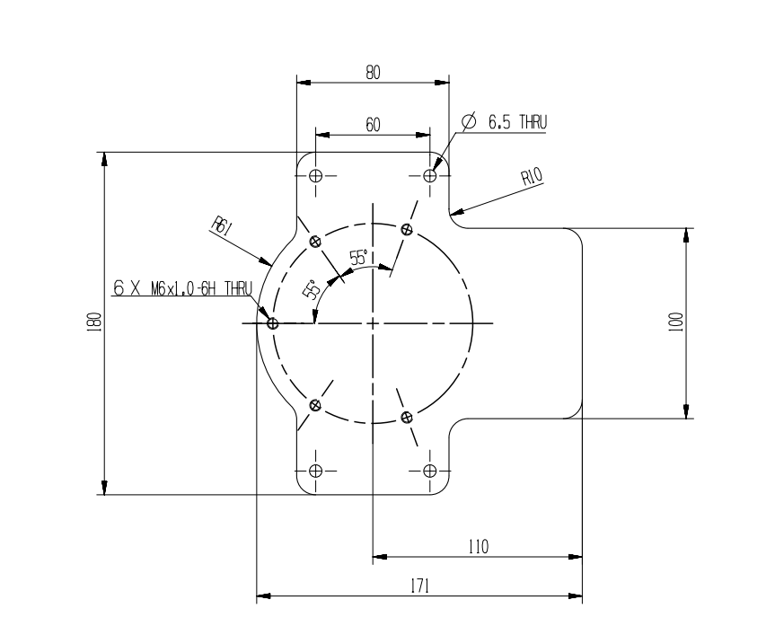
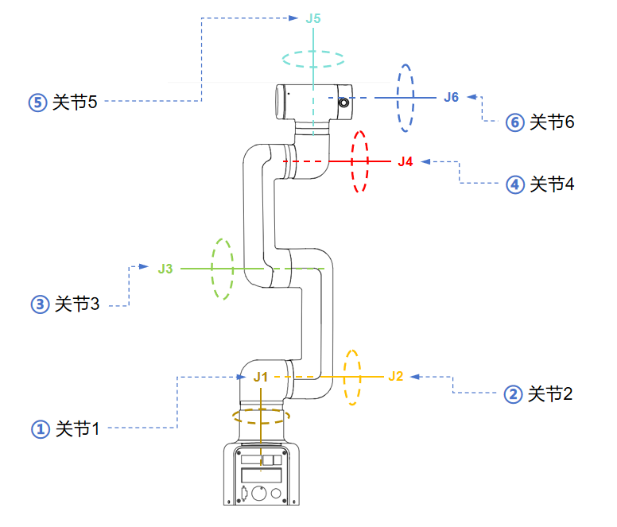

# 机器人参数说明

> 第一章中，我们探讨了产品的卖点及其设计理念，为您提供了对产品高层次理解的全景视角。现在，让我们进入第二章——机器人参数说明。这一章节将是您理解产品技术细节的关键。详细了解这些技术参数，不仅可以帮助您充分认识到我们产品的先进性和实用性，而且还能够确保您能够更有效地利用这些技术来满足您的具体需求。

## 1. 机器人规格参数

| 指标       | 参数 |
| :-----------: | :---------: |
| 名称         | 全谐波协作机械臂 |
| 型号         | myCobot Pro 450 |
| 自由度       | 6          |
| 有效负载     | 1 Kg       |
| 工作半径     | 450mm      |
| 重复定位精度 | ±0.1mm  |
| 重量         | <5Kg       |
| 电源输入     | 24V，9.2A       |
| 工作温度     | 0-45℃     |
| 通信         | TCP/IP-Socket MODBUS Ethernet IP    |

## 2. 控制核心参数

### 2.1 主控制器规格表

### 2.2 辅助控制器规格表

---

## 3. 结构尺寸参数
> ！本章以毫米为距离单位，以度为角度单位。

### 3.1 产品尺寸和工作空间
<!--  -->

### 3.2 关节运动范围
| 关节       | 范围 |
| :--------: | :----------:|
| J1        | -360 ~ +360     |
| J2        | -135 ~ +135      |
| J3  | -135 ~ +135                   |
| J4        | -150 ~ +150 |
| J5   | -360 ~ +360                   |
| J6   | -360 ~ +360         |
### 3.3 孔位安装
- 机器人底座安装法兰，底座同时兼容乐高科技件安装方式和M4螺丝安装方式。

- 机器人末端安装法兰，机械臂末端同时兼容乐高科技件孔与螺丝螺纹孔。

## 4. 电气特性参数

## 5. 笛卡尔坐标参数

---

[← 上一章](../1-ProductIntroduction/1-ProductIntroduction.md) | [下一章 →](../../2-BasicSettings/3-UserNotes/README.md)
