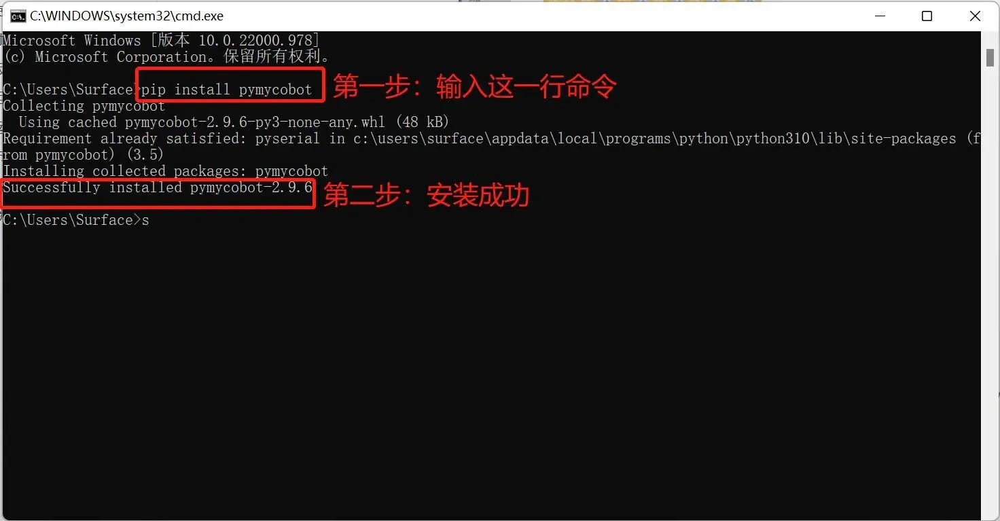

# 软件问题

## 1. myBlockly 相关

- **问题 1**：运行 myBlockly 时，出现错误信息 `ModuleNotFoundError: No module named 'pymycobot'`
  - **解决方案**: 这是因为在设置 Python 环境时没有安装 pymycobot 库。要安装 pymycobot 库，需要打开终端（Win 键 + R 键），输入 `pip install pymycobot --upgrade --user`点击回车键，即可看到 "成功安装 pymycobot"。



- **问题 2**：由于未添加 `sleep` 方法模块，机械臂没有响应
  - **解决方案**: 操作机械臂的程序需要一定时间才能完成，因此在完成一个动作后，需要连接一个 `sleep` 模块，让机械臂在进行下一个动作前有足够的时间（所需时间取决于具体情况和机器，机械臂的默认设置是运行 myBlockly 时休眠时间最短不少于 0.5 秒），否则机械臂将无法实现理想的动作。

- **问题 3**: SSH无法连接
  - **解决方案**：该情况一般是网线连接不良导致，可先拔出PC端网线再重新插上连接，当控制面板检测出连接时（一般是`以太网`），然后打开`Windows 命令提示符`，使用`ping`命令进行检查，正常输出信息时再进行`SSH`连接尝试。以上步骤无法解决，尝试对机器重启再操作。

- **问题 4**：输入 IP 后打不开？
  - **解决方案**: 请确认 PC 与机械臂处于同一局域网，尝试更换浏览器（推荐 Chrome / Edge），刷新缓存（Ctrl + F5）


## 2. ROS1 相关

### 1 环境相关问题

- **问题 1**：运行 `roslaunch` 报错 `package 'mycobot_pro_450' not found`
  - **原因**：ROS 工作空间没有正确编译或环境变量未加载  
  - **解决方式**：  
    ```bash
    cd ~/catkin_ws
    catkin_make
    source devel/setup.bash
    ```

### 2 网络通信问题

- **问题 1**：报错 Trying to connect to real MyCobot Pro450... Timeout

  - **原因**：PC 与机械臂未在同一网段，或 IP 地址设置错误

  - **解决方式**：

    - 确认机械臂默认 IP 为 192.168.0.232

    - 将 PC 网卡设置为同网段，例如 192.168.0.100

    - 测试连通性：

      ```bash
      ping 192.168.0.232
      ```

### 3 Python API/库问题

- **问题 1**：**运行时报错** ModuleNotFoundError: No module named 'pymycobot'

  - **原因**：Python 环境中未安装 pymycobot

  - **解决方式**：

    ```bash
    pip3 install pymycobot
    ```

- **问题 2**：**运行时报错** ImportError: cannot import name 'Pro450Client' from 'pymycobot'

  - **原因**：pymycobot 版本过低

  - **解决方式**：

    ```bash
    pip install -U pymycobot
    ```

- **问题 3**：**运行时报错** RuntimeError: The version of pymycobot library must be greater than 3.9.9 or higher. The current version is 3.9.7. Please upgrade the library version.

  - **原因**：pymycobot 版本过低

  - **解决方式**：

    ```bash
    pip install -U pymycobot
    ```

    **注意**：版本需大于 **4.0.0**

### 4 ROS节点运行问题

- **问题 1**：rviz 打开后模型不显示

  - **原因1**：`robot_description` 未正确加载

  - **解决方式**：
    - 检查 `roslaunch` 命令是否完整
    - 在终端输入：

      ```bash
      rosparam list | grep robot_description
      ```
      若能看到 `/robot_description` 参数，说明模型已加载。

    - 请检查 joint_state_publisher 与 robot_state_publisher 是否已正常运行。
    - 通过 `rostopic list` 命令确认存在 `/joint_states`、`/tf`、`/tf_static`，这些是模型显示和运动的必要话题。

- **问题 2**：rviz 打开后模型显示不齐全,并且终端一直输出类似警告信息：`Warning [Invalid frame ID "base" passed to canTransform argument target frame frame does not exist rviz] rviz- at line 133 in /tmp/binarydeb/ros-foxy-tf2-0.13.13/src/buffer core.cpp`

  - **原因1**：机械臂通信异常，无法正常读取角度坐标

  - **解决方式**：
    - `joint_states` 是否在发布（会打印消息）
      - 在终端输入：

        ```bash
        rostopic echo -n 5 /joint_states
        ```
        如果 `/joint_states` 没有输出，很大概率是机械臂通信或 mycobot 服务没获取到数据。

      - 请检查 joint_state_publisher 与 robot_state_publisher 是否已正常运行。
      - 通过 `rostopic list` 命令确认存在 `/joint_states`、`/tf`、`/tf_static`，这些是模型显示和运动的必要话题。

    - 检查机械臂的通信状态，具体查看 [Python异常处理](../6.1-python/7_exception_description.md)
    - 检查机械臂能否正常读取角度和坐标
        ```python
        from pymycobot import Pro450Client
        mc = Pro450Client('192.168.0.232', 4500)

        if mc.is_power_on() !=1:
            mc.power_on()

        print(mc.get_angles(), mc.get_coords())
        ```

- **问题 3**：报错信息：`[WARN]: Coordinate control disabled. Please press '2' first.`

  - **解决方式**：先在键盘控制界面输入 `2`，让机械臂回到初始点，再进行坐标控制

## 3 ROS2 相关

### 1 环境相关问题

- **问题 1**：运行 `ros2 launch` 报错 `package 'mycobot_pro_450' not found`
  - **原因**：ROS 工作空间没有正确编译或环境变量未加载  
  - **解决方式**：  
    ```bash
    cd ~/colcon_ws
    colcon build
    source install/setup.bash
    ```

### 2 网络通信问题

- **问题 1**：报错 Trying to connect to real MyCobot Pro450... Timeout

  - **原因**：PC 与机械臂未在同一网段，或 IP 地址设置错误

  - **解决方式**：

    - 确认机械臂默认 IP 为 192.168.0.232

    - 将 PC 网卡设置为同网段，例如 192.168.0.100

    - 测试连通性：

      ```bash
      ping 192.168.0.232
      ```

### 3 Python API/库问题

- **问题 1**：**运行时报错** ModuleNotFoundError: No module named 'pymycobot'

  - **原因**：Python 环境中未安装 pymycobot

  - **解决方式**：

    ```bash
    pip3 install pymycobot
    ```

- **问题 2**：**运行时报错** ImportError: cannot import name 'Pro450Client' from 'pymycobot'

  - **原因**：pymycobot 版本过低

  - **解决方式**：

    ```bash
    pip install -U pymycobot
    ```

- **问题 3**：**运行时报错** RuntimeError: The version of pymycobot library must be greater than 3.9.9 or higher. The current version is 3.9.7. Please upgrade the library version.

  - **原因**：pymycobot 版本过低

  - **解决方式**：

    ```bash
    pip install -U pymycobot
    ```

    **注意**：版本需大于 **4.0.0**

### 4 ROS节点运行问题

- **问题 1**：rviz2 打开后模型不显示

  - **原因1**：`robot_description` 未正确加载

  - **解决方式**：
    - 检查 `ros2 launch` 命令是否完整
    - 在终端输入：

      ```bash
      ros2 param list | grep robot_description
      ```
      若能看到 `/robot_description` 参数，说明模型已加载。

    - 请检查 joint_state_publisher 与 robot_state_publisher 是否已正常运行。
    - 通过 `ros2 topic list` 命令确认存在 `/joint_states`、`/tf`、`/tf_static`，这些是模型显示和运动的必要话题。

- **问题 2**：rviz 打开后模型显示不齐全,并且终端一直输出类似警告信息：`Warning [Invalid frame ID "base" passed to canTransform argument target frame frame does not exist rviz2-2] rviz2-2 at line 133 in /tmp/binarydeb/ros-foxy-tf2-0.13.13/src/buffer core.cpp`

  - **原因1**：机械臂通信异常，无法正常读取角度坐标

  - **解决方式**：
    - `joint_states` 是否在发布（会打印消息）
      - 在终端输入：

        ```bash
        ros2 topic echo /joint_states -n 5
        ```
        如果 `/joint_states` 没有数据输出，很大概率是机械臂通信或 mycobot 服务没获取到数据。

      - 请检查 joint_state_publisher 与 robot_state_publisher 是否已正常运行。
      - 通过 `ros2 topic list` 命令确认存在 `/joint_states`、`/tf`、`/tf_static`，这些是模型显示和运动的必要话题。

    - 检查机械臂的通信状态，具体查看 [Python异常处理](../6.1-python/7_exception_description.md)
    - 检查机械臂能否正常读取角度和坐标
        ```bash
        from pymycobot import Pro450Client
        mc = Pro450Client('192.168.0.232', 4500)

        if mc.is_power_on() !=1:
            mc.power_on()

        print(mc.get_angles(), mc.get_coords())
        ```

- **问题 3**：报错信息：`[WARN]: Coordinate control disabled. Please press '2' first.`

  - **解决方式**：先在键盘控制界面输入 `2`，让机械臂回到初始点，再进行坐标控制

---

[← 上一章](./3.4-FAQs.md) | [下一章 →](./3.4.2-hardware.md)