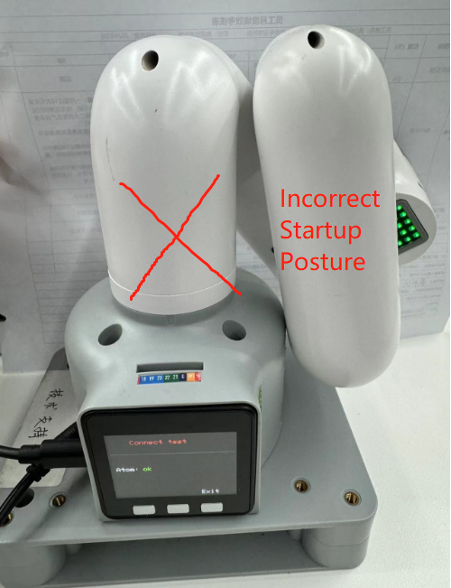
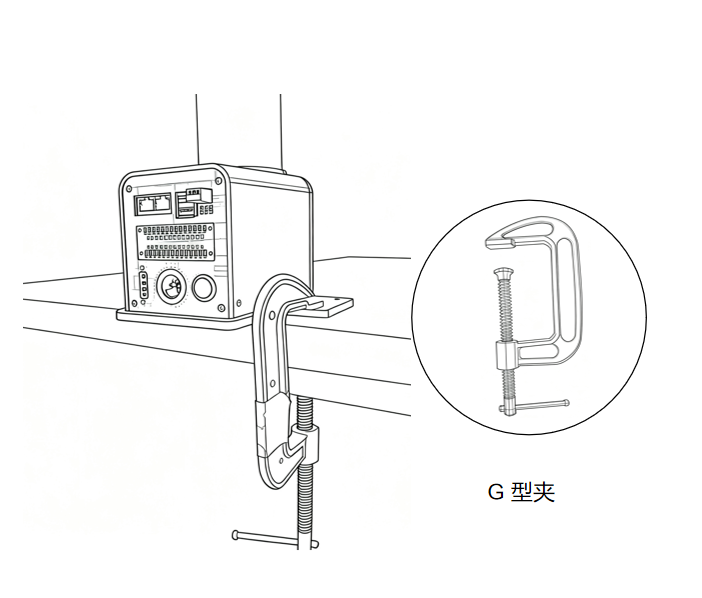

# 开机检测指南

## 1. 首次使用自查-机器关节功能验

>> **注意:** 在机械臂启动时，请注意不要让机械臂处于蜷缩或者关节之间触碰的姿态，建议启动时,机械臂姿态应如下图1所示，图2、图3均为错误启动姿态：

|  |  |    |
|---------------|---------------|---------------|
| 图1 (正确姿态)     | 图2（错误姿态）     |  图3（错误姿态）      |

## 2. 结构安装和固定

在 **机械臂** 的运动过程中，如果不将 myCobot 的**底面与桌面或其他底面相连**，仍然会造成 myCobot 的 **摇晃或倾覆**。

1.在开始组装之前，请清理工作台，并准备好需要用到的工具。

  工作环境：不小于机械臂的工作范围，并有足够的安装、使用、维护和修理空间。
  工具清单：mycobot pro 450  机械臂主体、产品配件包、产品使用指南等。

2.将.把机器臂平放在桌面上并正向放到桌面边，用G型夹固定。   

    

3.结构安装完成后，方可进行下一步的电源连接。

*注意*：myCobot 底座的螺丝孔位连接

需要将机器人固定在牢固机座上才可以正常使用。机座重量要求：固定式机座，或移动式机座。

请确定固定底座上有对应螺纹孔位，再进行安装。

正式进行安装前，请确认：

* 待安装环境符合以上《工作环境与条件》表格的要求。
*  安装位置不小于机器人工作范围，且留有足够大的安装、使用、维护、维修的空间。
*  将机座放置到合适位置。
*  安装相关工具已准备好，如螺丝、扳手等。
  **确认以上内容后**，请将机器人搬运至机座安装台面上，调整机器人位置，将机器人基座固定孔位与机座安装台面上的孔位对准。对准孔位后，将螺丝对准孔位，拧紧即可。

* 注意：在机座安装台面上调整机器人位置时，请尽量避免在机座安装台面上直接推拉机器人，以免产生划痕。人工移动机器人时请尽量避免对机器人本体脆弱部分施加外力，以免造成机器人不必要的损伤。

请尽可能详细描述下使用细节，如果方便的话请提供一个操作视频，这将会有助于快速分析定位问题，提前感谢！ -->

---

[← 上一章](./4.2-ProductUnboxingGuide.md) | [下一章 →](../../3-FunctionsAndApplications/5-BasicApplication/README.md)
