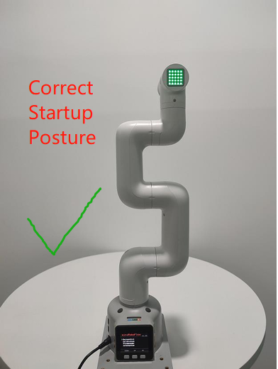
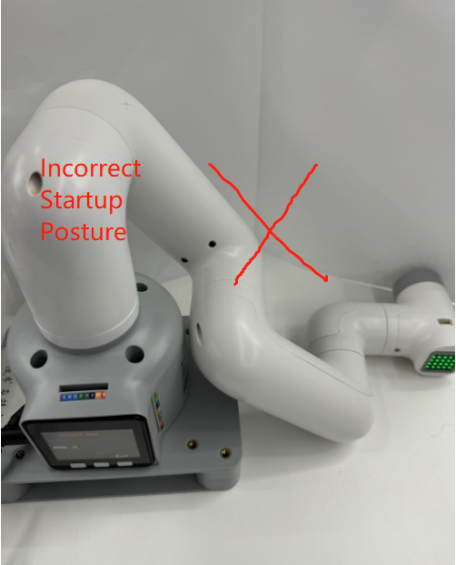
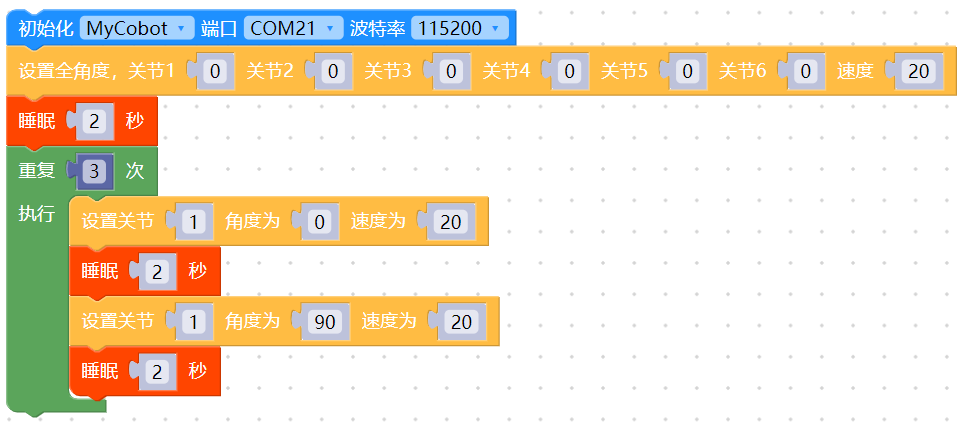

# 开机检测指南

## 1. 首次使用自查-机器关节功能验

>> **注意:** 在机械臂启动时，请注意不要让机械臂处于蜷缩或者关节之间触碰的姿态，建议启动时,机械臂姿态应如下图1所示，图2、图3均为错误启动姿态：

|  |  |    |
|---------------|---------------|---------------|
| 图1 (正确姿态)     | 图2（错误姿态）     |  图3（错误姿态）      |

## 2. 结构安装和固定

在 **机械臂** 的运动过程中，如果不将 myCobot 的**底面与桌面或其他底面相连**，仍然会造成 myCobot 的 **摇晃或倾覆**。

### 安装机械臂
安装M6X16螺丝将底板固定在台面上

<div align=center></div> 

安装完成的效果图

<div align=center></div> 

将机械臂底座放置到固定好的底板上

<div align=center></div> 

拆卸机械臂底座上的罩壳固定螺丝

<div align=center></div> 

打开机械臂底座的罩壳，并使用M6X16的螺丝将机械臂底座和底板固定

<!-- <div align=center></div> 

安装完成后，将机械臂底座的罩壳扣上 -->

<div align=center></div> 

安装机械臂底座的罩壳固定螺丝

<div align=center></div> 
安装机械臂底座的罩壳固定螺丝
   <div align=center></div>

*注意*：myCobot 底座的螺丝孔位连接

需要将机器人固定在牢固机座上才可以正常使用。机座重量要求：固定式机座，或移动式机座。

请确定固定底座上有对应螺纹孔位，再进行安装。

正式进行安装前，请确认：

* 待安装环境符合以上《工作环境与条件》表格的要求。
*  安装位置不小于机器人工作范围，且留有足够大的安装、使用、维护、维修的空间。
*  将机座放置到合适位置。
*  安装相关工具已准备好，如螺丝、扳手等。
  **确认以上内容后**，请将机器人搬运至机座安装台面上，调整机器人位置，将机器人基座固定孔位与机座安装台面上的孔位对准。对准孔位后，将螺丝对准孔位，拧紧即可。

* 注意：在机座安装台面上调整机器人位置时，请尽量避免在机座安装台面上直接推拉机器人，以免产生划痕。人工移动机器人时请尽量避免对机器人本体脆弱部分施加外力，以免造成机器人不必要的损伤。

## 3. 关节控制方法步骤

### 1. 进行硬件连接

### 2. 进行软件环境安装与配置

### 3. 选择正确的通讯方式

### 4. USB通讯示例

#### 4.1 机械臂关节运动myblockly源码



当你看到机械臂的关节1在0-90度循环运动3次效果，说明机械臂关节1响应正常，可尝试更改关节ID测试其他关节及循序渐进学习使用gitbook的其他案例或者利用机械臂做各种有趣的事情！
指的一提的是，如果你目前对myblockly的代码块开发方式并不熟悉，还有一个相对快捷的关节验证方式是：使用myblockly快速移动工具进行简单的关节运动控制，具体用法请参考：[myblockly快速移动工具使用](https://drive.google.com/file/d/1pDR-WBjkGrLcRdeshDmAMIWbEpu_jsJW/view?usp=sharing)


#### 4.2 机械臂关节运动关节python源码

```python
#运动效果为机械臂围绕零位姿态，1-6关节逐一运动±20度
import time
from pymycobot.mycobot import MyCobot

if __name__ == "__main__":
    cobot = MyCobot('com22',115200)#根据机型选择对应的端口号及波特率
    cobot.set_fresh_mode(1)
    cobot.send_angles([0, 0, 0, 0, 0, 0], 20)
    time.sleep(2)
    print("start")
    for i in range(1,7):
        cobot.send_angle(i, (-30), 20)
        time.sleep(2)
        cobot.send_angle(i, (30), 20)
        time.sleep(2)
        cobot.send_angle(i, (0), 20)
        time.sleep(2)

```

当你看到机械臂围绕零位姿态，1-6关节逐一运动±20度的运动效果，说明关节1-6响应正常，可循序渐进学习使用gitbook的其他案例或者利用机械臂做各种有趣的事情！

**如果执行案例没有看到相对应的效果，那么请参考下文的常见问题解决方案，另外请注意在联系技术支持人员前确保你已经检查了以下2点：**

1. 机械臂是否能在上电之后正常锁住？如果不能锁住，请参考FQA硬件相关问题：“Q：机械臂上电锁不住如何解决？”进行排查
2. 运行代码是否有任何报错信息？

请尽可能详细描述下使用细节，如果方便的话请提供一个操作视频，这将会有助于快速分析定位问题，提前感谢！

---

[← 上一章](./4.2-ProductUnboxingGuide.md) | [下一章 →](../../3-FunctionsAndApplications/5-BasicApplication/README.md)
