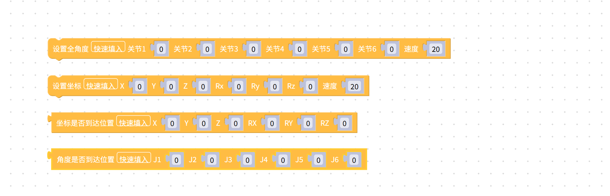
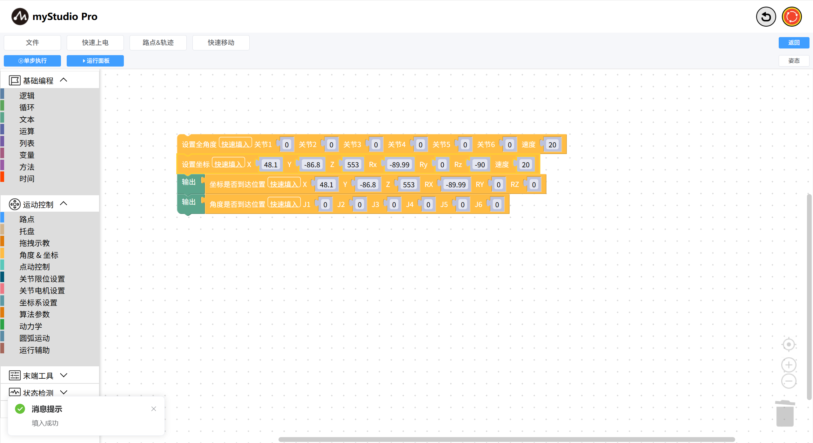

# 快速填入数据

本章介绍积木块的中 快速填入 功能。

当一个积木块拥有过多的数据项，一个一个填入未免过于麻烦。 于是对于数据项填入项过多的积木块，我们可以使用快速填入功能。

目前支持快速填入的积木块有以下几个：

### 如何使用快速填入

以设置`设置全角度`积木块为例，首先需要选中积木块，然后点击积木块中的 `快速填入`按钮即可。

当页面上出现下图提示框，即填入成功。

[← 上一页](./5.1.5.3-littleCase.md) |[下一页 →](./5.1.5.5-quickMove.md)

