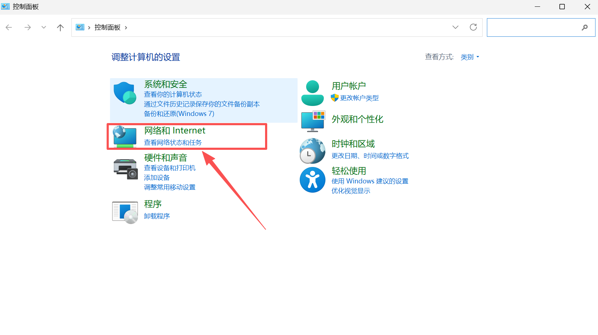
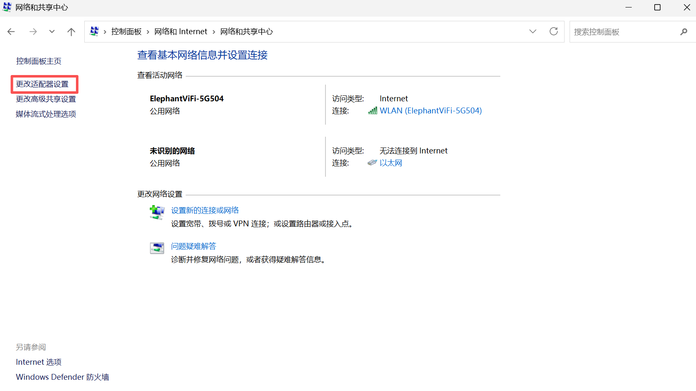
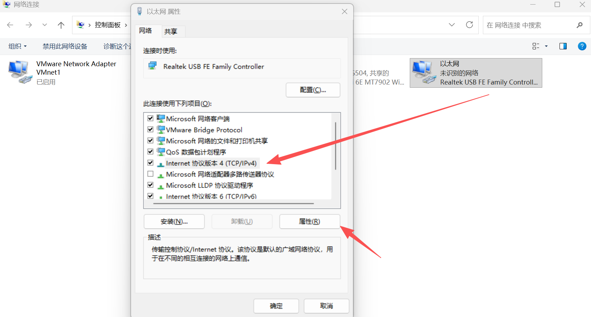
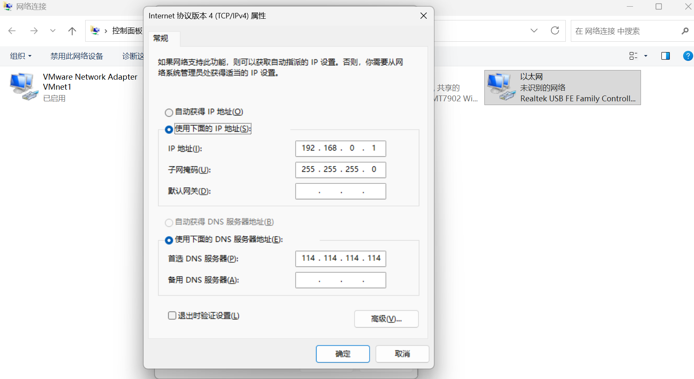
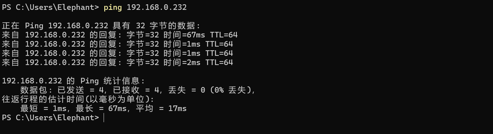
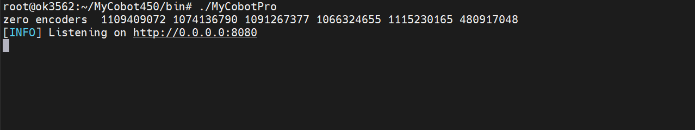
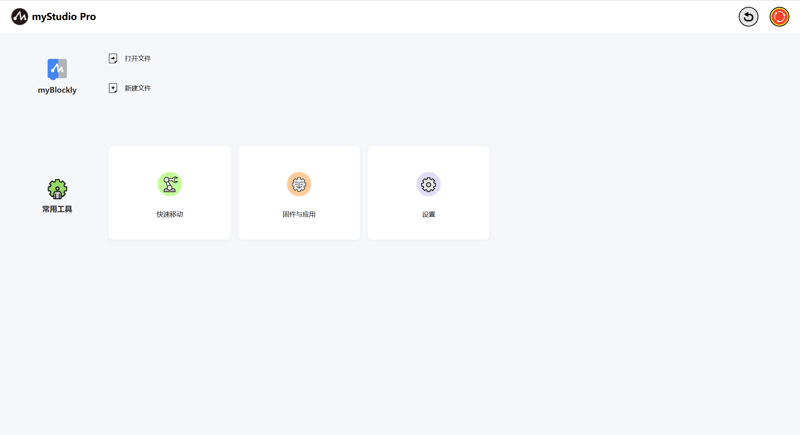

# 使用 myStudio Pro 前的准备工作

### 硬件配置

> 使用 myStudio Pro 之前，请确保机器已通电。
> 
> 以下是对如何开启服务端程序说明步骤（以Windows操作系统为例）：

#### 静态IP配置

- 首先，您需要准备一条可正常使用的`网线`，将网线的一端连接到`机器底座的网口`上，另一端连接到您的`PC端设备网口`。

- 将网线连接完成后，需要进行手动配置机器的`静态IP`，用于后续的`ssh连接`。配置步骤如下：
  
  - 打开控制面板，选择`网络和Internet`，然后点击`查看网络状态和任务`。
   
    

  - 此时进入到`网络和共享中心`面板，选择左侧菜单栏中的`更改适配器设置`并点击打开`网络连接`面板。

    

  - 选择`以太网`并鼠标右键点击`属性`面板打开成功后，鼠标左键选择`Internet协议版本 4 （TCP/IPv4）`，最后点击地下的属性按钮
    
    

  - 进入到属性面板，鼠标点击`使用下面的IP地址（S）`，配置静态IP地址`192.168.0.x`，子网掩码`255.255.255.0`。

    

  - 最后点击确认，关闭对应配置面板即可。
  
- 验证静态IP配置是否成功，按下`Win+R`组合键调出运行窗口，然后在运行窗口中输入`cmd`，打开`Windows 命令提示符`，输入`ping 192.168.0.232`并按下回车键，当输出以下内容时则说明静态IP配置成功，且网线连接正常。
  
  

#### 启动服务端程序

- 可通过`ssh`连接的方式，登录到机器系统进行操作和控制，本章以`MobaXterm`图形化工具为例操作。

- 打开应用点击左上角`Session`弹出面板，并选择`SSH`连接输入对应的`Remote host`，输入完成后点击确认。

- 连接成功后面板需要您输入`用户名`及`密码`默认均为`root`并回车，登陆到系统。

- MyCobot Pro 450服务端程序默认在以下路径`/root/MyCobot450/bin`目录下，然后使用查看当前目录文件命令，检查是否存在对应的`执行文件`，执行文件名称一般为`MyCobotPro`。
  ```bash
  ls 
  ```
- 执行服务端文件，终端没有报错信息并输出以下信息，则文件运行成功。
  
  ```bash
  ./MyCobotPro
  ```
  
  


### 软件配置

> 使用 myStudio Pro 之前，请确保已在您的计算机上安装浏览器，如：Chrome / Edge / Safari 等现代浏览器。 

### myStudio Pro访问

> myStudio Pro 是Web应用无需安装，可在浏览器中通过IP的方式进行使用。

- 在`ssh`连接终端中输入`ifconfig`查看、配置和管理网络接口参数命令，确认`IP`。
  ```bash
  ifconfig
  ```
  

- 然后将该`IP`输入到浏览器的`URL`地址即可，注意：需要加上`http`协议，完整地址如下；
  
  ```bash
  http://<机械臂系统IP>:<端口号>
  ```

- 当浏览器渲染出页面时，则代表成功访问myStudio Pro。
  
  

[← 上一章](./README.md) | [下一章 →](./5.2-install_uninstall.md)