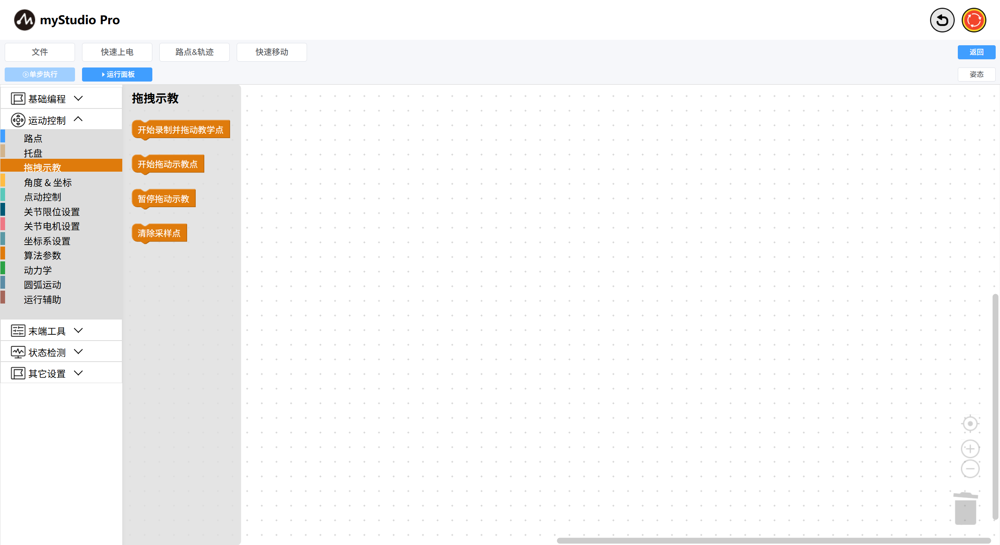
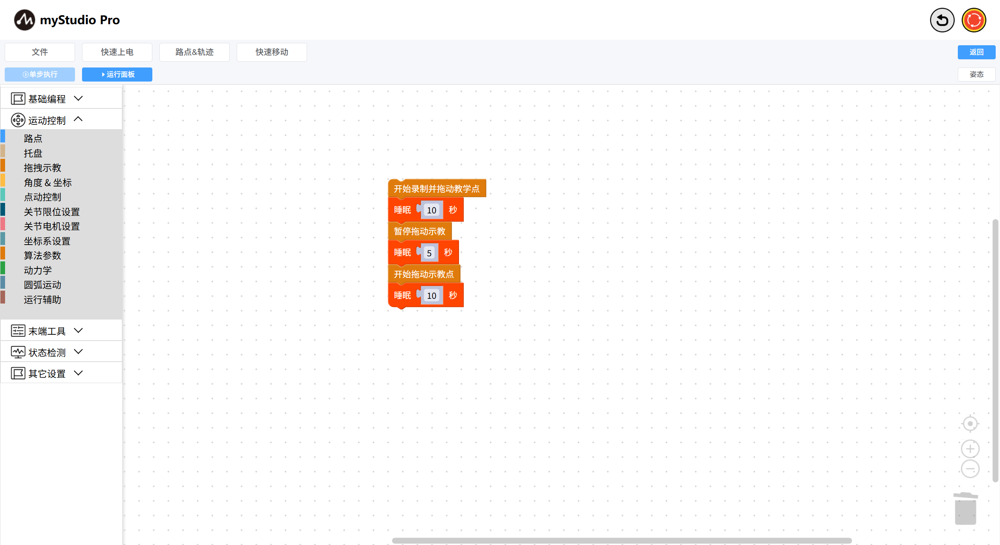
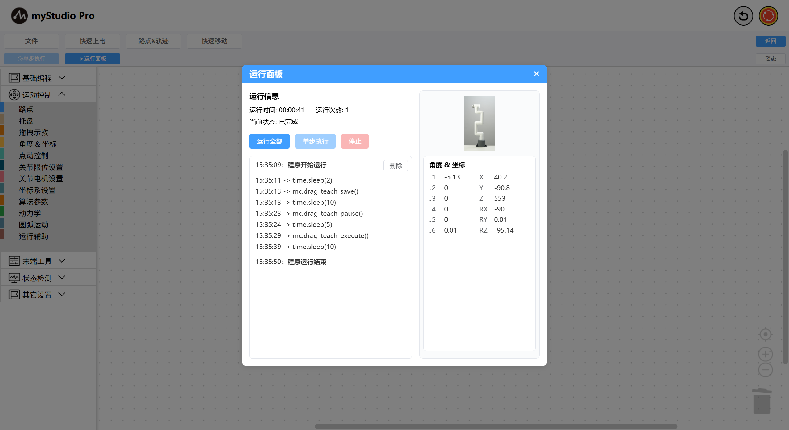

# 拖动示教的使用

*开始之前*

> *1、确保机器已上电*
> 
> *2、确保机器连接正常*
> 
> *3、服务端已开启*

本章介绍如何使用`blockly`中的拖动示教功能。

是指在操作者的牵引下（牵引末端或者牵引某一个操作臂），操作臂会沿着人的作用力方向移动。

这一功能可以很方便地进行规划轨迹（对过程轨迹精度不高的任务），以便操作者记录和复现轨迹，而无需人工编程，降低了对操作者的门槛，提高了效率。

### API display

### 小案例

我们将会实现这样一个效果：随意拖动机械臂做一些动作，拖动结束后，机械臂将会执行刚才的动作。相当于轨迹的录制和播放。

完整代码如下：

代码解释：
- 等待 2 秒
- 录制轨迹：执行该积木块后，机械臂关节刹车放松，机械臂现在可以被拖动
- 等待 10 秒（相当于录制了10 秒钟）
- 暂停录制：机械臂关节刹车锁紧，不可被人力拖动
- 等待 5 秒
- 播放轨迹：机械臂开始执行刚才录制的轨迹
- 等待 10 秒（相当于播放刚才录制的 10 秒钟轨迹）

[← 上一页](./5.5.10-gripperUse.md) |[下一页 →](../5.6-quickmove/5.6.1-quickmovefirstuse.md)