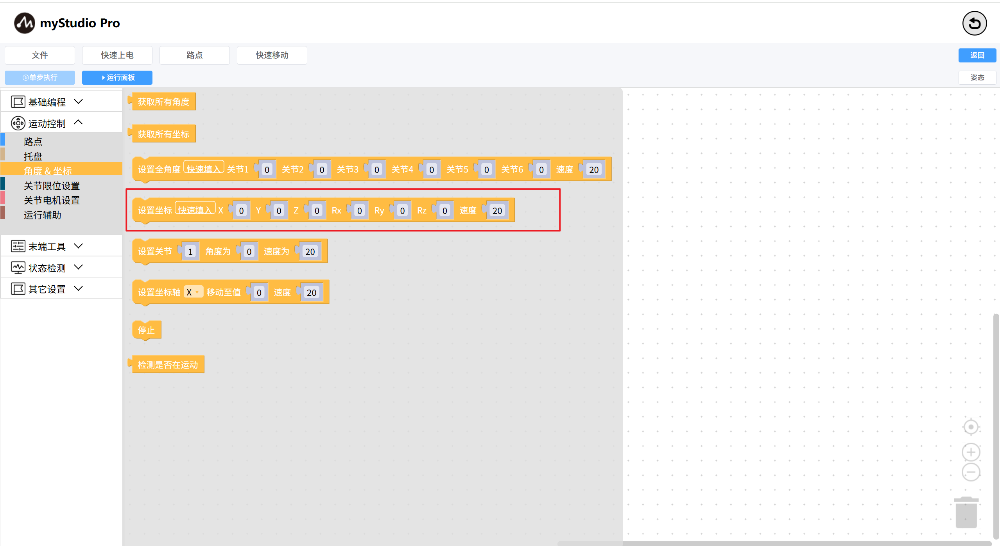
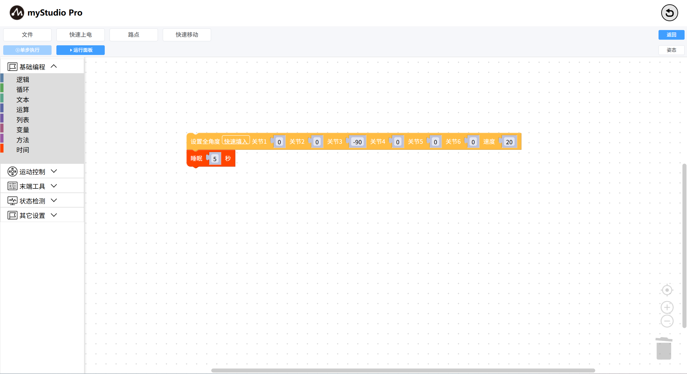
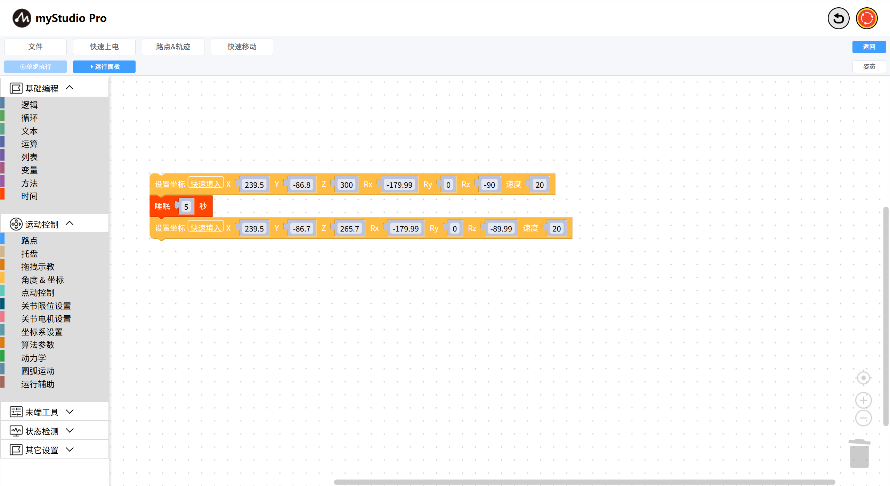
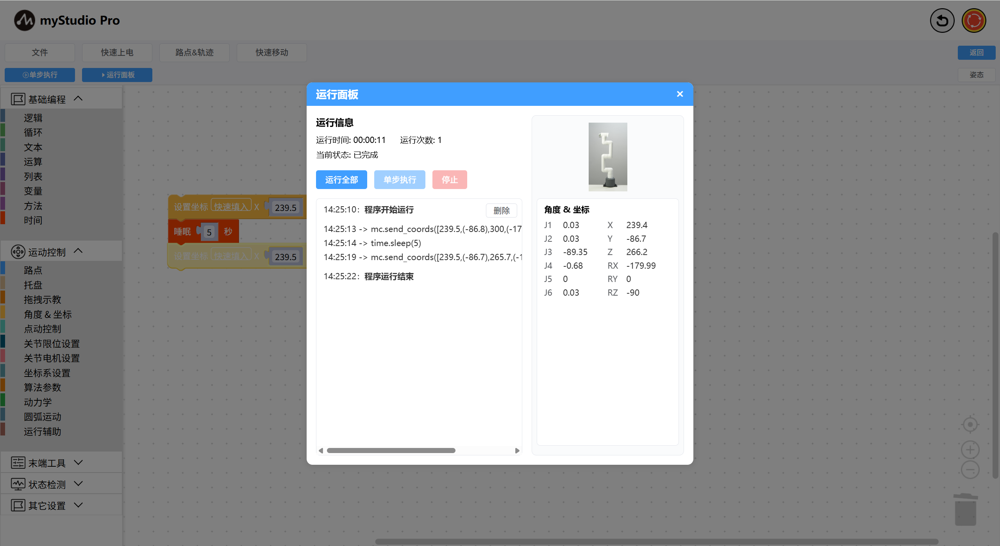

# 学习使用坐标控制

*开始之前*

> *1、确保机器已上电*
>
> *2、确保机器连接正常*
>
> *3、服务端已开启*

本章介绍如何使用坐标来控制机械臂。

### 主要涉及到的API：

**设置坐标**

- **原型**：`send_coords(values,speed)`

- **接口说明**：设置机械臂多坐标

- 参数：

  - values：[X,Y,Z,RX,RY,RZ]

  - speed：速度，范围为 1-100

### 小案例

#### 首次使用坐标移动前，需要执行的一些操作：

- 机械臂回到零位，可参考[控制机械臂回零](./5.5.3-littleCase.md)

- 设置机械臂坐标运动的初始姿态（机器J3需要与地面平行）

  - 如下图代码所示：

    

    打开`运行面板`，运行代码。

    

#### 坐标移动

拖动一个`设置坐标`积木块到工作区，并点击积木块中的`快速填入`按钮填入数据，并将 `Z` 轴数据修改为 `300`

完整代码如下：

执行代码，整个过程观察到机械臂在上下移动

[← 上一页](./5.5.5-quickMove.md) | [下一页 →](./5.5.7-singleStep.md)