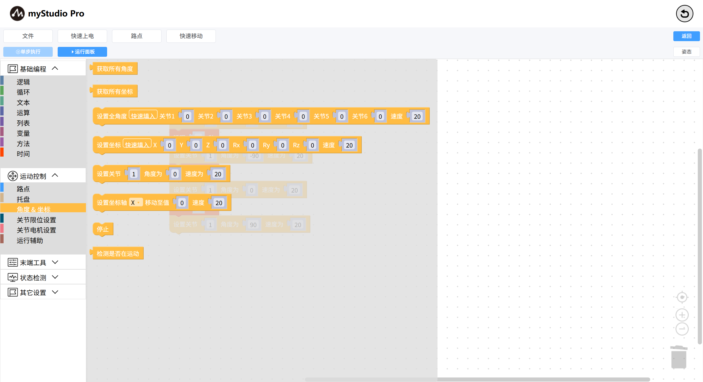
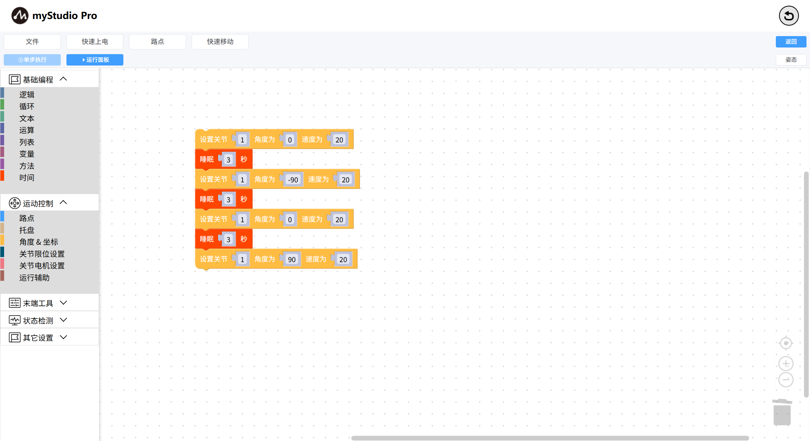

# 程序控制

*开始之前*

> *1、确保机器已上电*
>
> *2、确保机器连接正常*

本章介绍如何通过`运行面板`来调试积木块代码，实现程序的 `暂停`、`恢复`、**`单步执行`**、`停止`。

编辑一段控制 机械臂 关节1 运动的程序

点击`运行面板`按钮，当运行面板弹出后，点击`运行全部`，马上点击 `暂停`按钮，程序会在执行完第一条指令`mc.send_angle(1,0,20)` 后暂停。

程序已暂停。出现下一条要执行的指令`time.sleep(3)`

此时：

- 如果点击`恢复`按钮，程序将会自动往下执行；
- 如果点击`单步执行`按钮，程序会执行下一条指令，即`mc.send_angle(1,-90,20)`；
- 如果点击`停止`按钮，程序会被终止；

至于接下来如何操作，由您自己决定吧！

[← 上一页](./5.5.7-singleStep.md) | [下一页 →](./5.5.9-waypoint.md)