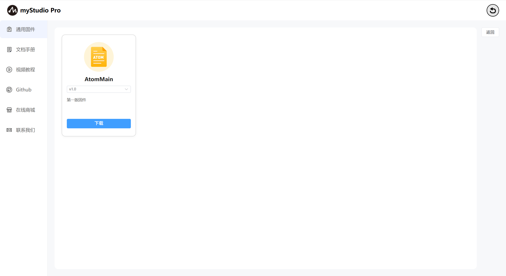
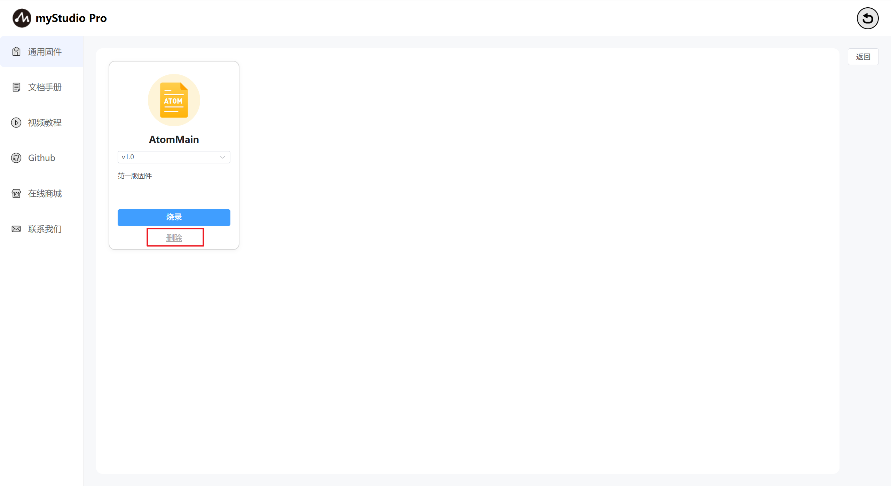
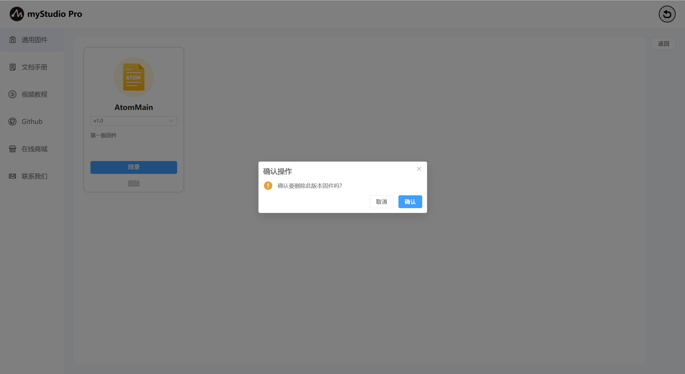
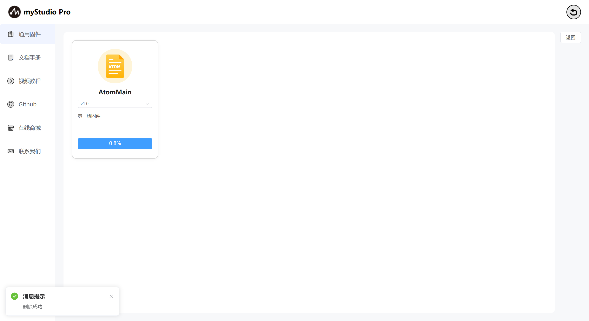
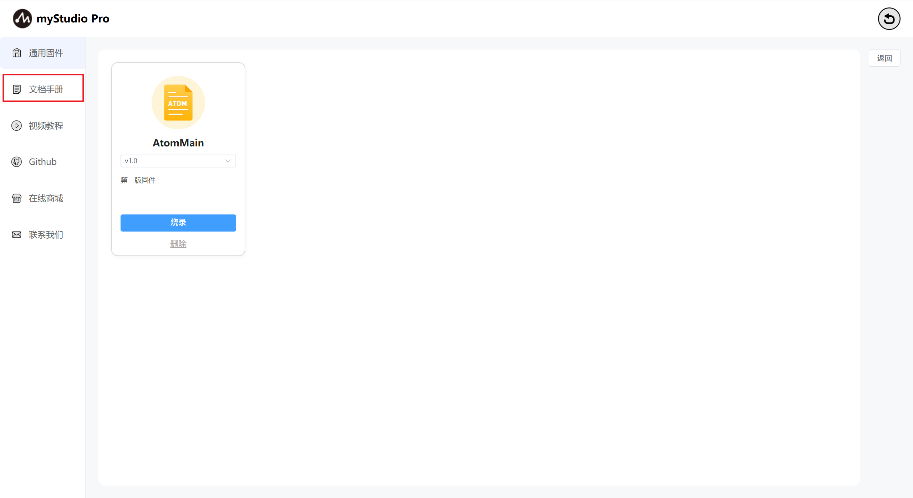
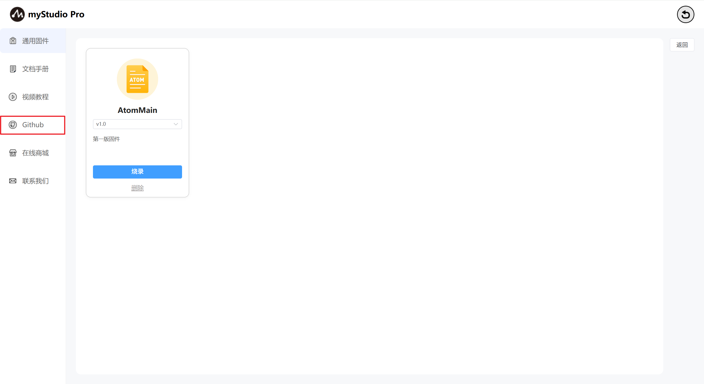
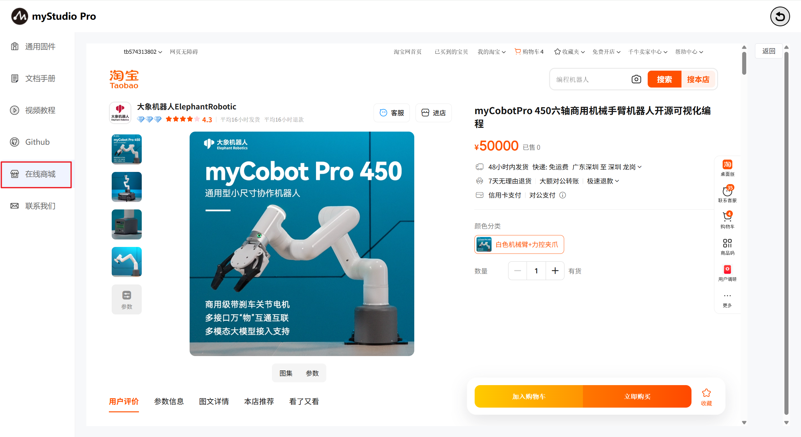
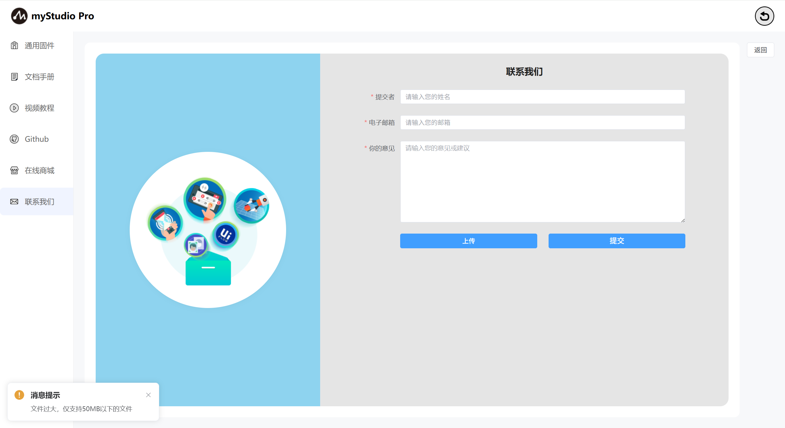

# 固件与应用
### 1 界面介绍

首页如下图：

myCobotPro450支持用户远程升级并且烧录最新版本的末端固件，机器出厂默认是使用的最新版本的固件，后续有新版本的固件发布，只需要在使用myStudio的时候保持网络畅通连接，myStudio会自动下载最新版本的固件。

### 2 通用固件

功能介绍：

**AtomMain**

末端固件名称

**版本号**

默认是最新已经发布的固件版本，也可以选择其他的版本进行烧录。

### 描述信息

固件对应版本的描述信息，一般会包含此版本固件的更新信息。

### **删除**

删除按钮：固件删除按钮，用于删除存储在本地指定版本的固件。

点击此按钮，会弹出提示信息，提示你确认是否要删除固件，点击"**确定**"按钮，表示确认删除；点击"**取消**"按钮，表示取消删除。

当有是未下载的固件或者删除固件以后，"**烧录**"按钮就会变成"**下载**"按钮，并且"**删除**"按钮会消失，点击"**下载**"会自动下载固件。

下载完成以后，会恢复"**烧录**"和"**删除**"按钮。

### 3 文档手册

此功能为网页跳转链接，点击以后，会在当前使用浏览器上打开产品的gitbook页面。

### 4 视频教程

此功能为网页跳转链接，点击以后，会在当前使用浏览器上打开官方的视频号。英文版本会跳转到YouTube，中文版本会跳转到bilibili，并且会以内嵌的形式访问对应链接。

### 5 Github

此功能为网页跳转链接，点击以后，会在当前使用浏览器上打开官方Github。

### 6 在线商城

此功能为网页跳转链接，点击以后，会在当前使用浏览器上打开对应产品的购买界面。中文版本会跳转到淘宝，英文版本的会跳转到，并且会以内嵌的形式访问对应链接。

### 7 联系我们

如果你有任何的问题或者想法，可以通过这里来联系我们。

功能介绍：

### 名称

这里可以输入您的昵称

> 此处是必填项，如果你不填直接提交，会有对应文字提示您。

### 电子邮箱

这里可以输入您的电子邮箱

> 此处是必填项，这里可以输入你的邮箱地址，方便官方人员后续回复您，如果你不填直接提交，会有对应文字提示您。

### 您的意见

这里可以输入您的意见

> 此处是必填项，这里可以输入您的问题或者想法，如果你不填直接提交，会有对应文字提示您。

### 上传

> 点击此按钮，可以上传文件，最多上传3个文件，并且每个文件不得超过50M。

> 点击以后会弹窗以供选择文件。

> 如果你选中的文件大小超过50M，在点击"**打开**"以后，会打开失败，并且弹窗提示你文件过大。

> 当你要上传的文件数量超过3个时，会弹窗提示你。

### 提交

> 点击提交按钮，可以将所有信息进行提交，该步骤需要的时间可能较长，请您耐心等待

[← 上一页](../5.6-quickmove/5.6.1-quickmovefirstuse.md) | [下一页 →](../5.8-setting/5.8.1-setting_main.md)