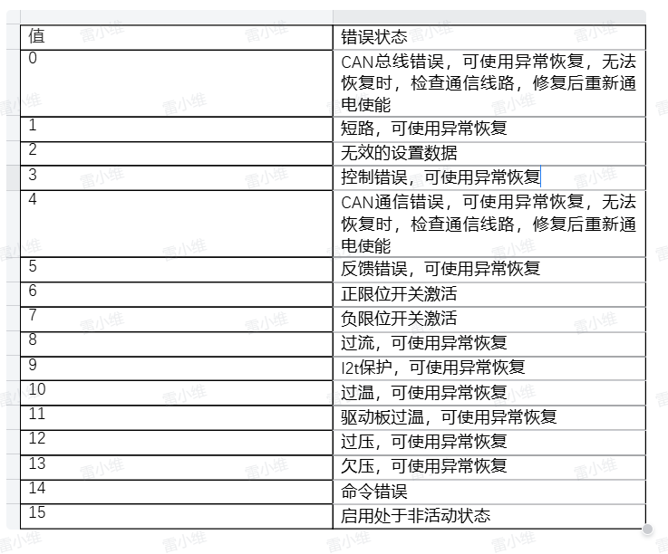
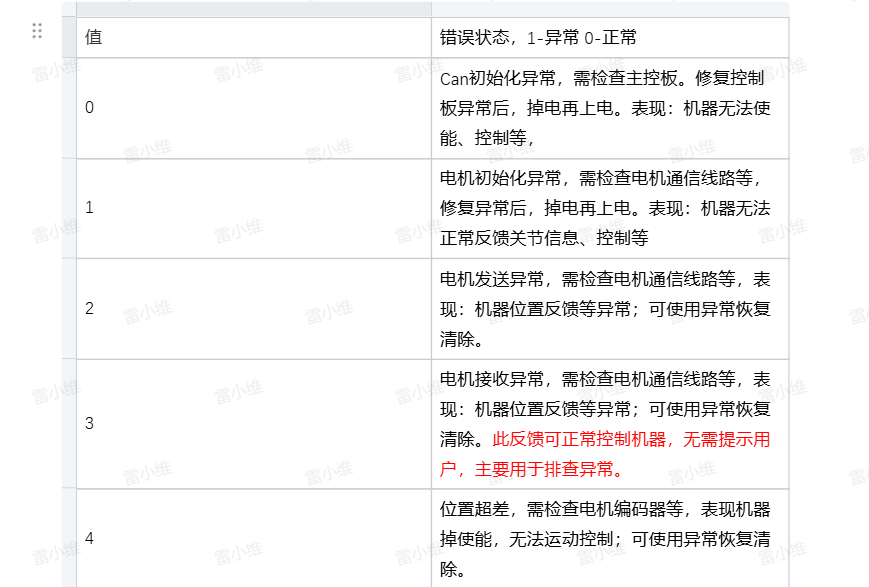
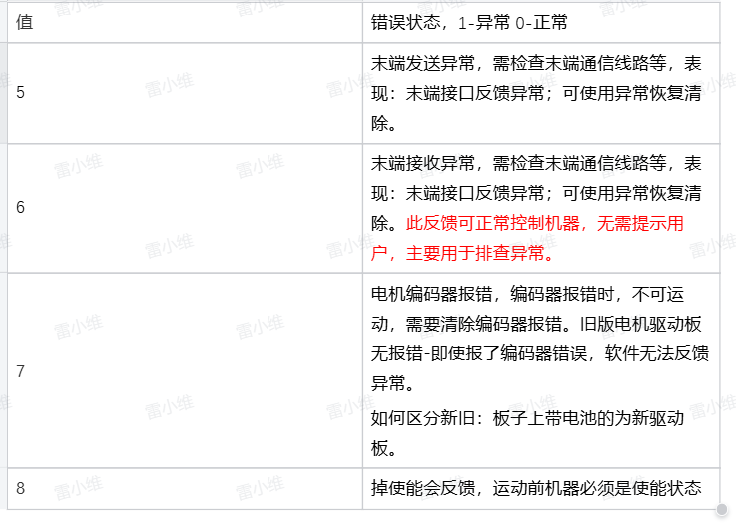

# 机械臂异常查看以及处理方法
    
当机械臂未成功执行运动指令时，可以在python终端中查询到对应的异常信息, 例如

## 读取机器人状态

### 状态反馈解析

正常情况下此接口反馈全0，读取机器人状态如下：

```python
from pymycobot import Pro450Client

pro450 = Pro450Client('192.168.0.232', 4500)

pro450.get_robot_status() #读取机器人状态
```

返回:

```bash
[0, 0, 0, 0, 0, 0, 0, 0, 0, 0, 0, 0, 0, 0, 0, 0, 0, 0, 0, 0]
```

表示机器人未在运动，无关节超限，无关节硬件报错、无关节软件报错

各个值完整解析如下:

`[保留，是否正在运动，J1是否超限，J2是否超限，J3是否超限，J4是否超限，J5是否超限，J6是否超限，J1是否电机硬件报错，J2是否电机硬件报错，J3是否电机硬件报错，J4是否电机硬件报错，J5是否电机硬件报错，J6是否电机硬件报错，J1是否软件通信报错，J2是否软件通信报错，J3是否软件通信报错，J4是否软件通信报错，J5是否软件通信报错，J6是否软件通信报错]`

案例如下：

```bash
[0, 1, 0, 0, 0, 0, 0, 0, 0, 0, 0, 3, 0, 0, 0, 0, 0, 0, 0, 0]
```

表示机器人在运动时报错，J4报控制错误。

```bash
[0, 0, 0, 1, 0, 0, 0, 0, 0, 0, 0, 0, 0, 0, 0, 0, 0, 0, 0, 0]
```

表示机器人J2超限。

```bash
[0, 0, 0, 0, 0, 0, 0, 0, 0, 0, 0, 0, 0, 0, 0, 0, 0, 0, 3, 0]
```

表示机器人J5线路异常--接收报错

### 异常解决

#### 关节超限

关节超限时，可使用以下解决方法之一：

- 执行超限回零接口：

```bash
pro450.over_limit_return_zero() #机器人会以较慢速度回到原点
```

- 执行关节放松，手动将关节移动到限位内

```bash
pro450.set_motor_enable(254, 0)
```

#### 关节硬件报错

大部分硬件报错可以使用异常恢复

```bash
pro450.servo_restore(joint_id)
```

若使用异常恢复或者机器人重启后，仍然频繁出现此问题，请联系我方工程师，具体各关节硬件详细报错见图1：



#### 关节软件报错

软件上的错误反馈主要为：线路异常、can模块异常、编码器异常、掉使能等，当出现掉使能，请使用`pro450.set_motor_enable(254, 1)`上使能再运动，其它异常，请联系我方工程师，具体各关节软件详细报错见图2、图3：





#### 机器人处于运动状态，机器人无法运动

机器人处于运动状态，发送运动点位不响应，请先将机器人运动停止，执行`pro450.stop()`、`pro450.resume()`，如仍然无法继续运动，请联系我方工程师。<br/>


---

[← 上一页](./6_gripper.md) | [下一节 →](../6.2-ROS1/README.md)