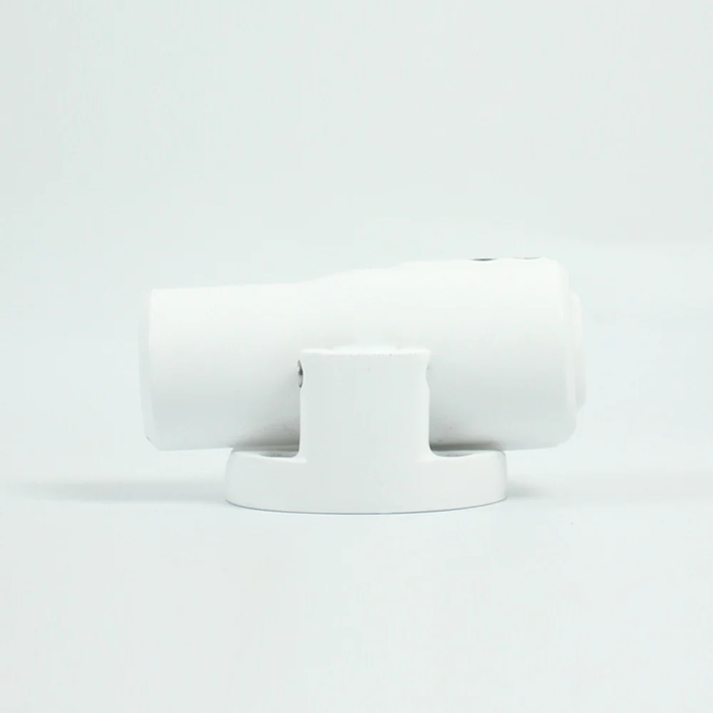
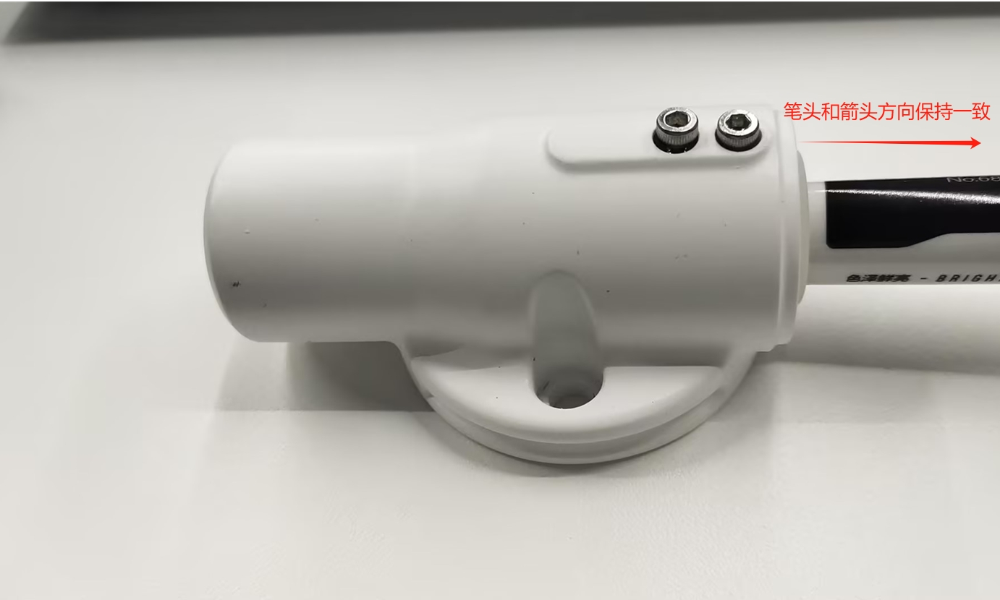

# myCobot Pro 夹持器

> **兼容型号:** myCobot 600、myCobot 630、myCobot Pro 450

## 产品图片

**规格说明：**

| 名称         | myCobotPro 笔夹持器                       |
| ------------ | ----------------------------------------- |
| 型号         | myCobot_Pro_penHolder_J6                  |
| 材料         | 光敏树脂                                  |
| 固定方式     | 螺丝固定                                  |
| 使用环境要求 | 常温常压                                  |
| 适用设备     | myCobot 600、myCobot 630、myCobot Pro 450 |
<!-- | 笔尖虚位     | ±1 mm                                     |
| 使用寿命     | 两年                                      | -->
**myCobotPro 笔夹持器：** 使用机械臂写字画画时使用

**简介**

- 整体纯色设计，支持上下 15mm 超大行程伸缩，有效减少误差，可以用于写字、画画等应用。

**适用物体**

- 白板笔

**安装使用**

- 安装

  1. 将两颗短螺丝伸入夹持器孔位中,将笔固定住，注意笔头朝向：
     
  2. 使用内六角扳手将夹持器固定在机械臂末端：  
     

---

[← 上一章](./10.8-CameraModulePro.md) | [下一章 →](../../5-Acknowledgments/11-Acknowledgements.md)