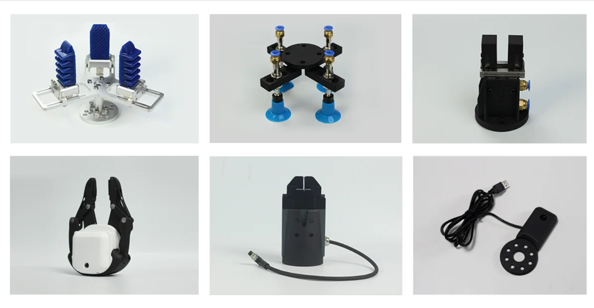

# Product Introduction
## 1. Product Description

##### myCobot Pro 450  

##### The first choice for getting started with the full harmonic collaborative robot arm

### 1.1 Product Introduction

The myCobot Pro 450 is a compact, **fully harmonic, six-axis collaborative robot arm** designed for use in **education, scientific experiments, commercial demonstrations, and light industrial automation**. It boasts a wide range of core functions and precise manipulation capabilities, including a working radius of up to 450 mm, a payload capacity of 1 kg, and positioning repeatability up to ±0.1 mm. It excels at a wide range of light-load, high-precision tasks.

In terms of control, it relies on a built-in industrial-grade core control board and self-developed control system, which can be easily connected to terminal devices such as computers, tablets, and mobile phones. The pre-installed drag-and-drop programming software and quick debugging interface make it easy for users with no basic knowledge to get started. At the same time, the integrated interface design on the tool side eliminates the trouble of cables when connecting the grippers, and the newly added CAN and RS485 interfaces on the base provide ample space for secondary development and function expansion. Its core value lies in providing users in different fields with a high-performance, easy-to-use and highly scalable collaborative robot arm solution, helping to improve work efficiency and innovation capabilities.

### 1.2 Design Concept

The myCobot Pro 450 was designed to meet the growing demand for diverse applications. In education, it aims to help students more intuitively engage with and learn robotics, cultivating practical skills and innovative thinking. In scientific research, it aims to provide researchers with stable and precise experimental tools, accelerating their research progress. In commercial displays, it aims to create engaging interactive experiences and enhance presentations.

### 1.3 Design Goals

| Design goals                                             | description                                                  | Application scenarios and features                           |
| ---------------------- | ------------------------------------------------------------ | ------------------------------------------------------------ |
| **Meet diverse high-precision operation needs**     | The 450mm working radius covers a standard tabletop, the 1kg payload supports multiple end effectors, and the repeatability accuracy is controlled to ±0.1mm. | - Educational and scientific research scenarios: can be used for experimental data collection, and its high precision can ensure the accuracy and reliability of the data； - Light industrial automation scenarios: It can perform fine material processing, such as the installation and sorting of electronic components, to improve production efficiency and product quality.|
| **Lowering usage thresholds and technical barriers**           | Multi-terminal connection, pre-installed drag-and-drop programming software, 4 industrial-grade connections and multi-standard protocols, easy to use even with zero basic knowledge. | - Educational teaching scenario: Students can easily connect and operate the robotic arm through terminal devices, learn robot programming knowledge with the help of programming software, and improve practical skills； - Business scenarios: Enterprise personnel can use this robotic arm to conduct preliminary research and verification of solutions without complex technical training, reducing the cost of using technology. |
| **Promote innovative application and expansion**   |It integrates multimodal and embodied intelligent large models, features visual and voice control, provides four out-of-the-box solutions, and supports secondary development through its interfaces. | - Research scenarios: Researchers can conduct cutting-edge research on robot intelligent decision-making, autonomous motion strategies, and other topics based on large models and embodied intelligence capabilities.； - Commercial display scenarios: Leverage multimodal interaction and unique application solutions to create a novel interactive display experience, attract customer attention, and enhance brand image. |

### 1.4 Feature

| Features                | Feature description                                                     |
| -----------------------| ------------------------------------------------------------ | 
| **Ultra-long standby**            | Laboratory-verified lifespan > 10,000 hours (Note: actual operating conditions may affect this), long-lasting stability, making teaching and research less stressful. |
| **Commercial-grade safety joints**      | The integrated harmonic reducer + servo motor + joint brake + controller self-locks upon power failure, ensuring safety and reliability, and greater peace of mind for human-machine collaboration. |
| **Integrated precision, solid and reliable**   | The all-metal integrated high-temperature die-cast body has uniform structural strength and a built-in controller, eliminating the need for external electrical boxes and complex cables, making it simple and efficient. |
| **The Internet of Things**          | Support for four industrial-grade connections (WLAN/EtherNet/RS485/CAN) and a variety of protocols (Socket-TCP/Modbus/CANOpen) allows for easy integration into existing systems and worry-free Industry 4.0 integration. |
| **Precise and efficient, lightweight choice**   | Working radius: 450mm, load: 1kg, accuracy: ±0.1mm, weight: < 5kg, optimized for light-load, high-precision tasks, it is an ideal partner for desktop automation and precision operations. |
| **Zero threshold control**          | myCobot Pro cross-platform control center - connect directly from your browser (just enter the IP address), no installation required! Integrated: Blockly graphical programming & drag-to-teach: turn novice programmers into programming experts in seconds. Fast mobile control & status monitoring. Supports multiple connection configurations including Modbus, VNC, and Socket. One-stop firmware upgrades and management. |
| **Open source ecosystem, unlimited possibilities**   | Provides a complete URDF model and exposes low-level interfaces for joint motors (including queryable position, velocity, acceleration, and current), facilitating kinematic and dynamic simulation modeling (ROS2, Isaac Sim, and MuJoCo). Over 90 standard control interface libraries (Python and C++) are available, covering status query and joint and Cartesian motion control. This is developer-friendly and efficiently enables secondary development. |
| **Infusion of "soul" into large models**     | Supports integration with large multimodal models (such as DeepSeek and ChatGPT) to enable intelligent grasping using voice commands and visual recognition, making interaction more intuitive. Supports integration with large embodied intelligence models (such as Lerobot) to enable autonomous motion strategy learning and deployment, exploring the frontiers of intelligent agents. |
| **Cool App Suite**             | Provides three out-of-the-box solutions: 3D visual disordered sorting, high-precision writing and painting, and mobile composite robots, allowing you to quickly build teaching/experimental/display scenarios. |

## 2. Product Application

### 2.1 Client

|                              |                                                              |
| ---------------------------- | ------------------------------------------------------------ |
| **Educators and students**          | It is suitable for course teaching, experimental training and skills competitions in robotics engineering, artificial intelligence, automation control, mechatronics and other majors in colleges and vocational schools, providing teachers and students with an ideal platform from theory to practice. |
| **Researchers and developers**          | It provides a stable hardware platform and deep software open interfaces for scientific research institutes, corporate R&D departments and a large number of robotics enthusiasts to assist in algorithm verification, prototype development and cutting-edge technology exploration. |
| **Commercial and industrial users**            | It is suitable for interactive product display in commercial showrooms, small-batch precision production in light industrial environments, sample sorting, quality inspection and other tasks, providing efficient and reliable automation solutions. |

### 2.2 Application Scenario

| **user group**               | **Core application scenarios (out-of-the-box)**                                   | **Expand application scenarios (unlimited possibilities)**                                                           |
| -------------------------- | ------------------------------------------------------------ | ------------------------------------------------------------ |
| **Teachers and students in the field of education**   | - Basic teaching of robotics: mechanical structure, kinematics, and trajectory planning principle experiments. - Drag-and-drop programming: manual craftsmanship imitation, action recording and reproduction. - Introduction to graphical programming: Use Blockly for basic training in logical thinking and programming. | - Advanced algorithm development: Research on machine vision, path planning, force control and other algorithms based on Python/C++/ROS2. - Artificial intelligence integration: Develop AI comprehensive application projects such as voice control and intelligent visual recognition and grasping. |
| **Makers and technology developers**       | - Rapid Prototyping (PoC): Verify the feasibility of automated processes or gripping solutions. - High-precision simulation: Provides accurate URDF models and seamlessly integrates with simulation environments such as Isaac Sim and MuJoCo. | - Exploration of cutting-edge fields: As a physical platform, it is used for research on cutting-edge topics such as embodied intelligence, reinforcement learning, and human-machine collaboration. - Composite system development: Integrate with AGV/AMR mobile chassis to build mobile manipulation robots. |
| **Commercial demonstrations and light industry** | - Automated commercial display: 24/7 automated product display and fun interaction with the audience. - Precision operations: high-precision writing and drawing, circuit board point detection, and sample sorting. - 3D visual sorting: Combined with 3D cameras, it can realize the grasping and sorting of disordered workpieces in cluttered environments.                       | - Production line automation integration: Communicate with PLCs via Modbus/TCP/IP and other protocols, and integrate into small production lines to perform tasks such as loading and unloading, and precision assembly. - Laboratory automation: Replace manual labor to perform repetitive experimental operations, such as sample pipetting and culture dish transportation. |

---

## 3. Supported Extension Development

The mycobot series of robotic arms are extremely valuable in the fields of education and scientific research, especially in Python and ROS (Robot Operating System), two widely used development environments. These environments provide strong support, allowing the mycobot series of products to be widely used in machine learning, artificial intelligence research, complex motion control, and visual processing tasks. At the same time, with dozens of accessories such as adaptive grippers, camera flanges, suction pumps, etc., you can give full play to myCobot's creative ideas.

| | |
| ------------------------------------------------------------ | ------------------------------------------------------------ |
| **Python** | The robot supports Python and has a complete Python API library. The robot's joint angles, coordinates, grippers, etc. can be controlled through Python. |
| **ROS** |The myCobot Pro 450 supports ROS 2 and the RVIZ2 simulation environment. It allows users to display the robot arm and collect robot status information in real time, making it suitable for ROS beginners and educational purposes. |
| **Hardware interface** | Including IO, USB, etc., to facilitate the connection of various sensors and actuators. |
| **Software library** | Provides a wealth of open source libraries and APIs to simplify the development process. |
| **System compatibility** | Compatible with Windows, Linux, MacOS, and adaptable to a variety of development environments. |
| **C++** | Using the C++ language, you can freely develop (coordinate control, angle control, IO control, gripper control, etc.) through the C++ dynamic library developed by our company, and control some robots that our company has developed. |
| **myBlockly** | It is both a graphical programming software and a visualization tool. Users can drag and drop modules to create programs. This process is very similar to building blocks, which is convenient, fast and easy to use. |

---

## 4. Purchase Address

If you are interested in purchasing this device, please click on the link below

Taobao：[https://shop504055678.taobao.com](https://shop504055678.taobao.com)  
Shopify：[https://shop.elephantrobotics.com/](https://shop.elephantrobotics.com/)  
AliExpress：[https://elephantrobotics.aliexpress.com/store/1101941423](https://elephantrobotics.aliexpress.com/store/1101941423)

---

[← Previous Chapter](../../README.md) | [Next Chapter→](../2.ProductParameter/2-ProductParameters.md)