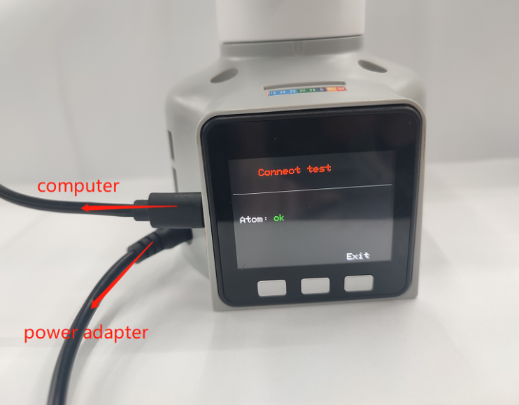
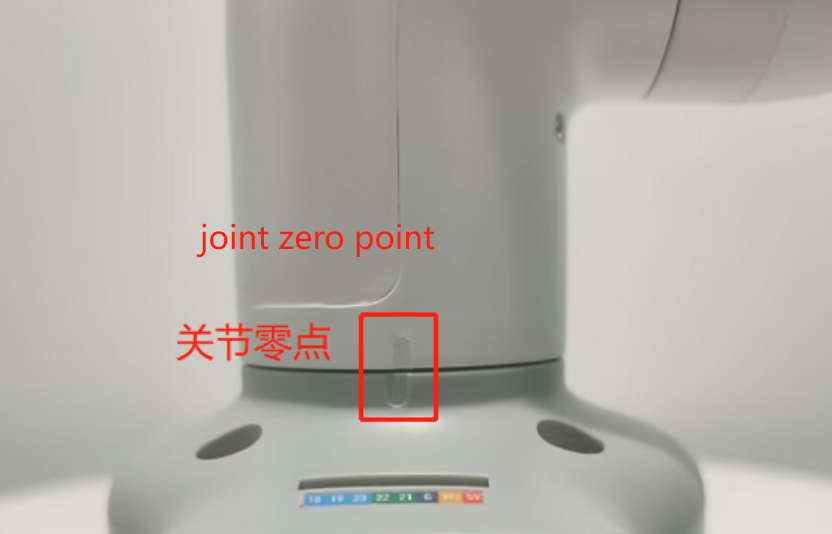

# Hardware Issues

**Q: How to solve the problem that the robot arm cannot be locked when powered on?**

1. Check whether the original power adapter is connected or whether the adapter is in good contact. You can try to re-plug the power adapter

2. Check whether the joint can rotate normally when the power is off, whether there is too much or too little resistance, and preliminarily determine whether the internal structure is physically broken. If there is no physical break, continue to check.

**Q: After pressing the emergency stop, the emergency stop cannot be locked after release. How to lock the robotic arm again?**

You need to power on the machine again, for example, power on the machine with myblockly

**Q: How to optimize joint jitter, excessive joint angle deviation or joint weakness?**

1. Refer to the robot parameter introduction section to check whether the actual load is within the effective load range of the robot arm. Excessive load will cause joint jitter. The load of the actual joint can be appropriately reduced.

2. Change the motion mode to refresh mode, so that the running trajectory of the robot arm will be relatively smooth. For specific APIs, please refer to
set_fresh_mode(1)

3. Check the following link to adjust pid: https://drive.google.com/file/d/1UWhaaSTuwLFImuEGY1J2tvgxTQDwWxK_/view?usp=sharing
4.  Check Chapter 5 of the gitbook to calibrate the robot arm at zero position. You can also refer to the calibration steps in the following link: https://drive.google.com/file/d/1XtKH-ykKWPH0q9Z_YHwzkgwNKRhstHhi/view?usp=sharing
5. For machines that have been used for a long time (more than 3 months), joints may age and produce joint gaps. You can follow the following video to manually bend the joints to check if there is any joint gap: https://drive.google.com/file/d/1tXDUALmfw1z0u6lM9uH5hOHivjbRoWxW/view?usp=sharing
6. If there is a joint gap problem due to joint aging, this kind of jitter is inevitable due to the natural aging of the machine.

**Q: What is the joint zero position?**

Take the following figure as an example, there is an arched groove designed between the joint and the edge of the joint shell, which is the joint zero point

Generally, the zero point posture after calibration is as follows:

**Q: Is there a method for zero point calibration?**

Please refer to Chapter 5 of gitbook or the following link:

https://drive.google.com/file/d/1XtKH-ykKWPH0q9Z_YHwzkgwNKRhstHhi/view?usp=sharing

**Q: What are the limits of myCobot's joints?**

- A: One axis and five axes have limits. One axis is about 165° clockwise and about 165° counterclockwise. The five axes can rotate about 165° clockwise and counterclockwise

**Note: When rotating the robot arm, it should be rotated at a small angle and gently. After reaching the limit, it cannot be rotated forcefully.**

**Q: What communication interfaces do different versions of the robot arm support?**

- A: The robot arm based on the microprocessor supports socket communication TCP; the robot arm based on the microcontroller can communicate via USB to serial port.

---

[← Previous Chapter](./3.4.1-software.md) | [Next Chapter→](./3.4.3-other.md)