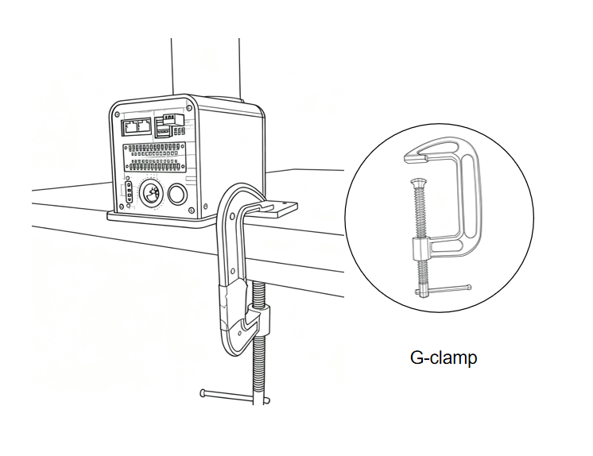

# Power-on Inspection Guide

## 1. First Use Self-check-machine Joint Function Test

>> **Note:** When starting the robotic arm, please be careful not to let the robotic arm be in a curled-up position or the joints touching each other. It is recommended that the robotic arm posture should be as shown in Figure 1 below when starting. Figures 2 and 3 are both incorrect starting postures:

|  |  |    |
|---------------|---------------|---------------|
| Figure 1 (Correct posture)     | Figure 2 (Wrong Posture)     |  Figure 3 (Wrong Posture)      |

## 2. Structural Installation And Fixing

During the movement of the **robotic arm**, if the **bottom surface of myCobot is not connected to a table or other bottom surface**, myCobot may still **sway or overturn**.

1. Before starting assembly, please clean the workbench and prepare the necessary tools.

  Working Environment: No smaller than the robot's working range, with ample space for installation, use, maintenance, and repair.

  Tool List: Mycobot Pro 450 robot, accessory kit, user guide, etc.

2. Place the robot arm flat on the table and place it forward to the edge of the table, and secure it with a G-clamp.  

    

3. After the structure is installed, the next step of power connection can be carried out.

*Note*: myCobot Base Screw Connection

The robot must be secured to a secure base for proper operation. Base weight requirements: Fixed or mobile.

Please ensure the base has corresponding threaded holes before installation.

* The installation related tools are ready, such as screws, wrenches, etc.
**After confirming the above content**, please move the robot to the base installation table, adjust the robot position, and align the robot base fixing holes with the holes on the base installation table. After aligning the holes, align the screws with the holes and tighten them.

* Note: When adjusting the robot position on the base installation table, please try to avoid pushing and pulling the robot directly on the base installation table to avoid scratches. When manually moving the robot, please try to avoid applying external force to the fragile parts of the robot body to avoid unnecessary damage to the robot.

---

[← Previous Chapter](./4.2-ProductUnboxingGuide.md) | [Next Chapter→](../../3-FunctionsAndApplications/5-BasicApplication/README.md)
